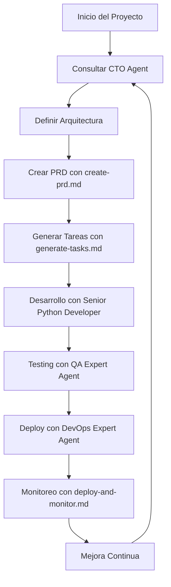

# Instrucciones de Uso - Sistema de Agentes IDE

## Descripción General

Este documento explica cómo utilizar el sistema completo de agentes IDE y documentación técnica para implementar, desarrollar y mantener una plataforma SAAS. El sistema está diseñado para proporcionar asistencia técnica especializada en tiempo real durante el desarrollo.

## Arquitectura del Sistema de Agentes

### Agentes Principales
- **CTO Agent**: Liderazgo técnico y decisiones arquitectónicas
- **Senior Python Developer**: Desarrollo backend y mejores prácticas
- **DevOps Expert Agent**: Infraestructura, CI/CD y operaciones
- **QA Expert Agent**: Calidad de software y testing
- **Product Expert Agent**: Estrategia de producto, UX/UI y validación de requisitos de negocio

### Documentación de Soporte
- **Instrucciones Operativas**: Procesos y workflows
- **Templates de Configuración**: Configuraciones estándar
- **Documentación Técnica**: Arquitectura y patrones
- **Documentación de APIs**: Especificaciones y SDKs

## Flujo de Trabajo General



## Ejemplos Prácticos de Uso

### Ejemplo 1: Inicio de Nuevo Proyecto SAAS

**Situación**: Necesitas crear una nueva plataforma SAAS desde cero.

**Proceso**:

1. **Consulta inicial con CTO Agent**:
   ```
   @CTO-Agent: "Necesito crear una plataforma SAAS para gestión de inventarios B2B. 
   ¿Qué arquitectura recomiendas y qué tecnologías debería usar?"
   ```

2. **Respuesta esperada del CTO Agent**:
   - Recomendación de arquitectura de microservicios
   - Stack tecnológico: FastAPI, PostgreSQL, Redis, React
   - Patrones arquitectónicos: CQRS, Event-Driven
   - Consideraciones de escalabilidad

3. **Crear PRD usando create-prd.md**:
   ```
   @Senior-Python-Developer: "Basándome en la arquitectura del CTO, 
   ayúdame a crear el PRD siguiendo el template de create-prd.md"
   ```

4. **Generar tareas con generate-tasks.md**:
   ```
   @CTO-Agent: "Con el PRD creado, genera la lista de tareas técnicas 
   usando el proceso de generate-tasks.md. Asegúrate de incluir archivos 
   de contexto y agentes recomendados para cada tarea"
   ```

   **Resultado esperado**: Lista de tareas estructurada con:
   - Tareas padre e hijas claramente definidas
   - **Context Files**: Archivos de documentación relevantes para cada tarea
   - **Recommended Agent**: Agente IDE más adecuado para cada tarea
   - Referencias específicas a templates y patrones arquitectónicos

5. **Configurar infraestructura**:
   ```
   @DevOps-Expert-Agent: "Configura el entorno de desarrollo usando 
   los templates de Docker y Kubernetes de la carpeta 05-Templates-Configuracion"
   ```

**Archivos utilizados**:
- `02-Agentes-IDE/CTO-Agent.md`
- `03-Instrucciones-Operativas/create-prd.md`
- `03-Instrucciones-Operativas/generate-tasks.md`
- `05-Templates-Configuracion/docker-templates.md`
- `05-Templates-Configuracion/kubernetes-templates.md`

---

### Ejemplo 2: Implementación de Nueva Funcionalidad

**Situación**: Necesitas agregar un sistema de facturación a tu plataforma existente.

**Proceso**:

1. **Análisis arquitectónico**:
   ```
   @CTO-Agent: "Tengo una plataforma SAAS con microservicios. 
   ¿Cómo integro un sistema de facturación manteniendo la arquitectura actual?"
   ```

2. **Diseño de la API**:
   ```
   @Senior-Python-Developer: "Basándome en la documentación de APIs 
   (06-Documentacion-APIs/api-documentation.md), diseña los endpoints 
   para el servicio de facturación"
   ```

3. **Implementación del código**:
   ```
   @Senior-Python-Developer: "Implementa el servicio de facturación 
   siguiendo los patrones de architecture-patterns.md y usando 
   los templates de seguridad"
   ```

4. **Testing**:
   ```
   @QA-Expert-Agent: "Crea los tests para el servicio de facturación 
   usando los templates de testing-templates.md"
   ```

5. **Despliegue**:
   ```
   @DevOps-Expert-Agent: "Configura el pipeline de CI/CD para el nuevo 
   servicio usando cicd-templates.md"
   ```

**Archivos utilizados**:
- `04-Documentacion-Tecnica/architecture-patterns.md`
- `06-Documentacion-APIs/api-documentation.md`
- `05-Templates-Configuracion/security-templates.md`
- `05-Templates-Configuracion/testing-templates.md`
- `05-Templates-Configuracion/cicd-templates.md`

---

### Ejemplo 3: Resolución de Problemas de Performance

**Situación**: Tu aplicación tiene problemas de rendimiento en producción.

**Proceso**:

1. **Análisis inicial**:
   ```
   @CTO-Agent: "La aplicación tiene alta latencia en las consultas de usuarios. 
   Los logs muestran timeouts en la base de datos. ¿Qué estrategia recomiendas?"
   ```

2. **Diagnóstico técnico**:
   ```
   @DevOps-Expert-Agent: "Revisa las métricas usando los templates de 
   monitoring-templates.md. ¿Qué patrones ves en Prometheus y Grafana?"
   ```

3. **Optimización de código**:
   ```
   @Senior-Python-Developer: "Basándome en el análisis, optimiza las consultas 
   de base de datos usando los patrones de database-templates.md"
   ```

4. **Implementación de caché**:
   ```
   @Senior-Python-Developer: "Implementa una estrategia de caché con Redis 
   siguiendo los patrones de architecture-patterns.md"
   ```

5. **Testing de performance**:
   ```
   @QA-Expert-Agent: "Crea tests de carga usando los templates de 
   testing-templates.md para validar las mejoras"
   ```

6. **Monitoreo continuo**:
   ```
   @DevOps-Expert-Agent: "Configura alertas específicas para performance 
   usando deploy-and-monitor.md"
   ```

**Archivos utilizados**:
- `05-Templates-Configuracion/monitoring-templates.md`
- `05-Templates-Configuracion/database-templates.md`
- `04-Documentacion-Tecnica/architecture-patterns.md`
- `05-Templates-Configuracion/testing-templates.md`
- `03-Instrucciones-Operativas/deploy-and-monitor.md`

---

### Ejemplo 4: Implementación de Seguridad Avanzada

**Situación**: Necesitas implementar autenticación OAuth2 y mejorar la seguridad general.

**Proceso**:

1. **Consulta estratégica**:
   ```
   @CTO-Agent: "Necesito implementar OAuth2 con múltiples proveedores 
   (Google, Microsoft, GitHub) y mejorar la seguridad general. 
   ¿Qué arquitectura de seguridad recomiendas?"
   ```

2. **Diseño de la implementación**:
   ```
   @Senior-Python-Developer: "Usando security-templates.md, 
   implementa OAuth2 con los proveedores mencionados y 
   JWT para gestión de sesiones"
   ```

3. **Configuración de infraestructura segura**:
   ```
   @DevOps-Expert-Agent: "Configura HTTPS, certificados SSL y 
   políticas de seguridad usando los templates de Kubernetes y Nginx"
   ```

4. **Testing de seguridad**:
   ```
   @QA-Expert-Agent: "Crea tests de seguridad para validar la autenticación, 
   autorización y protección contra vulnerabilidades comunes"
   ```

5. **Monitoreo de seguridad**:
   ```
   @DevOps-Expert-Agent: "Configura alertas de seguridad y 
   logging de eventos de autenticación usando monitoring-templates.md"
   ```

**Archivos utilizados**:
- `05-Templates-Configuracion/security-templates.md`
- `05-Templates-Configuracion/kubernetes-templates.md`
- `05-Templates-Configuracion/monitoring-templates.md`
- `05-Templates-Configuracion/testing-templates.md`

---

### Ejemplo 5: Migración y Escalabilidad

**Situación**: Tu aplicación monolítica necesita migrar a microservicios para escalar.

**Proceso**:

1. **Planificación estratégica**:
   ```
   @CTO-Agent: "Tengo una aplicación monolítica en Django con 100k usuarios. 
   Necesito migrar a microservicios. ¿Cuál es la mejor estrategia de migración?"
   ```

2. **Análisis de la arquitectura actual**:
   ```
   @Senior-Python-Developer: "Analiza el código actual y propón una 
   estrategia de descomposición usando los patrones de architecture-patterns.md"
   ```

3. **Plan de migración por fases**:
   ```
   @CTO-Agent: "Crea un plan de migración por fases usando 
   manage-development-workflow.md, priorizando servicios críticos"
   ```

4. **Implementación del primer microservicio**:
   ```
   @Senior-Python-Developer: "Implementa el servicio de usuarios como 
   primer microservicio usando FastAPI y los templates de Docker"
   ```

5. **Configuración de infraestructura**:
   ```
   @DevOps-Expert-Agent: "Configura Kubernetes, API Gateway y 
   service mesh usando kubernetes-templates.md"
   ```

6. **Testing de integración**:
   ```
   @QA-Expert-Agent: "Crea tests de integración entre el monolito 
   y el nuevo microservicio usando testing-templates.md"
   ```

7. **Monitoreo distribuido**:
   ```
   @DevOps-Expert-Agent: "Implementa tracing distribuido con Jaeger 
   y métricas específicas para microservicios"
   ```

8. **Proceso de mejora continua**:
   ```
   @CTO-Agent: "Establece el proceso de mejora continua usando 
   continuous-improvement.md para optimizar la migración"
   ```

**Archivos utilizados**:
- `04-Documentacion-Tecnica/architecture-patterns.md`
- `03-Instrucciones-Operativas/manage-development-workflow.md`
- `05-Templates-Configuracion/docker-templates.md`
- `05-Templates-Configuracion/kubernetes-templates.md`
- `05-Templates-Configuracion/testing-templates.md`
- `05-Templates-Configuracion/monitoring-templates.md`
- `03-Instrucciones-Operativas/continuous-improvement.md`

### Ejemplo 6: Validación de Requisitos de Producto y UX

**Situación**: Necesitas validar que una nueva funcionalidad cumple con los requisitos de negocio y proporcionar recomendaciones de UX.

**Proceso**:

1. **Consulta inicial con Product Expert Agent**:
   ```
   @Product-Expert-Agent: "Necesito validar los requisitos para un sistema de notificaciones 
   push en nuestra plataforma SAAS. ¿Qué aspectos de negocio y UX debo considerar?"
   ```

2. **Análisis de experiencia de usuario**:
   ```
   @Product-Expert-Agent: "Basándome en el PRD, ¿qué patrones de UX recomiendas 
   para las notificaciones? Considera usabilidad y engagement."
   ```

3. **Validación de requisitos de negocio**:
   ```
   @Product-Expert-Agent: "Valida si los KPIs propuestos para las notificaciones 
   están alineados con los objetivos de negocio del producto."
   ```

4. **Coordinación con desarrollo**:
   ```
   @CTO-Agent: "Con las recomendaciones del Product Expert, ¿cómo implementamos 
   técnicamente el sistema de notificaciones?"
   ```

**Archivos utilizados**:
- `create-prd.md` - Para estructurar requisitos de producto
- `04-Documentacion-Tecnica/architecture-patterns.md` - Para patrones de UX
- `generate-tasks.md` - Para crear tareas específicas de implementación

## Mejores Prácticas de Uso

### 1. Secuencia de Consultas
- **Siempre inicia con CTO Agent** para decisiones arquitectónicas
- **Consulta al especialista apropiado** según el dominio técnico
- **Valida con QA Expert Agent** antes de implementar
- **Finaliza con DevOps Expert Agent** para despliegue

### 2. Uso de Documentación
- **Referencia siempre los templates** correspondientes
- **Sigue los procesos operativos** documentados
- **Utiliza los patrones arquitectónicos** establecidos
- **Mantén consistencia** con las especificaciones de API

### 3. Gestión de Tareas
```
1. Crear PRD → 2. Generar tareas con contexto → 3. Procesar lista con agentes → 4. Implementar → 5. Validar
```

**Estructura de Tareas Mejorada**:
Cada tarea ahora incluye:
- **Context Files**: Documentación técnica relevante
- **Recommended Agent**: Agente IDE especializado
- **Sub-tareas específicas**: Con contexto y agente por sub-tarea

### 4. Comunicación con Agentes
- **Sé específico** en tus consultas
- **Proporciona contexto** del proyecto actual
- **Referencia archivos** de documentación relevantes (ahora incluidos automáticamente en las tareas)
- **Solicita ejemplos** de código cuando sea necesario
- **Utiliza los agentes recomendados** especificados en cada tarea para obtener mejores resultados

### 5. Iteración y Mejora
- **Usa continuous-improvement.md** para procesos de mejora
- **Documenta decisiones** arquitectónicas importantes
- **Mantén actualizada** la documentación técnica
- **Revisa regularmente** las métricas y KPIs

## Comandos Rápidos de Referencia

### Consultas Frecuentes
```bash
# Decisión arquitectónica
@CTO-Agent: "¿Qué patrón arquitectónico recomiendas para [problema específico]?"

# Implementación de código
@Senior-Python-Developer: "Implementa [funcionalidad] usando [template específico]"

# Configuración de infraestructura
@DevOps-Expert-Agent: "Configura [servicio] usando [template] de la carpeta 05"

# Testing y calidad
@QA-Expert-Agent: "Crea tests para [componente] usando testing-templates.md"

# Estrategia de producto y UX
@Product-Expert-Agent: "Valida los requisitos de negocio para [funcionalidad] y proporciona recomendaciones UX"
```

### Archivos de Referencia Rápida
- **Arquitectura**: `04-Documentacion-Tecnica/architecture-patterns.md`
- **APIs**: `06-Documentacion-APIs/api-documentation.md`
- **Seguridad**: `05-Templates-Configuracion/security-templates.md`
- **Testing**: `05-Templates-Configuracion/testing-templates.md`
- **CI/CD**: `05-Templates-Configuracion/cicd-templates.md`
- **Monitoreo**: `05-Templates-Configuracion/monitoring-templates.md`

## Solución de Problemas Comunes

### Problema: "No sé qué agente consultar"
**Solución**: Siempre inicia con CTO Agent para orientación estratégica.

### Problema: "El agente no entiende mi contexto"
**Solución**: Proporciona más detalles del proyecto y referencia archivos de documentación específicos.

### Problema: "Necesito implementar algo no documentado"
**Solución**: Consulta con CTO Agent para crear nueva documentación o adaptar templates existentes.

### Problema: "Los templates no se ajustan a mi caso"
**Solución**: Solicita al agente correspondiente que adapte el template a tu situación específica.

## Nuevas Mejoras en el Sistema

### Estructura de Tareas Enriquecida

A partir de las actualizaciones realizadas, el sistema ahora genera tareas con información contextual completa:

#### Formato de Tarea Mejorado
```markdown
- [ ] 1.0 Implementar Sistema de Autenticación
  - **Context Files:** `05-Templates-Configuracion/security-templates.md`, `04-Documentacion-Tecnica/architecture-patterns.md`
  - **Recommended Agent:** Senior Python Developer
  - [ ] 1.1 Configurar JWT y OAuth2
    - **Context Files:** `05-Templates-Configuracion/security-templates.md`
    - **Recommended Agent:** Senior Python Developer
  - [ ] 1.2 Implementar tests de seguridad
    - **Context Files:** `05-Templates-Configuracion/testing-templates.md`
    - **Recommended Agent:** QA Expert Agent
```

#### Beneficios de la Nueva Estructura
1. **Contexto Automático**: Cada tarea incluye referencias a documentación relevante
2. **Especialización**: Agente recomendado para cada tarea específica
3. **Consistencia**: Garantiza el uso de estándares y patrones establecidos
4. **Eficiencia**: Reduce tiempo de búsqueda de documentación relevante
5. **Calidad**: Asegura implementación siguiendo mejores prácticas

## Conclusión

Este sistema de agentes IDE está diseñado para proporcionar asistencia técnica especializada en tiempo real. La clave del éxito está en:

1. **Usar la secuencia correcta** de consultas
2. **Referenciar la documentación** apropiada
3. **Mantener consistencia** con los patrones establecidos
4. **Iterar y mejorar** continuamente

Con estos ejemplos y mejores prácticas, podrás aprovechar al máximo el sistema para desarrollar, implementar y mantener plataformas SAAS robustas y escalables.