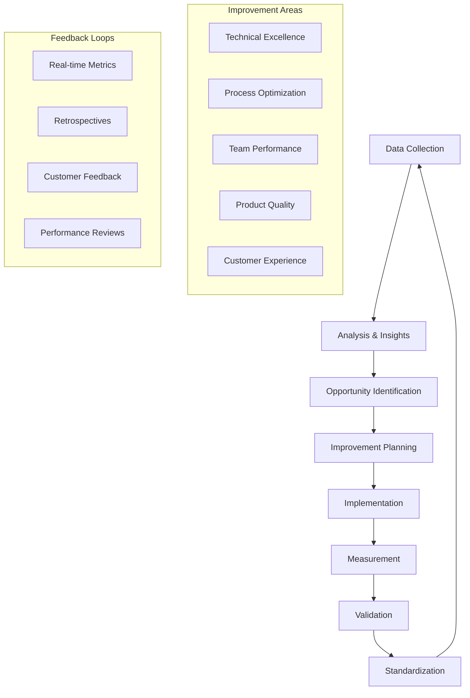

# Instrucciones Operativas: Mejora Continua

## Objetivo
Establecer un framework sistemático de mejora continua que permita la evolución constante de procesos, tecnologías, y capacidades del equipo, mediante la implementación de ciclos de retroalimentación, análisis de métricas, y optimización iterativa de todos los aspectos del desarrollo y operación de productos SAAS.

## Contexto del Proceso
Este documento define la metodología para implementar una cultura de mejora continua que abarque desde el desarrollo de software hasta las operaciones, pasando por la gestión de productos, la experiencia del usuario, y el crecimiento del equipo, utilizando principios de Kaizen, Lean, y metodologías ágiles.

## Roles y Responsabilidades

### Agentes AI Especializados
- **CTO Agent**: Liderazgo técnico en mejoras arquitecturales y tecnológicas
- **Senior Python Developer Agent**: Implementación de mejoras técnicas y optimizaciones
- **QA Expert Agent**: Mejoras en procesos de testing y calidad
- **DevOps Expert Agent**: Optimización de infraestructura y procesos de despliegue

### Roles de Soporte
- **Continuous Improvement Lead**: Coordinación de iniciativas de mejora
- **Product Owner**: Priorización de mejoras desde perspectiva de negocio
- **Scrum Master**: Facilitación de retrospectivas y mejoras de proceso
- **Data Analyst**: Análisis de métricas y identificación de oportunidades

## Framework de Mejora Continua

### 1. Arquitectura del Sistema de Mejora


### 2. Continuous Improvement Engine
```python
# Sistema de motor de mejora continua
class ContinuousImprovementEngine:
    def __init__(self):
        self.data_collector = DataCollector()
        self.analytics_engine = AnalyticsEngine()
        self.opportunity_detector = OpportunityDetector()
        self.improvement_planner = ImprovementPlanner()
        self.implementation_tracker = ImplementationTracker()
        self.impact_measurer = ImpactMeasurer()
    
    def execute_improvement_cycle(self) -> ImprovementCycleResult:
        """Ejecutar ciclo completo de mejora continua"""
        
        # Collect data from all sources
        data_collection = self.collect_improvement_data()
        
        # Analyze data and generate insights
        insights = self.analytics_engine.analyze_data(data_collection)
        
        # Identify improvement opportunities
        opportunities = self.opportunity_detector.identify_opportunities(insights)
        
        # Plan improvements
        improvement_plans = self.improvement_planner.create_improvement_plans(opportunities)
        
        # Execute improvements
        implementation_results = self.execute_improvements(improvement_plans)
        
        # Measure impact
        impact_measurement = self.impact_measurer.measure_impact(implementation_results)
        
        # Generate recommendations for next cycle
        next_cycle_recommendations = self.generate_next_cycle_recommendations(
            impact_measurement
        )
        
        return ImprovementCycleResult(
            data_collection=data_collection,
            insights=insights,
            opportunities=opportunities,
            improvement_plans=improvement_plans,
            implementation_results=implementation_results,
            impact_measurement=impact_measurement,
            next_cycle_recommendations=next_cycle_recommendations
        )
    
    def collect_improvement_data(self) -> DataCollection:
        """Recopilar datos para mejora continua"""
        
        # Technical metrics
        technical_metrics = self.data_collector.collect_technical_metrics([
            "code_quality_scores",
            "test_coverage",
            "deployment_frequency",
            "lead_time",
            "mttr",
            "change_failure_rate",
            "performance_metrics",
            "security_scan_results"
        ])
        
        # Process metrics
        process_metrics = self.data_collector.collect_process_metrics([
            "sprint_velocity",
            "story_completion_rate",
            "defect_escape_rate",
            "cycle_time",
            "throughput",
            "work_in_progress",
            "blocked_time_percentage"
        ])
        
        # Team metrics
        team_metrics = self.data_collector.collect_team_metrics([
            "team_satisfaction",
            "knowledge_sharing_frequency",
            "skill_development_progress",
            "collaboration_index",
            "innovation_rate",
            "retention_rate"
        ])
        
        # Customer metrics
        customer_metrics = self.data_collector.collect_customer_metrics([
            "user_satisfaction_score",
            "nps_score",
            "feature_adoption_rate",
            "support_ticket_volume",
            "churn_rate",
            "time_to_value"
        ])
        
        # Business metrics
        business_metrics = self.data_collector.collect_business_metrics([
            "revenue_growth",
            "customer_acquisition_cost",
            "lifetime_value",
            "market_share",
            "competitive_position",
            "roi_on_improvements"
        ])
        
        return DataCollection(
            technical=technical_metrics,
            process=process_metrics,
            team=team_metrics,
            customer=customer_metrics,
            business=business_metrics,
            timestamp=datetime.now()
        )
    
    def execute_improvements(self, improvement_plans: List[ImprovementPlan]) -> List[ImplementationResult]:
        """Ejecutar planes de mejora"""
        
        implementation_results = []
        
        for plan in improvement_plans:
            # Create implementation team
            implementation_team = self.create_implementation_team(plan)
            
            # Execute improvement plan
            result = self.implementation_tracker.execute_plan(plan, implementation_team)
            
            # Track progress
            progress_tracking = self.implementation_tracker.track_progress(result)
            
            implementation_results.append(ImplementationResult(
                plan=plan,
                team=implementation_team,
                execution_result=result,
                progress_tracking=progress_tracking
            ))
        
        return implementation_results
```

### 3. Opportunity Detection System
```python
class OpportunityDetector:
    def __init__(self):
        self.pattern_analyzer = PatternAnalyzer()
        self.benchmark_comparator = BenchmarkComparator()
        self.trend_analyzer = TrendAnalyzer()
        self.anomaly_detector = AnomalyDetector()
    
    def identify_opportunities(self, insights: AnalyticsInsights) -> List[ImprovementOpportunity]:
        """Identificar oportunidades de mejora"""
        
        opportunities = []
        
        # Pattern-based opportunities
        pattern_opportunities = self.identify_pattern_opportunities(insights)
        opportunities.extend(pattern_opportunities)
        
        # Benchmark-based opportunities
        benchmark_opportunities = self.identify_benchmark_opportunities(insights)
        opportunities.extend(benchmark_opportunities)
        
        # Trend-based opportunities
        trend_opportunities = self.identify_trend_opportunities(insights)
        opportunities.extend(trend_opportunities)
        
        # Anomaly-based opportunities
        anomaly_opportunities = self.identify_anomaly_opportunities(insights)
        opportunities.extend(anomaly_opportunities)
        
        # Prioritize opportunities
        prioritized_opportunities = self.prioritize_opportunities(opportunities)
        
        return prioritized_opportunities
    
    def identify_pattern_opportunities(self, insights: AnalyticsInsights) -> List[ImprovementOpportunity]:
        """Identificar oportunidades basadas en patrones"""
        
        opportunities = []
        
        # Code quality patterns
        if insights.technical.code_quality_trend == "declining":
            opportunities.append(ImprovementOpportunity(
                category="technical",
                type="code_quality",
                title="Implement Code Quality Improvement Program",
                description="Code quality metrics show declining trend",
                impact_estimate="high",
                effort_estimate="medium",
                priority="high",
                suggested_actions=[
                    "Implement stricter code review guidelines",
                    "Add automated code quality gates",
                    "Conduct code quality training sessions",
                    "Refactor high-complexity modules"
                ]
            ))
        
        # Performance patterns
        if insights.technical.performance_degradation_detected:
            opportunities.append(ImprovementOpportunity(
                category="technical",
                type="performance",
                title="Address Performance Degradation",
                description="Performance metrics show degradation pattern",
                impact_estimate="high",
                effort_estimate="high",
                priority="critical",
                suggested_actions=[
                    "Conduct performance profiling",
                    "Optimize database queries",
                    "Implement caching strategies",
                    "Scale infrastructure resources"
                ]
            ))
        
        # Process efficiency patterns
        if insights.process.cycle_time_increasing:
            opportunities.append(ImprovementOpportunity(
                category="process",
                type="efficiency",
                title="Optimize Development Cycle Time",
                description="Development cycle time is increasing",
                impact_estimate="medium",
                effort_estimate="medium",
                priority="medium",
                suggested_actions=[
                    "Analyze bottlenecks in development process",
                    "Implement parallel development streams",
                    "Automate manual testing processes",
                    "Improve requirement clarity"
                ]
            ))
        
        return opportunities
    
    def prioritize_opportunities(self, opportunities: List[ImprovementOpportunity]) -> List[ImprovementOpportunity]:
        """Priorizar oportunidades de mejora"""
        
        # Calculate priority score for each opportunity
        for opportunity in opportunities:
            priority_score = self.calculate_priority_score(opportunity)
            opportunity.priority_score = priority_score
        
        # Sort by priority score (descending)
        prioritized_opportunities = sorted(
            opportunities, 
            key=lambda x: x.priority_score, 
            reverse=True
        )
        
        return prioritized_opportunities
    
    def calculate_priority_score(self, opportunity: ImprovementOpportunity) -> float:
        """Calcular puntuación de prioridad"""
        
        # Impact weight (40%)
        impact_weights = {"low": 1, "medium": 2, "high": 3, "critical": 4}
        impact_score = impact_weights.get(opportunity.impact_estimate, 1) * 0.4
        
        # Effort weight (30% - inverse, lower effort = higher score)
        effort_weights = {"low": 3, "medium": 2, "high": 1, "very_high": 0.5}
        effort_score = effort_weights.get(opportunity.effort_estimate, 1) * 0.3
        
        # Strategic alignment (20%)
        strategic_score = self.calculate_strategic_alignment_score(opportunity) * 0.2
        
        # Urgency (10%)
        urgency_weights = {"low": 1, "medium": 2, "high": 3, "critical": 4}
        urgency_score = urgency_weights.get(opportunity.priority, 1) * 0.1
        
        return impact_score + effort_score + strategic_score + urgency_score
```

## Retrospectivas y Análisis

### 1. Retrospective Management System
```python
class RetrospectiveManager:
    def __init__(self):
        self.retrospective_facilitator = RetrospectiveFacilitator()
        self.action_item_tracker = ActionItemTracker()
        self.sentiment_analyzer = SentimentAnalyzer()
        self.pattern_detector = RetrospectivePatternDetector()
    
    def conduct_retrospective(self, retrospective_config: RetrospectiveConfig) -> RetrospectiveResult:
        """Conducir retrospectiva estructurada"""
        
        # Prepare retrospective
        preparation = self.prepare_retrospective(retrospective_config)
        
        # Gather feedback
        feedback_collection = self.gather_retrospective_feedback(retrospective_config)
        
        # Facilitate retrospective session
        session_result = self.retrospective_facilitator.facilitate_session(
            retrospective_config, feedback_collection
        )
        
        # Analyze sentiment and patterns
        sentiment_analysis = self.sentiment_analyzer.analyze_feedback(feedback_collection)
        pattern_analysis = self.pattern_detector.detect_patterns(session_result)
        
        # Generate action items
        action_items = self.generate_action_items(session_result, pattern_analysis)
        
        # Create improvement roadmap
        improvement_roadmap = self.create_improvement_roadmap(action_items)
        
        return RetrospectiveResult(
            preparation=preparation,
            feedback_collection=feedback_collection,
            session_result=session_result,
            sentiment_analysis=sentiment_analysis,
            pattern_analysis=pattern_analysis,
            action_items=action_items,
            improvement_roadmap=improvement_roadmap
        )
    
    def gather_retrospective_feedback(self, config: RetrospectiveConfig) -> FeedbackCollection:
        """Recopilar feedback para retrospectiva"""
        
        # Pre-retrospective survey
        survey_responses = self.conduct_pre_retrospective_survey(config.participants)
        
        # Collect quantitative data
        quantitative_data = self.collect_quantitative_metrics(config.time_period)
        
        # Collect qualitative feedback
        qualitative_feedback = self.collect_qualitative_feedback(config.participants)
        
        # Analyze team dynamics
        team_dynamics = self.analyze_team_dynamics(config.participants)
        
        return FeedbackCollection(
            survey_responses=survey_responses,
            quantitative_data=quantitative_data,
            qualitative_feedback=qualitative_feedback,
            team_dynamics=team_dynamics
        )
    
    def generate_action_items(self, session_result: SessionResult, 
                            pattern_analysis: PatternAnalysis) -> List[ActionItem]:
        """Generar elementos de acción"""
        
        action_items = []
        
        # Process identified issues
        for issue in session_result.identified_issues:
            action_item = ActionItem(
                title=f"Address: {issue.title}",
                description=issue.description,
                category=issue.category,
                priority=self.calculate_issue_priority(issue),
                assigned_to=self.assign_action_item_owner(issue),
                due_date=self.calculate_due_date(issue),
                success_criteria=self.define_success_criteria(issue),
                tracking_metrics=self.define_tracking_metrics(issue)
            )
            action_items.append(action_item)
        
        # Process improvement suggestions
        for suggestion in session_result.improvement_suggestions:
            action_item = ActionItem(
                title=f"Implement: {suggestion.title}",
                description=suggestion.description,
                category="improvement",
                priority=self.calculate_suggestion_priority(suggestion),
                assigned_to=self.assign_action_item_owner(suggestion),
                due_date=self.calculate_due_date(suggestion),
                success_criteria=self.define_success_criteria(suggestion),
                tracking_metrics=self.define_tracking_metrics(suggestion)
            )
            action_items.append(action_item)
        
        return action_items
```

### 2. Learning and Development Framework
```python
class LearningDevelopmentManager:
    def __init__(self):
        self.skill_assessor = SkillAssessor()
        self.learning_path_generator = LearningPathGenerator()
        self.knowledge_base_manager = KnowledgeBaseManager()
        self.mentorship_coordinator = MentorshipCoordinator()
    
    def create_team_development_plan(self, team_config: TeamConfig) -> TeamDevelopmentPlan:
        """Crear plan de desarrollo del equipo"""
        
        # Assess current skills
        skill_assessment = self.assess_team_skills(team_config)
        
        # Identify skill gaps
        skill_gaps = self.identify_skill_gaps(skill_assessment, team_config.required_skills)
        
        # Generate learning paths
        learning_paths = self.generate_learning_paths(skill_gaps)
        
        # Plan knowledge sharing sessions
        knowledge_sharing_plan = self.plan_knowledge_sharing_sessions(team_config)
        
        # Coordinate mentorship programs
        mentorship_plan = self.coordinate_mentorship_programs(team_config, skill_gaps)
        
        # Create innovation time allocation
        innovation_plan = self.create_innovation_time_plan(team_config)
        
        return TeamDevelopmentPlan(
            skill_assessment=skill_assessment,
            skill_gaps=skill_gaps,
            learning_paths=learning_paths,
            knowledge_sharing_plan=knowledge_sharing_plan,
            mentorship_plan=mentorship_plan,
            innovation_plan=innovation_plan
        )
    
    def assess_team_skills(self, team_config: TeamConfig) -> SkillAssessment:
        """Evaluar habilidades del equipo"""
        
        team_skills = {}
        
        for member in team_config.members:
            # Technical skills assessment
            technical_skills = self.skill_assessor.assess_technical_skills(member)
            
            # Soft skills assessment
            soft_skills = self.skill_assessor.assess_soft_skills(member)
            
            # Domain knowledge assessment
            domain_knowledge = self.skill_assessor.assess_domain_knowledge(member)
            
            team_skills[member.id] = MemberSkillProfile(
                member=member,
                technical_skills=technical_skills,
                soft_skills=soft_skills,
                domain_knowledge=domain_knowledge,
                overall_score=self.calculate_overall_skill_score(
                    technical_skills, soft_skills, domain_knowledge
                )
            )
        
        return SkillAssessment(
            team_skills=team_skills,
            team_average_score=self.calculate_team_average_score(team_skills),
            skill_distribution=self.analyze_skill_distribution(team_skills),
            strengths=self.identify_team_strengths(team_skills),
            weaknesses=self.identify_team_weaknesses(team_skills)
        )
    
    def generate_learning_paths(self, skill_gaps: List[SkillGap]) -> List[LearningPath]:
        """Generar rutas de aprendizaje"""
        
        learning_paths = []
        
        for skill_gap in skill_gaps:
            # Determine learning objectives
            learning_objectives = self.define_learning_objectives(skill_gap)
            
            # Select learning resources
            learning_resources = self.select_learning_resources(skill_gap)
            
            # Create learning milestones
            milestones = self.create_learning_milestones(skill_gap, learning_objectives)
            
            # Estimate timeline
            timeline = self.estimate_learning_timeline(skill_gap, learning_resources)
            
            learning_path = LearningPath(
                skill_gap=skill_gap,
                objectives=learning_objectives,
                resources=learning_resources,
                milestones=milestones,
                timeline=timeline,
                assessment_criteria=self.define_assessment_criteria(skill_gap)
            )
            
            learning_paths.append(learning_path)
        
        return learning_paths
```

## Métricas y KPIs de Mejora

### 1. Metrics Dashboard System
```python
class ImprovementMetricsDashboard:
    def __init__(self):
        self.metrics_collector = MetricsCollector()
        self.dashboard_generator = DashboardGenerator()
        self.trend_analyzer = TrendAnalyzer()
        self.benchmark_tracker = BenchmarkTracker()
    
    def generate_improvement_dashboard(self, dashboard_config: DashboardConfig) -> ImprovementDashboard:
        """Generar dashboard de métricas de mejora"""
        
        # Collect current metrics
        current_metrics = self.collect_current_metrics(dashboard_config)
        
        # Analyze trends
        trend_analysis = self.trend_analyzer.analyze_trends(current_metrics)
        
        # Compare with benchmarks
        benchmark_comparison = self.benchmark_tracker.compare_with_benchmarks(current_metrics)
        
        # Generate visualizations
        visualizations = self.dashboard_generator.generate_visualizations(
            current_metrics, trend_analysis, benchmark_comparison
        )
        
        # Create insights and recommendations
        insights = self.generate_insights(current_metrics, trend_analysis)
        recommendations = self.generate_recommendations(insights)
        
        return ImprovementDashboard(
            current_metrics=current_metrics,
            trend_analysis=trend_analysis,
            benchmark_comparison=benchmark_comparison,
            visualizations=visualizations,
            insights=insights,
            recommendations=recommendations
        )
    
    def collect_current_metrics(self, config: DashboardConfig) -> MetricsCollection:
        """Recopilar métricas actuales"""
        
        # Technical excellence metrics
        technical_metrics = {
            "code_quality_score": self.metrics_collector.get_code_quality_score(),
            "test_coverage_percentage": self.metrics_collector.get_test_coverage(),
            "technical_debt_ratio": self.metrics_collector.get_technical_debt_ratio(),
            "deployment_frequency": self.metrics_collector.get_deployment_frequency(),
            "lead_time_for_changes": self.metrics_collector.get_lead_time(),
            "mean_time_to_recovery": self.metrics_collector.get_mttr(),
            "change_failure_rate": self.metrics_collector.get_change_failure_rate()
        }
        
        # Process efficiency metrics
        process_metrics = {
            "sprint_velocity": self.metrics_collector.get_sprint_velocity(),
            "cycle_time": self.metrics_collector.get_cycle_time(),
            "throughput": self.metrics_collector.get_throughput(),
            "work_in_progress": self.metrics_collector.get_wip(),
            "defect_escape_rate": self.metrics_collector.get_defect_escape_rate(),
            "customer_satisfaction": self.metrics_collector.get_customer_satisfaction()
        }
        
        # Team performance metrics
        team_metrics = {
            "team_velocity": self.metrics_collector.get_team_velocity(),
            "knowledge_sharing_index": self.metrics_collector.get_knowledge_sharing_index(),
            "innovation_rate": self.metrics_collector.get_innovation_rate(),
            "team_satisfaction": self.metrics_collector.get_team_satisfaction(),
            "skill_development_rate": self.metrics_collector.get_skill_development_rate(),
            "collaboration_score": self.metrics_collector.get_collaboration_score()
        }
        
        # Business impact metrics
        business_metrics = {
            "feature_adoption_rate": self.metrics_collector.get_feature_adoption_rate(),
            "time_to_market": self.metrics_collector.get_time_to_market(),
            "customer_retention_rate": self.metrics_collector.get_retention_rate(),
            "revenue_per_feature": self.metrics_collector.get_revenue_per_feature(),
            "cost_of_quality": self.metrics_collector.get_cost_of_quality(),
            "roi_on_improvements": self.metrics_collector.get_improvement_roi()
        }
        
        return MetricsCollection(
            technical=technical_metrics,
            process=process_metrics,
            team=team_metrics,
            business=business_metrics,
            timestamp=datetime.now()
        )
```

### 2. Benchmarking and Goal Setting
```python
class BenchmarkingManager:
    def __init__(self):
        self.industry_benchmarks = self.load_industry_benchmarks()
        self.internal_benchmarks = self.load_internal_benchmarks()
        self.goal_setter = GoalSetter()
        self.progress_tracker = ProgressTracker()
    
    def establish_improvement_goals(self, current_metrics: MetricsCollection) -> ImprovementGoals:
        """Establecer objetivos de mejora"""
        
        # Analyze current performance vs benchmarks
        benchmark_analysis = self.analyze_benchmark_gaps(current_metrics)
        
        # Set SMART goals
        smart_goals = self.goal_setter.create_smart_goals(benchmark_analysis)
        
        # Define success criteria
        success_criteria = self.define_success_criteria(smart_goals)
        
        # Create measurement plan
        measurement_plan = self.create_measurement_plan(smart_goals)
        
        # Establish timeline
        timeline = self.establish_improvement_timeline(smart_goals)
        
        return ImprovementGoals(
            benchmark_analysis=benchmark_analysis,
            smart_goals=smart_goals,
            success_criteria=success_criteria,
            measurement_plan=measurement_plan,
            timeline=timeline
        )
    
    def track_goal_progress(self, improvement_goals: ImprovementGoals) -> GoalProgressReport:
        """Rastrear progreso de objetivos"""
        
        progress_reports = []
        
        for goal in improvement_goals.smart_goals:
            # Measure current progress
            current_progress = self.progress_tracker.measure_progress(goal)
            
            # Calculate completion percentage
            completion_percentage = self.calculate_completion_percentage(goal, current_progress)
            
            # Identify blockers and risks
            blockers = self.identify_goal_blockers(goal, current_progress)
            risks = self.identify_goal_risks(goal, current_progress)
            
            # Generate recommendations
            recommendations = self.generate_goal_recommendations(goal, current_progress)
            
            progress_report = GoalProgress(
                goal=goal,
                current_progress=current_progress,
                completion_percentage=completion_percentage,
                blockers=blockers,
                risks=risks,
                recommendations=recommendations,
                on_track=completion_percentage >= goal.expected_progress_percentage
            )
            
            progress_reports.append(progress_report)
        
        return GoalProgressReport(
            progress_reports=progress_reports,
            overall_progress=self.calculate_overall_progress(progress_reports),
            summary=self.generate_progress_summary(progress_reports)
        )
```

## Innovación y Experimentación

### 1. Innovation Management System
```python
class InnovationManager:
    def __init__(self):
        self.idea_generator = IdeaGenerator()
        self.experiment_designer = ExperimentDesigner()
        self.hypothesis_tester = HypothesisTester()
        self.innovation_tracker = InnovationTracker()
    
    def manage_innovation_pipeline(self, innovation_config: InnovationConfig) -> InnovationPipeline:
        """Gestionar pipeline de innovación"""
        
        # Generate and collect ideas
        idea_collection = self.collect_innovation_ideas(innovation_config)
        
        # Evaluate and prioritize ideas
        idea_evaluation = self.evaluate_ideas(idea_collection)
        
        # Design experiments
        experiments = self.design_experiments(idea_evaluation.top_ideas)
        
        # Execute experiments
        experiment_results = self.execute_experiments(experiments)
        
        # Analyze results and make decisions
        analysis_results = self.analyze_experiment_results(experiment_results)
        
        # Implement successful innovations
        implementation_plan = self.create_implementation_plan(analysis_results.successful_experiments)
        
        return InnovationPipeline(
            idea_collection=idea_collection,
            idea_evaluation=idea_evaluation,
            experiments=experiments,
            experiment_results=experiment_results,
            analysis_results=analysis_results,
            implementation_plan=implementation_plan
        )
    
    def collect_innovation_ideas(self, config: InnovationConfig) -> IdeaCollection:
        """Recopilar ideas de innovación"""
        
        # Team brainstorming sessions
        brainstorming_ideas = self.conduct_brainstorming_sessions(config.team)
        
        # Customer feedback analysis
        customer_ideas = self.analyze_customer_feedback_for_ideas()
        
        # Market research insights
        market_ideas = self.generate_market_research_ideas()
        
        # Technology trend analysis
        tech_trend_ideas = self.analyze_technology_trends_for_ideas()
        
        # Internal process improvement ideas
        process_ideas = self.identify_process_improvement_ideas()
        
        all_ideas = brainstorming_ideas + customer_ideas + market_ideas + tech_trend_ideas + process_ideas
        
        return IdeaCollection(
            ideas=all_ideas,
            sources=["team", "customers", "market", "technology", "process"],
            collection_date=datetime.now()
        )
    
    def design_experiments(self, ideas: List[Idea]) -> List[Experiment]:
        """Diseñar experimentos para ideas"""
        
        experiments = []
        
        for idea in ideas:
            # Define hypothesis
            hypothesis = self.formulate_hypothesis(idea)
            
            # Design experiment methodology
            methodology = self.experiment_designer.design_methodology(idea, hypothesis)
            
            # Define success metrics
            success_metrics = self.define_experiment_success_metrics(idea)
            
            # Estimate resources and timeline
            resource_estimate = self.estimate_experiment_resources(methodology)
            timeline = self.estimate_experiment_timeline(methodology)
            
            experiment = Experiment(
                idea=idea,
                hypothesis=hypothesis,
                methodology=methodology,
                success_metrics=success_metrics,
                resource_estimate=resource_estimate,
                timeline=timeline,
                risk_assessment=self.assess_experiment_risks(idea, methodology)
            )
            
            experiments.append(experiment)
        
        return experiments
```

### 2. A/B Testing and Feature Flags
```python
class ExperimentationPlatform:
    def __init__(self):
        self.ab_test_manager = ABTestManager()
        self.feature_flag_manager = FeatureFlagManager()
        self.statistical_analyzer = StatisticalAnalyzer()
        self.experiment_tracker = ExperimentTracker()
    
    def create_ab_test(self, test_config: ABTestConfig) -> ABTest:
        """Crear test A/B"""
        
        # Validate test configuration
        validation_result = self.validate_ab_test_config(test_config)
        if not validation_result.valid:
            raise ValueError(f"Invalid A/B test configuration: {validation_result.errors}")
        
        # Calculate sample size
        sample_size = self.statistical_analyzer.calculate_sample_size(
            test_config.expected_effect_size,
            test_config.statistical_power,
            test_config.significance_level
        )
        
        # Create test variants
        variants = self.create_test_variants(test_config)
        
        # Setup traffic allocation
        traffic_allocation = self.setup_traffic_allocation(test_config, variants)
        
        # Configure feature flags
        feature_flags = self.feature_flag_manager.create_test_flags(test_config, variants)
        
        # Setup tracking and analytics
        tracking_setup = self.setup_test_tracking(test_config)
        
        ab_test = ABTest(
            config=test_config,
            sample_size=sample_size,
            variants=variants,
            traffic_allocation=traffic_allocation,
            feature_flags=feature_flags,
            tracking_setup=tracking_setup,
            status="created",
            created_at=datetime.now()
        )
        
        return ab_test
    
    def analyze_ab_test_results(self, ab_test: ABTest) -> ABTestResults:
        """Analizar resultados de test A/B"""
        
        # Collect test data
        test_data = self.experiment_tracker.collect_test_data(ab_test)
        
        # Perform statistical analysis
        statistical_results = self.statistical_analyzer.analyze_test_results(test_data)
        
        # Calculate confidence intervals
        confidence_intervals = self.statistical_analyzer.calculate_confidence_intervals(
            statistical_results, ab_test.config.significance_level
        )
        
        # Determine test conclusion
        test_conclusion = self.determine_test_conclusion(statistical_results, confidence_intervals)
        
        # Generate recommendations
        recommendations = self.generate_test_recommendations(test_conclusion, statistical_results)
        
        return ABTestResults(
            ab_test=ab_test,
            test_data=test_data,
            statistical_results=statistical_results,
            confidence_intervals=confidence_intervals,
            conclusion=test_conclusion,
            recommendations=recommendations,
            analysis_date=datetime.now()
        )
```

## Gestión del Cambio

### 1. Change Management Framework
```python
class ChangeManagementSystem:
    def __init__(self):
        self.change_assessor = ChangeAssessor()
        self.stakeholder_manager = StakeholderManager()
        self.communication_manager = ChangeCommunicationManager()
        self.training_coordinator = TrainingCoordinator()
        self.resistance_manager = ResistanceManager()
    
    def manage_improvement_change(self, change_initiative: ChangeInitiative) -> ChangeManagementResult:
        """Gestionar cambio de mejora"""
        
        # Assess change impact
        impact_assessment = self.change_assessor.assess_change_impact(change_initiative)
        
        # Identify stakeholders
        stakeholder_analysis = self.stakeholder_manager.analyze_stakeholders(change_initiative)
        
        # Develop change strategy
        change_strategy = self.develop_change_strategy(change_initiative, impact_assessment)
        
        # Create communication plan
        communication_plan = self.communication_manager.create_communication_plan(
            change_initiative, stakeholder_analysis
        )
        
        # Plan training and support
        training_plan = self.training_coordinator.create_training_plan(change_initiative)
        
        # Execute change management
        execution_result = self.execute_change_management(
            change_initiative, change_strategy, communication_plan, training_plan
        )
        
        # Monitor and adjust
        monitoring_result = self.monitor_change_progress(execution_result)
        
        return ChangeManagementResult(
            change_initiative=change_initiative,
            impact_assessment=impact_assessment,
            stakeholder_analysis=stakeholder_analysis,
            change_strategy=change_strategy,
            communication_plan=communication_plan,
            training_plan=training_plan,
            execution_result=execution_result,
            monitoring_result=monitoring_result
        )
    
    def develop_change_strategy(self, initiative: ChangeInitiative, 
                              impact_assessment: ImpactAssessment) -> ChangeStrategy:
        """Desarrollar estrategia de cambio"""
        
        # Determine change approach
        change_approach = self.determine_change_approach(initiative, impact_assessment)
        
        # Create change roadmap
        change_roadmap = self.create_change_roadmap(initiative, change_approach)
        
        # Define success criteria
        success_criteria = self.define_change_success_criteria(initiative)
        
        # Plan risk mitigation
        risk_mitigation = self.plan_change_risk_mitigation(initiative, impact_assessment)
        
        return ChangeStrategy(
            approach=change_approach,
            roadmap=change_roadmap,
            success_criteria=success_criteria,
            risk_mitigation=risk_mitigation
        )
```

## Mejores Prácticas

### Para Mejora Continua
1. **Cultura de Aprendizaje**: Fomentar mentalidad de crecimiento y experimentación
2. **Datos Objetivos**: Basar decisiones en métricas y evidencia
3. **Iteración Rápida**: Ciclos cortos de mejora con feedback rápido
4. **Participación Activa**: Involucrar a todo el equipo en el proceso

### Para Innovación
1. **Tiempo Dedicado**: Asignar tiempo específico para innovación (20% time)
2. **Experimentación Segura**: Crear entorno seguro para fallar y aprender
3. **Diversidad de Ideas**: Fomentar perspectivas diversas y pensamiento lateral
4. **Implementación Ágil**: Convertir ideas exitosas en mejoras rápidamente

### Para Gestión del Cambio
1. **Comunicación Clara**: Explicar el "por qué" detrás de los cambios
2. **Participación Temprana**: Involucrar stakeholders en el diseño del cambio
3. **Soporte Continuo**: Proporcionar entrenamiento y soporte durante la transición
4. **Celebración de Éxitos**: Reconocer y celebrar mejoras logradas

**Recuerda**: La mejora continua es un viaje, no un destino. La clave está en crear sistemas y procesos que faciliten la evolución constante y el aprendizaje organizacional.