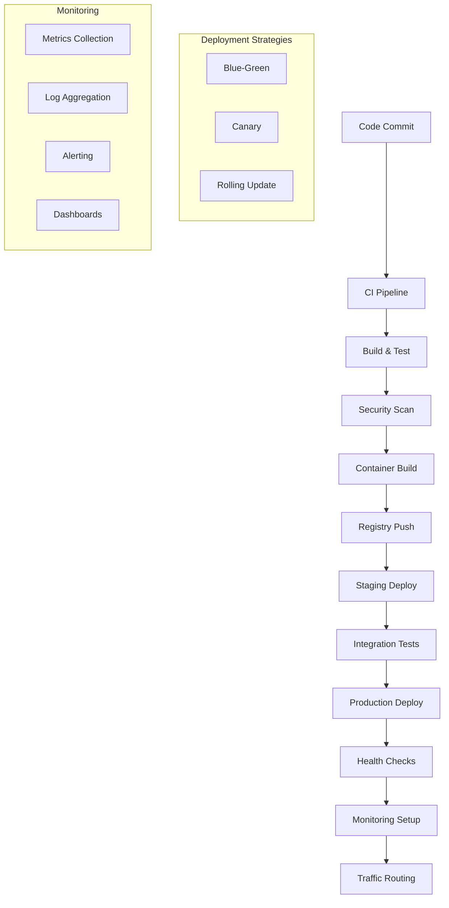

# Instrucciones Operativas: Despliegue y Monitoreo

## Objetivo
Establecer un framework integral para el despliegue automatizado y monitoreo continuo de aplicaciones SAAS, asegurando alta disponibilidad, rendimiento óptimo, y capacidad de respuesta rápida ante incidentes, mediante la coordinación efectiva de agentes AI especializados en DevOps y operaciones.

## Contexto del Proceso
Este documento define los procedimientos operativos para la gestión completa del ciclo de vida de despliegue y operaciones, desde la preparación del release hasta el monitoreo en producción, integrando prácticas de DevOps, SRE (Site Reliability Engineering), y observabilidad moderna.

## Roles y Responsabilidades

### Agentes AI Especializados
- **DevOps Expert Agent**: Automatización de despliegues, infraestructura como código
- **CTO Agent**: Supervisión arquitectural, decisiones de infraestructura críticas
- **QA Expert Agent**: Validación post-despliegue, testing en producción
- **Senior Python Developer Agent**: Soporte técnico, debugging de aplicaciones

### Roles de Soporte
- **Site Reliability Engineer (SRE)**: Confiabilidad del sistema, SLOs/SLIs
- **Security Engineer**: Validación de seguridad, compliance
- **Product Owner**: Validación de funcionalidad, rollback decisions

## Framework de Despliegue

### 1. Arquitectura de Despliegue


### 2. Deployment Pipeline System
```python
# Sistema de pipeline de despliegue
class DeploymentPipeline:
    def __init__(self, environment: str):
        self.environment = environment
        self.stages = self.initialize_stages()
        self.deployment_strategy = self.determine_strategy()
        self.monitoring = MonitoringSystem()
        self.rollback_manager = RollbackManager()
    
    def initialize_stages(self) -> List[DeploymentStage]:
        """Inicializar etapas del pipeline"""
        return [
            PreDeploymentStage(),
            BuildStage(),
            SecurityStage(),
            TestingStage(),
            DeploymentStage(),
            PostDeploymentStage(),
            MonitoringStage()
        ]
    
    def execute_deployment(self, release: Release) -> DeploymentResult:
        """Ejecutar despliegue completo"""
        
        deployment_context = DeploymentContext(
            release=release,
            environment=self.environment,
            strategy=self.deployment_strategy,
            timestamp=datetime.now()
        )
        
        # Pre-deployment validation
        pre_validation = self.validate_pre_deployment(deployment_context)
        if not pre_validation.success:
            return DeploymentResult(
                status="FAILED",
                stage="PRE_DEPLOYMENT",
                error=pre_validation.error
            )
        
        # Execute deployment stages
        stage_results = []
        for stage in self.stages:
            try:
                result = stage.execute(deployment_context)
                stage_results.append(result)
                
                if not result.success:
                    # Trigger rollback if stage fails
                    rollback_result = self.rollback_manager.execute_rollback(
                        deployment_context, stage_results
                    )
                    return DeploymentResult(
                        status="FAILED",
                        stage=stage.name,
                        error=result.error,
                        rollback=rollback_result
                    )
                    
            except Exception as e:
                # Handle unexpected errors
                error_result = self.handle_deployment_error(e, stage, deployment_context)
                return error_result
        
        # Post-deployment monitoring setup
        monitoring_setup = self.setup_post_deployment_monitoring(deployment_context)
        
        return DeploymentResult(
            status="SUCCESS",
            stage_results=stage_results,
            monitoring_setup=monitoring_setup,
            deployment_context=deployment_context
        )
    
    def validate_pre_deployment(self, context: DeploymentContext) -> ValidationResult:
        """Validar condiciones pre-despliegue"""
        validations = [
            self.validate_infrastructure_readiness(),
            self.validate_dependencies(),
            self.validate_security_requirements(),
            self.validate_rollback_capability(),
            self.validate_monitoring_readiness()
        ]
        
        failed_validations = [v for v in validations if not v.success]
        
        return ValidationResult(
            success=len(failed_validations) == 0,
            validations=validations,
            failed_validations=failed_validations
        )
```

### 3. Deployment Strategies
```python
class DeploymentStrategyManager:
    def __init__(self):
        self.strategies = {
            'blue_green': BlueGreenStrategy(),
            'canary': CanaryStrategy(),
            'rolling': RollingUpdateStrategy(),
            'recreate': RecreateStrategy()
        }
    
    def execute_blue_green_deployment(self, context: DeploymentContext) -> StrategyResult:
        """Ejecutar despliegue Blue-Green"""
        
        # Prepare green environment
        green_env = self.prepare_green_environment(context)
        
        # Deploy to green
        green_deployment = self.deploy_to_green(context, green_env)
        
        # Validate green environment
        green_validation = self.validate_green_environment(green_env)
        
        if green_validation.success:
            # Switch traffic to green
            traffic_switch = self.switch_traffic_to_green(green_env)
            
            # Monitor for issues
            monitoring_result = self.monitor_post_switch(green_env, duration_minutes=10)
            
            if monitoring_result.success:
                # Decommission blue environment
                blue_cleanup = self.cleanup_blue_environment(context)
                return StrategyResult(
                    success=True,
                    strategy="blue_green",
                    green_env=green_env,
                    cleanup=blue_cleanup
                )
            else:
                # Rollback to blue
                rollback = self.rollback_to_blue(context)
                return StrategyResult(
                    success=False,
                    strategy="blue_green",
                    error="Post-switch monitoring failed",
                    rollback=rollback
                )
        else:
            return StrategyResult(
                success=False,
                strategy="blue_green",
                error="Green environment validation failed"
            )
    
    def execute_canary_deployment(self, context: DeploymentContext) -> StrategyResult:
        """Ejecutar despliegue Canary"""
        
        canary_config = CanaryConfig(
            initial_traffic_percentage=5,
            increment_percentage=10,
            increment_interval_minutes=15,
            max_traffic_percentage=100,
            success_criteria=self.define_canary_success_criteria()
        )
        
        # Deploy canary version
        canary_deployment = self.deploy_canary_version(context, canary_config)
        
        # Progressive traffic routing
        traffic_progression = self.execute_progressive_traffic_routing(
            context, canary_config
        )
        
        return StrategyResult(
            success=traffic_progression.success,
            strategy="canary",
            canary_config=canary_config,
            traffic_progression=traffic_progression
        )
    
    def define_canary_success_criteria(self) -> CanarySuccessCriteria:
        """Definir criterios de éxito para canary"""
        return CanarySuccessCriteria(
            error_rate_threshold=0.01,  # 1% error rate
            response_time_p95_threshold=500,  # 500ms P95
            cpu_utilization_threshold=80,  # 80% CPU
            memory_utilization_threshold=85,  # 85% Memory
            custom_metrics=[
                CustomMetric("business_conversion_rate", ">", 0.95),
                CustomMetric("user_satisfaction_score", ">", 4.0)
            ]
        )
```

## Infraestructura como Código (IaC)

### 1. Terraform Configuration Management
```python
class TerraformManager:
    def __init__(self, environment: str):
        self.environment = environment
        self.terraform_client = TerraformClient()
        self.state_manager = TerraformStateManager()
    
    def deploy_infrastructure(self, infrastructure_config: InfrastructureConfig) -> InfrastructureResult:
        """Desplegar infraestructura usando Terraform"""
        
        # Generate Terraform configuration
        tf_config = self.generate_terraform_config(infrastructure_config)
        
        # Validate configuration
        validation = self.terraform_client.validate(tf_config)
        if not validation.success:
            return InfrastructureResult(
                success=False,
                error="Terraform validation failed",
                validation_errors=validation.errors
            )
        
        # Plan infrastructure changes
        plan_result = self.terraform_client.plan(tf_config)
        
        # Apply infrastructure changes
        apply_result = self.terraform_client.apply(plan_result)
        
        # Update state management
        state_update = self.state_manager.update_state(apply_result)
        
        return InfrastructureResult(
            success=apply_result.success,
            plan=plan_result,
            apply_result=apply_result,
            state_update=state_update
        )
    
    def generate_terraform_config(self, config: InfrastructureConfig) -> TerraformConfig:
        """Generar configuración de Terraform"""
        
        # Base infrastructure
        base_config = self.generate_base_infrastructure(config)
        
        # Application-specific resources
        app_config = self.generate_application_resources(config)
        
        # Monitoring and logging
        monitoring_config = self.generate_monitoring_resources(config)
        
        # Security resources
        security_config = self.generate_security_resources(config)
        
        return TerraformConfig(
            base=base_config,
            application=app_config,
            monitoring=monitoring_config,
            security=security_config
        )
```

### 2. Kubernetes Deployment Management
```yaml
# Kubernetes deployment configuration
apiVersion: apps/v1
kind: Deployment
metadata:
  name: saas-application
  namespace: production
  labels:
    app: saas-application
    version: v1.2.3
    environment: production
spec:
  replicas: 3
  strategy:
    type: RollingUpdate
    rollingUpdate:
      maxSurge: 1
      maxUnavailable: 0
  selector:
    matchLabels:
      app: saas-application
  template:
    metadata:
      labels:
        app: saas-application
        version: v1.2.3
    spec:
      containers:
      - name: application
        image: registry.company.com/saas-application:v1.2.3
        ports:
        - containerPort: 8000
        env:
        - name: DATABASE_URL
          valueFrom:
            secretKeyRef:
              name: database-secret
              key: url
        - name: REDIS_URL
          valueFrom:
            configMapKeyRef:
              name: redis-config
              key: url
        resources:
          requests:
            memory: "256Mi"
            cpu: "250m"
          limits:
            memory: "512Mi"
            cpu: "500m"
        livenessProbe:
          httpGet:
            path: /health
            port: 8000
          initialDelaySeconds: 30
          periodSeconds: 10
        readinessProbe:
          httpGet:
            path: /ready
            port: 8000
          initialDelaySeconds: 5
          periodSeconds: 5
```

```python
class KubernetesDeploymentManager:
    def __init__(self, cluster_config: ClusterConfig):
        self.k8s_client = KubernetesClient(cluster_config)
        self.helm_client = HelmClient()
        self.deployment_monitor = DeploymentMonitor()
    
    def deploy_application(self, deployment_spec: DeploymentSpec) -> K8sDeploymentResult:
        """Desplegar aplicación en Kubernetes"""
        
        # Prepare namespace
        namespace_result = self.prepare_namespace(deployment_spec.namespace)
        
        # Apply ConfigMaps and Secrets
        config_result = self.apply_configurations(deployment_spec)
        
        # Deploy application
        deployment_result = self.k8s_client.apply_deployment(deployment_spec.deployment)
        
        # Deploy services
        service_result = self.k8s_client.apply_service(deployment_spec.service)
        
        # Configure ingress
        ingress_result = self.k8s_client.apply_ingress(deployment_spec.ingress)
        
        # Monitor deployment rollout
        rollout_status = self.monitor_deployment_rollout(deployment_spec)
        
        return K8sDeploymentResult(
            namespace=namespace_result,
            config=config_result,
            deployment=deployment_result,
            service=service_result,
            ingress=ingress_result,
            rollout_status=rollout_status
        )
    
    def monitor_deployment_rollout(self, deployment_spec: DeploymentSpec) -> RolloutStatus:
        """Monitorear el rollout del despliegue"""
        
        timeout_minutes = 10
        start_time = datetime.now()
        
        while (datetime.now() - start_time).seconds < timeout_minutes * 60:
            status = self.k8s_client.get_deployment_status(
                deployment_spec.deployment.metadata.name,
                deployment_spec.namespace
            )
            
            if status.ready_replicas == status.desired_replicas:
                return RolloutStatus(
                    success=True,
                    ready_replicas=status.ready_replicas,
                    desired_replicas=status.desired_replicas,
                    duration=datetime.now() - start_time
                )
            
            time.sleep(10)  # Wait 10 seconds before checking again
        
        return RolloutStatus(
            success=False,
            error="Deployment rollout timeout",
            ready_replicas=status.ready_replicas,
            desired_replicas=status.desired_replicas
        )
```

## Sistema de Monitoreo Integral

### 1. Observability Stack
```python
class ObservabilityManager:
    def __init__(self):
        self.metrics_collector = PrometheusCollector()
        self.log_aggregator = ELKStackManager()
        self.trace_collector = JaegerCollector()
        self.alert_manager = AlertManager()
        self.dashboard_manager = GrafanaDashboardManager()
    
    def setup_application_monitoring(self, app_config: ApplicationConfig) -> MonitoringSetup:
        """Configurar monitoreo para aplicación"""
        
        # Setup metrics collection
        metrics_setup = self.setup_metrics_collection(app_config)
        
        # Setup log aggregation
        logging_setup = self.setup_log_aggregation(app_config)
        
        # Setup distributed tracing
        tracing_setup = self.setup_distributed_tracing(app_config)
        
        # Setup alerting rules
        alerting_setup = self.setup_alerting_rules(app_config)
        
        # Create dashboards
        dashboard_setup = self.create_monitoring_dashboards(app_config)
        
        return MonitoringSetup(
            metrics=metrics_setup,
            logging=logging_setup,
            tracing=tracing_setup,
            alerting=alerting_setup,
            dashboards=dashboard_setup
        )
    
    def setup_metrics_collection(self, app_config: ApplicationConfig) -> MetricsSetup:
        """Configurar recolección de métricas"""
        
        # Application metrics
        app_metrics = [
            Metric("http_requests_total", "counter", ["method", "endpoint", "status"]),
            Metric("http_request_duration_seconds", "histogram", ["method", "endpoint"]),
            Metric("database_connections_active", "gauge", ["database"]),
            Metric("cache_hits_total", "counter", ["cache_type"]),
            Metric("business_events_total", "counter", ["event_type"])
        ]
        
        # Infrastructure metrics
        infra_metrics = [
            Metric("cpu_usage_percent", "gauge", ["instance"]),
            Metric("memory_usage_bytes", "gauge", ["instance"]),
            Metric("disk_usage_percent", "gauge", ["instance", "mount"]),
            Metric("network_bytes_total", "counter", ["instance", "direction"])
        ]
        
        # Configure Prometheus scraping
        prometheus_config = self.metrics_collector.configure_scraping(
            app_config, app_metrics + infra_metrics
        )
        
        return MetricsSetup(
            application_metrics=app_metrics,
            infrastructure_metrics=infra_metrics,
            prometheus_config=prometheus_config
        )
```

### 2. Alerting and Notification System
```python
class AlertingSystem:
    def __init__(self):
        self.alert_rules = self.load_alert_rules()
        self.notification_channels = self.setup_notification_channels()
        self.escalation_policies = self.load_escalation_policies()
    
    def setup_alert_rules(self, app_config: ApplicationConfig) -> List[AlertRule]:
        """Configurar reglas de alertas"""
        
        # SLI-based alerts
        sli_alerts = [
            AlertRule(
                name="High Error Rate",
                query="rate(http_requests_total{status=~'5..'}[5m]) > 0.01",
                severity="critical",
                duration="2m",
                description="Error rate above 1% for 2 minutes"
            ),
            AlertRule(
                name="High Response Time",
                query="histogram_quantile(0.95, rate(http_request_duration_seconds_bucket[5m])) > 0.5",
                severity="warning",
                duration="5m",
                description="95th percentile response time above 500ms"
            ),
            AlertRule(
                name="Low Availability",
                query="up == 0",
                severity="critical",
                duration="1m",
                description="Service is down"
            )
        ]
        
        # Resource-based alerts
        resource_alerts = [
            AlertRule(
                name="High CPU Usage",
                query="cpu_usage_percent > 80",
                severity="warning",
                duration="10m",
                description="CPU usage above 80% for 10 minutes"
            ),
            AlertRule(
                name="High Memory Usage",
                query="memory_usage_percent > 85",
                severity="warning",
                duration="5m",
                description="Memory usage above 85%"
            ),
            AlertRule(
                name="Disk Space Low",
                query="disk_usage_percent > 90",
                severity="critical",
                duration="1m",
                description="Disk usage above 90%"
            )
        ]
        
        # Business-specific alerts
        business_alerts = [
            AlertRule(
                name="Low Conversion Rate",
                query="rate(business_events_total{event_type='conversion'}[1h]) < 0.02",
                severity="warning",
                duration="30m",
                description="Conversion rate below 2% for 30 minutes"
            ),
            AlertRule(
                name="Payment Processing Issues",
                query="rate(business_events_total{event_type='payment_failed'}[5m]) > 0.05",
                severity="critical",
                duration="2m",
                description="Payment failure rate above 5%"
            )
        ]
        
        return sli_alerts + resource_alerts + business_alerts
    
    def handle_alert(self, alert: Alert) -> AlertHandlingResult:
        """Manejar alerta activada"""
        
        # Enrich alert with context
        enriched_alert = self.enrich_alert_context(alert)
        
        # Determine notification channels
        channels = self.determine_notification_channels(enriched_alert)
        
        # Send notifications
        notification_results = []
        for channel in channels:
            result = channel.send_notification(enriched_alert)
            notification_results.append(result)
        
        # Create incident if critical
        incident = None
        if enriched_alert.severity == "critical":
            incident = self.create_incident(enriched_alert)
        
        # Log alert handling
        self.log_alert_handling(enriched_alert, notification_results, incident)
        
        return AlertHandlingResult(
            alert=enriched_alert,
            notifications=notification_results,
            incident=incident
        )
```

### 3. Performance Monitoring
```python
class PerformanceMonitor:
    def __init__(self):
        self.apm_client = APMClient()
        self.synthetic_monitor = SyntheticMonitor()
        self.rum_collector = RealUserMonitoringCollector()
    
    def setup_performance_monitoring(self, app_config: ApplicationConfig) -> PerformanceMonitoringSetup:
        """Configurar monitoreo de rendimiento"""
        
        # Application Performance Monitoring (APM)
        apm_setup = self.setup_apm_monitoring(app_config)
        
        # Synthetic monitoring
        synthetic_setup = self.setup_synthetic_monitoring(app_config)
        
        # Real User Monitoring (RUM)
        rum_setup = self.setup_rum_monitoring(app_config)
        
        # Performance budgets
        budget_setup = self.setup_performance_budgets(app_config)
        
        return PerformanceMonitoringSetup(
            apm=apm_setup,
            synthetic=synthetic_setup,
            rum=rum_setup,
            budgets=budget_setup
        )
    
    def setup_synthetic_monitoring(self, app_config: ApplicationConfig) -> SyntheticMonitoringSetup:
        """Configurar monitoreo sintético"""
        
        # Define synthetic tests
        synthetic_tests = [
            SyntheticTest(
                name="Homepage Load Test",
                url=f"{app_config.base_url}/",
                frequency_minutes=5,
                locations=["us-east-1", "eu-west-1", "ap-southeast-1"],
                assertions=[
                    Assertion("response_time", "<", 2000),
                    Assertion("status_code", "==", 200),
                    Assertion("content_contains", "Welcome")
                ]
            ),
            SyntheticTest(
                name="API Health Check",
                url=f"{app_config.base_url}/api/health",
                frequency_minutes=1,
                locations=["us-east-1", "eu-west-1"],
                assertions=[
                    Assertion("response_time", "<", 500),
                    Assertion("status_code", "==", 200),
                    Assertion("json_path", "$.status", "healthy")
                ]
            ),
            SyntheticTest(
                name="User Journey Test",
                type="browser",
                script=self.generate_user_journey_script(),
                frequency_minutes=15,
                locations=["us-east-1"],
                assertions=[
                    Assertion("journey_completion", "==", True),
                    Assertion("total_time", "<", 30000)
                ]
            )
        ]
        
        # Configure synthetic monitoring
        for test in synthetic_tests:
            self.synthetic_monitor.create_test(test)
        
        return SyntheticMonitoringSetup(tests=synthetic_tests)
```

## Gestión de Incidentes y Respuesta

### 1. Incident Response Framework
```python
class IncidentResponseManager:
    def __init__(self):
        self.incident_classifier = IncidentClassifier()
        self.response_orchestrator = ResponseOrchestrator()
        self.communication_manager = IncidentCommunicationManager()
        self.postmortem_manager = PostmortemManager()
    
    def handle_incident(self, incident: Incident) -> IncidentResponse:
        """Manejar incidente completo"""
        
        # Classify incident
        classification = self.incident_classifier.classify(incident)
        
        # Assemble response team
        response_team = self.assemble_response_team(classification)
        
        # Create war room
        war_room = self.communication_manager.create_war_room(incident, response_team)
        
        # Execute response plan
        response_execution = self.response_orchestrator.execute_response(
            incident, classification, response_team
        )
        
        # Manage communications
        communication_updates = self.manage_incident_communications(
            incident, response_execution
        )
        
        # Post-incident activities
        postmortem = self.postmortem_manager.initiate_postmortem(incident)
        
        return IncidentResponse(
            incident=incident,
            classification=classification,
            response_team=response_team,
            war_room=war_room,
            execution=response_execution,
            communications=communication_updates,
            postmortem=postmortem
        )
    
    def assemble_response_team(self, classification: IncidentClassification) -> ResponseTeam:
        """Ensamblar equipo de respuesta"""
        
        team_members = []
        
        # Always include incident commander
        team_members.append(self.get_incident_commander())
        
        # Add specialists based on incident type
        if classification.category == "infrastructure":
            team_members.append(self.get_devops_expert())
            team_members.append(self.get_sre_engineer())
        
        if classification.category == "application":
            team_members.append(self.get_senior_developer())
            team_members.append(self.get_application_expert())
        
        if classification.severity in ["P0", "P1"]:
            team_members.append(self.get_cto_agent())
            team_members.append(self.get_product_owner())
        
        # Add communication lead for customer-facing incidents
        if classification.customer_impact:
            team_members.append(self.get_communication_lead())
        
        return ResponseTeam(members=team_members, classification=classification)
```

### 2. Rollback and Recovery Procedures
```python
class RollbackManager:
    def __init__(self):
        self.deployment_history = DeploymentHistory()
        self.rollback_strategies = self.initialize_rollback_strategies()
        self.recovery_procedures = self.load_recovery_procedures()
    
    def execute_emergency_rollback(self, incident: Incident) -> RollbackResult:
        """Ejecutar rollback de emergencia"""
        
        # Identify last known good deployment
        last_good_deployment = self.deployment_history.get_last_stable_deployment()
        
        # Determine rollback strategy
        rollback_strategy = self.determine_rollback_strategy(incident, last_good_deployment)
        
        # Execute rollback
        rollback_execution = self.execute_rollback_strategy(
            rollback_strategy, last_good_deployment
        )
        
        # Validate rollback success
        validation_result = self.validate_rollback_success(rollback_execution)
        
        # Update monitoring and alerting
        monitoring_update = self.update_post_rollback_monitoring(rollback_execution)
        
        return RollbackResult(
            strategy=rollback_strategy,
            execution=rollback_execution,
            validation=validation_result,
            monitoring_update=monitoring_update
        )
    
    def determine_rollback_strategy(self, incident: Incident, 
                                  last_good_deployment: Deployment) -> RollbackStrategy:
        """Determinar estrategia de rollback"""
        
        # Consider incident severity
        if incident.severity == "P0":
            return RollbackStrategy(
                type="immediate",
                method="blue_green_switch",
                validation_level="minimal"
            )
        
        # Consider deployment age
        deployment_age = datetime.now() - last_good_deployment.timestamp
        if deployment_age.hours > 24:
            return RollbackStrategy(
                type="careful",
                method="rolling_rollback",
                validation_level="comprehensive"
            )
        
        # Default strategy
        return RollbackStrategy(
            type="standard",
            method="rolling_rollback",
            validation_level="standard"
        )
```

## Optimización de Rendimiento

### 1. Performance Optimization Framework
```python
class PerformanceOptimizer:
    def __init__(self):
        self.profiler = ApplicationProfiler()
        self.load_tester = LoadTester()
        self.optimization_engine = OptimizationEngine()
    
    def analyze_performance_bottlenecks(self, app_config: ApplicationConfig) -> PerformanceAnalysis:
        """Analizar cuellos de botella de rendimiento"""
        
        # Application profiling
        profiling_results = self.profiler.profile_application(app_config)
        
        # Load testing
        load_test_results = self.load_tester.execute_load_tests(app_config)
        
        # Database performance analysis
        db_analysis = self.analyze_database_performance(app_config)
        
        # Infrastructure analysis
        infra_analysis = self.analyze_infrastructure_performance(app_config)
        
        # Identify bottlenecks
        bottlenecks = self.identify_bottlenecks(
            profiling_results, load_test_results, db_analysis, infra_analysis
        )
        
        return PerformanceAnalysis(
            profiling=profiling_results,
            load_testing=load_test_results,
            database=db_analysis,
            infrastructure=infra_analysis,
            bottlenecks=bottlenecks
        )
    
    def generate_optimization_recommendations(self, analysis: PerformanceAnalysis) -> List[OptimizationRecommendation]:
        """Generar recomendaciones de optimización"""
        
        recommendations = []
        
        for bottleneck in analysis.bottlenecks:
            recommendation = self.optimization_engine.generate_recommendation(bottleneck)
            recommendations.append(recommendation)
        
        # Prioritize recommendations
        prioritized_recommendations = self.prioritize_recommendations(recommendations)
        
        return prioritized_recommendations
```

### 2. Auto-scaling Configuration
```yaml
# Horizontal Pod Autoscaler configuration
apiVersion: autoscaling/v2
kind: HorizontalPodAutoscaler
metadata:
  name: saas-application-hpa
  namespace: production
spec:
  scaleTargetRef:
    apiVersion: apps/v1
    kind: Deployment
    name: saas-application
  minReplicas: 3
  maxReplicas: 20
  metrics:
  - type: Resource
    resource:
      name: cpu
      target:
        type: Utilization
        averageUtilization: 70
  - type: Resource
    resource:
      name: memory
      target:
        type: Utilization
        averageUtilization: 80
  - type: Pods
    pods:
      metric:
        name: http_requests_per_second
      target:
        type: AverageValue
        averageValue: "100"
  behavior:
    scaleUp:
      stabilizationWindowSeconds: 60
      policies:
      - type: Percent
        value: 50
        periodSeconds: 60
    scaleDown:
      stabilizationWindowSeconds: 300
      policies:
      - type: Percent
        value: 10
        periodSeconds: 60
```

## Seguridad en Despliegue

### 1. Security Scanning Pipeline
```python
class SecurityScanner:
    def __init__(self):
        self.vulnerability_scanner = VulnerabilityScanner()
        self.secret_scanner = SecretScanner()
        self.compliance_checker = ComplianceChecker()
        self.security_policy_engine = SecurityPolicyEngine()
    
    def execute_security_scan(self, deployment_artifact: DeploymentArtifact) -> SecurityScanResult:
        """Ejecutar escaneo de seguridad completo"""
        
        # Container vulnerability scanning
        vulnerability_scan = self.vulnerability_scanner.scan_container(
            deployment_artifact.container_image
        )
        
        # Secret scanning
        secret_scan = self.secret_scanner.scan_for_secrets(
            deployment_artifact.source_code
        )
        
        # Compliance checking
        compliance_scan = self.compliance_checker.check_compliance(
            deployment_artifact, ["SOC2", "GDPR", "PCI-DSS"]
        )
        
        # Security policy validation
        policy_validation = self.security_policy_engine.validate_policies(
            deployment_artifact
        )
        
        # Consolidate results
        overall_result = self.consolidate_security_results([
            vulnerability_scan,
            secret_scan,
            compliance_scan,
            policy_validation
        ])
        
        return SecurityScanResult(
            vulnerability_scan=vulnerability_scan,
            secret_scan=secret_scan,
            compliance_scan=compliance_scan,
            policy_validation=policy_validation,
            overall_result=overall_result
        )
```

## Mejores Prácticas

### Para Despliegue
1. **Automatización Completa**: Automatizar todo el pipeline de despliegue
2. **Despliegues Inmutables**: Usar contenedores inmutables
3. **Rollback Rápido**: Mantener capacidad de rollback en <5 minutos
4. **Testing en Producción**: Implementar canary deployments y feature flags

### Para Monitoreo
1. **Observabilidad Completa**: Métricas, logs, y trazas
2. **SLIs/SLOs Claros**: Definir indicadores y objetivos de nivel de servicio
3. **Alertas Accionables**: Solo alertas que requieren acción humana
4. **Dashboards Contextuales**: Dashboards específicos por rol y situación

### Para Operaciones
1. **Runbooks Actualizados**: Procedimientos operativos documentados
2. **Incident Response**: Procesos claros de respuesta a incidentes
3. **Postmortems Sin Culpa**: Aprender de incidentes sin asignar culpa
4. **Mejora Continua**: Iterar y mejorar procesos regularmente

**Recuerda**: El despliegue y monitoreo efectivos son fundamentales para mantener la confiabilidad y rendimiento de aplicaciones SAAS. La automatización, observabilidad, y respuesta rápida a incidentes son claves para el éxito operacional.