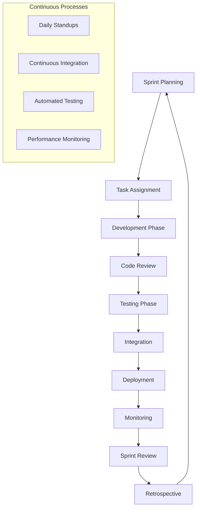

# Instrucciones Operativas: Gestionar Flujo de Trabajo de Desarrollo

## Objetivo
Establecer un sistema integral de gestión del flujo de trabajo de desarrollo que coordine eficientemente a todos los agentes AI especializados, optimice la productividad del equipo, y asegure la entrega de productos de alta calidad siguiendo las mejores prácticas de desarrollo ágil y DevOps.

## Contexto del Proceso
Este documento define el framework operativo para la gestión completa del ciclo de vida de desarrollo de software, desde la planificación inicial hasta el despliegue en producción, integrando múltiples agentes AI especializados en un flujo de trabajo cohesivo y eficiente.

## Roles y Responsabilidades

### Agentes AI Especializados
- **CTO Agent**: Liderazgo técnico, arquitectura, y decisiones estratégicas
- **Senior Python Developer Agent**: Desarrollo backend, APIs, y lógica de negocio
- **QA Expert Agent**: Testing automatizado, calidad, y validación
- **DevOps Expert Agent**: Infraestructura, despliegue, y operaciones

### Roles de Coordinación
- **Scrum Master/Project Manager**: Facilitación y coordinación del proceso
- **Product Owner**: Priorización y definición de requisitos
- **Tech Lead**: Coordinación técnica y mentoring

## Framework de Gestión de Workflow

### 1. Arquitectura del Workflow


### 2. Sprint Management System
```python
# Sistema de gestión de sprints
class SprintManager:
    def __init__(self, sprint_duration: int = 14):
        self.sprint_duration = sprint_duration
        self.current_sprint = None
        self.agents = self.initialize_agents()
        self.metrics = SprintMetrics()
    
    def initialize_sprint(self, sprint_goals: List[str], backlog_items: List[BacklogItem]) -> Sprint:
        """Inicializar nuevo sprint"""
        sprint = Sprint(
            id=self.generate_sprint_id(),
            goals=sprint_goals,
            duration=self.sprint_duration,
            start_date=datetime.now(),
            backlog_items=backlog_items
        )
        
        # Asignar tareas a agentes
        task_assignments = self.assign_tasks_to_agents(backlog_items)
        sprint.task_assignments = task_assignments
        
        # Configurar métricas y tracking
        self.setup_sprint_tracking(sprint)
        
        self.current_sprint = sprint
        return sprint
    
    def assign_tasks_to_agents(self, backlog_items: List[BacklogItem]) -> Dict[str, List[Task]]:
        """Asignar tareas a agentes especializados"""
        assignments = {
            'cto_agent': [],
            'developer_agent': [],
            'qa_agent': [],
            'devops_agent': []
        }
        
        for item in backlog_items:
            tasks = self.decompose_backlog_item(item)
            
            for task in tasks:
                agent = self.determine_primary_agent(task)
                assignments[agent].append(task)
        
        return assignments
    
    def determine_primary_agent(self, task: Task) -> str:
        """Determinar agente principal para una tarea"""
        task_type_mapping = {
            'architecture': 'cto_agent',
            'backend_development': 'developer_agent',
            'api_development': 'developer_agent',
            'database_design': 'developer_agent',
            'testing': 'qa_agent',
            'quality_assurance': 'qa_agent',
            'infrastructure': 'devops_agent',
            'deployment': 'devops_agent',
            'monitoring': 'devops_agent'
        }
        
        return task_type_mapping.get(task.type, 'developer_agent')
```

### 3. Task Coordination System
```python
class TaskCoordinator:
    def __init__(self):
        self.task_queue = TaskQueue()
        self.dependency_graph = DependencyGraph()
        self.agent_workload = AgentWorkloadManager()
    
    def coordinate_task_execution(self, sprint: Sprint) -> ExecutionPlan:
        """Coordinar ejecución de tareas del sprint"""
        
        # Analizar dependencias
        dependency_analysis = self.analyze_dependencies(sprint.tasks)
        
        # Crear plan de ejecución
        execution_plan = self.create_execution_plan(
            tasks=sprint.tasks,
            dependencies=dependency_analysis,
            agent_capacity=self.agent_workload.get_capacity()
        )
        
        # Optimizar plan
        optimized_plan = self.optimize_execution_plan(execution_plan)
        
        return optimized_plan
    
    def create_execution_plan(self, tasks: List[Task], dependencies: DependencyGraph, 
                            agent_capacity: Dict[str, int]) -> ExecutionPlan:
        """Crear plan de ejecución optimizado"""
        
        # Algoritmo de scheduling considerando dependencias y capacidad
        scheduled_tasks = []
        current_time = 0
        
        while tasks:
            # Encontrar tareas que pueden ejecutarse (sin dependencias pendientes)
            ready_tasks = self.find_ready_tasks(tasks, dependencies)
            
            # Asignar tareas a agentes disponibles
            for task in ready_tasks:
                agent = self.find_available_agent(task, agent_capacity, current_time)
                if agent:
                    scheduled_task = ScheduledTask(
                        task=task,
                        agent=agent,
                        start_time=current_time,
                        estimated_duration=task.estimated_hours
                    )
                    scheduled_tasks.append(scheduled_task)
                    tasks.remove(task)
            
            current_time += 1  # Incrementar tiempo
        
        return ExecutionPlan(scheduled_tasks=scheduled_tasks)
```

## Procesos de Desarrollo Detallados

### 1. Sprint Planning Process
```markdown
## Sprint Planning Workflow

### Pre-Planning (1 día antes)
- [ ] **Backlog Refinement**
  - Product Owner revisa y prioriza backlog
  - CTO Agent evalúa complejidad técnica
  - QA Agent identifica criterios de testing
  - DevOps Agent evalúa requisitos de infraestructura

- [ ] **Capacity Planning**
  - Evaluar disponibilidad de cada agente
  - Considerar días festivos y mantenimiento
  - Ajustar velocity basado en sprints anteriores

### Sprint Planning Meeting (4 horas)
#### Parte 1: ¿Qué vamos a hacer? (2 horas)
- [ ] **Review Sprint Goal**
  - Product Owner presenta objetivos del sprint
  - Alineación con roadmap del producto
  - Métricas de éxito definidas

- [ ] **Backlog Item Selection**
  - Seleccionar items basado en prioridad y capacidad
  - CTO Agent valida viabilidad técnica
  - Estimación inicial de esfuerzo

#### Parte 2: ¿Cómo lo vamos a hacer? (2 horas)
- [ ] **Task Breakdown**
  - Descomponer user stories en tareas técnicas
  - Identificar dependencias entre tareas
  - Asignar tareas a agentes especializados

- [ ] **Definition of Done Review**
  - Revisar y actualizar criterios de completitud
  - Alinear expectativas de calidad
  - Definir criterios de aceptación específicos
```

### 2. Daily Development Workflow
```python
class DailyWorkflowManager:
    def __init__(self):
        self.agents = self.initialize_agents()
        self.communication_hub = CommunicationHub()
        self.progress_tracker = ProgressTracker()
    
    def execute_daily_workflow(self) -> DailyWorkflowResult:
        """Ejecutar workflow diario"""
        
        # Morning standup
        standup_result = self.conduct_daily_standup()
        
        # Work execution
        work_sessions = []
        for agent in self.agents:
            session = self.execute_agent_work_session(agent)
            work_sessions.append(session)
        
        # Continuous integration
        ci_results = self.run_continuous_integration()
        
        # End of day sync
        eod_sync = self.conduct_end_of_day_sync()
        
        return DailyWorkflowResult(
            standup=standup_result,
            work_sessions=work_sessions,
            ci_results=ci_results,
            eod_sync=eod_sync
        )
    
    def conduct_daily_standup(self) -> StandupResult:
        """Conducir daily standup"""
        standup_data = {}
        
        for agent in self.agents:
            agent_update = agent.provide_daily_update()
            standup_data[agent.name] = {
                'yesterday': agent_update.completed_tasks,
                'today': agent_update.planned_tasks,
                'blockers': agent_update.blockers,
                'help_needed': agent_update.help_requests
            }
        
        # Identificar y resolver blockers
        blockers = self.identify_cross_agent_blockers(standup_data)
        blocker_resolutions = self.resolve_blockers(blockers)
        
        return StandupResult(
            agent_updates=standup_data,
            blockers=blockers,
            resolutions=blocker_resolutions
        )
    
    def execute_agent_work_session(self, agent: Agent) -> WorkSession:
        """Ejecutar sesión de trabajo para un agente"""
        session = WorkSession(agent=agent, start_time=datetime.now())
        
        # Obtener tareas asignadas
        assigned_tasks = self.get_agent_tasks(agent)
        
        # Ejecutar tareas
        for task in assigned_tasks:
            if self.can_execute_task(task):
                result = agent.execute_task(task)
                session.add_task_result(result)
                
                # Trigger follow-up actions
                self.handle_task_completion(task, result)
        
        session.end_time = datetime.now()
        return session
```

### 3. Code Review and Quality Gates
```python
class CodeReviewManager:
    def __init__(self):
        self.review_agents = [
            'cto_agent',
            'senior_developer_agent',
            'qa_agent'
        ]
        self.quality_gates = self.setup_quality_gates()
    
    def setup_quality_gates(self) -> List[QualityGate]:
        """Configurar quality gates"""
        return [
            QualityGate(
                name="Code Quality",
                checks=[
                    "Code coverage > 80%",
                    "No critical security vulnerabilities",
                    "Code complexity within limits",
                    "Documentation updated"
                ]
            ),
            QualityGate(
                name="Functional Testing",
                checks=[
                    "All unit tests pass",
                    "Integration tests pass",
                    "API tests pass",
                    "User acceptance criteria met"
                ]
            ),
            QualityGate(
                name="Performance",
                checks=[
                    "Response time < 500ms",
                    "Memory usage within limits",
                    "Database queries optimized",
                    "Load testing passed"
                ]
            ),
            QualityGate(
                name="Security",
                checks=[
                    "Security scan passed",
                    "Authentication implemented",
                    "Authorization verified",
                    "Data encryption validated"
                ]
            )
        ]
    
    def execute_code_review(self, pull_request: PullRequest) -> CodeReviewResult:
        """Ejecutar proceso de code review"""
        
        # Automated checks
        automated_results = self.run_automated_checks(pull_request)
        
        # Agent reviews
        agent_reviews = {}
        for agent_name in self.review_agents:
            agent = self.get_agent(agent_name)
            review = agent.review_code(pull_request)
            agent_reviews[agent_name] = review
        
        # Quality gate validation
        quality_results = self.validate_quality_gates(pull_request)
        
        # Consolidate results
        overall_result = self.consolidate_review_results(
            automated_results,
            agent_reviews,
            quality_results
        )
        
        return overall_result
```

## Gestión de Comunicación y Colaboración

### 1. Communication Hub
```python
class CommunicationHub:
    def __init__(self):
        self.channels = {
            'general': GeneralChannel(),
            'technical': TechnicalChannel(),
            'qa': QAChannel(),
            'devops': DevOpsChannel(),
            'alerts': AlertsChannel()
        }
        self.notification_manager = NotificationManager()
    
    def facilitate_agent_communication(self, message: Message) -> CommunicationResult:
        """Facilitar comunicación entre agentes"""
        
        # Determinar canal apropiado
        channel = self.determine_channel(message)
        
        # Identificar agentes relevantes
        relevant_agents = self.identify_relevant_agents(message)
        
        # Distribuir mensaje
        distribution_result = channel.distribute_message(message, relevant_agents)
        
        # Tracking de respuestas
        response_tracking = self.track_responses(message, relevant_agents)
        
        return CommunicationResult(
            message=message,
            channel=channel.name,
            recipients=relevant_agents,
            distribution_result=distribution_result,
            response_tracking=response_tracking
        )
    
    def handle_cross_agent_dependencies(self, dependency: CrossAgentDependency) -> DependencyResolution:
        """Manejar dependencias entre agentes"""
        
        # Notificar a agentes involucrados
        involved_agents = [dependency.dependent_agent, dependency.blocking_agent]
        
        for agent in involved_agents:
            notification = DependencyNotification(
                dependency=dependency,
                agent=agent,
                action_required=self.determine_required_action(agent, dependency)
            )
            self.notification_manager.send_notification(notification)
        
        # Crear plan de resolución
        resolution_plan = self.create_dependency_resolution_plan(dependency)
        
        # Tracking de progreso
        progress_tracker = self.setup_dependency_tracking(dependency, resolution_plan)
        
        return DependencyResolution(
            dependency=dependency,
            plan=resolution_plan,
            tracker=progress_tracker
        )
```

### 2. Knowledge Sharing System
```markdown
## Knowledge Sharing Framework

### Documentation Standards
- [ ] **Code Documentation**
  - Inline comments for complex logic
  - API documentation with examples
  - Architecture decision records (ADRs)
  - Deployment and configuration guides

- [ ] **Process Documentation**
  - Workflow procedures updated
  - Troubleshooting guides maintained
  - Best practices documented
  - Lessons learned captured

### Knowledge Transfer Mechanisms
- [ ] **Daily Standups**
  - Progress updates shared
  - Blockers communicated
  - Knowledge gaps identified
  - Cross-training opportunities

- [ ] **Technical Reviews**
  - Architecture reviews
  - Code review sessions
  - Design pattern discussions
  - Technology evaluation sessions

- [ ] **Sprint Retrospectives**
  - Process improvements identified
  - Tool effectiveness evaluated
  - Communication gaps addressed
  - Success patterns documented
```

## Métricas y Monitoreo

### 1. Sprint Metrics Dashboard
```python
class SprintMetricsCollector:
    def __init__(self):
        self.metrics_store = MetricsStore()
        self.dashboard = SprintDashboard()
    
    def collect_sprint_metrics(self, sprint: Sprint) -> SprintMetrics:
        """Recopilar métricas del sprint"""
        
        # Velocity metrics
        velocity = self.calculate_velocity(sprint)
        
        # Quality metrics
        quality_metrics = self.collect_quality_metrics(sprint)
        
        # Agent performance metrics
        agent_metrics = self.collect_agent_metrics(sprint)
        
        # Collaboration metrics
        collaboration_metrics = self.collect_collaboration_metrics(sprint)
        
        return SprintMetrics(
            sprint_id=sprint.id,
            velocity=velocity,
            quality=quality_metrics,
            agent_performance=agent_metrics,
            collaboration=collaboration_metrics
        )
    
    def calculate_velocity(self, sprint: Sprint) -> VelocityMetrics:
        """Calcular métricas de velocity"""
        return VelocityMetrics(
            planned_story_points=sprint.planned_story_points,
            completed_story_points=sprint.completed_story_points,
            velocity=sprint.completed_story_points,
            velocity_trend=self.calculate_velocity_trend(sprint),
            predictability=self.calculate_predictability(sprint)
        )
    
    def collect_quality_metrics(self, sprint: Sprint) -> QualityMetrics:
        """Recopilar métricas de calidad"""
        return QualityMetrics(
            code_coverage=self.get_code_coverage(),
            bug_count=self.get_bug_count(sprint),
            technical_debt=self.measure_technical_debt(),
            security_vulnerabilities=self.count_security_issues(),
            performance_metrics=self.collect_performance_data()
        )
```

### 2. Real-time Monitoring
```python
class WorkflowMonitor:
    def __init__(self):
        self.monitors = {
            'build_monitor': BuildMonitor(),
            'deployment_monitor': DeploymentMonitor(),
            'performance_monitor': PerformanceMonitor(),
            'error_monitor': ErrorMonitor()
        }
        self.alert_manager = AlertManager()
    
    def monitor_workflow_health(self) -> WorkflowHealthReport:
        """Monitorear salud del workflow"""
        
        health_checks = {}
        
        for monitor_name, monitor in self.monitors.items():
            health_check = monitor.check_health()
            health_checks[monitor_name] = health_check
            
            # Trigger alerts if needed
            if health_check.status == 'CRITICAL':
                alert = self.create_critical_alert(monitor_name, health_check)
                self.alert_manager.send_alert(alert)
        
        overall_health = self.calculate_overall_health(health_checks)
        
        return WorkflowHealthReport(
            timestamp=datetime.now(),
            overall_health=overall_health,
            individual_checks=health_checks,
            recommendations=self.generate_health_recommendations(health_checks)
        )
```

## Gestión de Incidentes y Escalación

### 1. Incident Response Framework
```python
class IncidentManager:
    def __init__(self):
        self.severity_levels = {
            'P0': 'Critical - System down',
            'P1': 'High - Major functionality impacted',
            'P2': 'Medium - Minor functionality impacted',
            'P3': 'Low - Cosmetic or enhancement'
        }
        self.response_teams = self.setup_response_teams()
    
    def handle_incident(self, incident: Incident) -> IncidentResponse:
        """Manejar incidente"""
        
        # Classify incident
        severity = self.classify_incident_severity(incident)
        
        # Assemble response team
        response_team = self.assemble_response_team(severity)
        
        # Create incident response plan
        response_plan = self.create_response_plan(incident, severity)
        
        # Execute response
        response_execution = self.execute_response_plan(response_plan, response_team)
        
        # Track resolution
        resolution_tracking = self.track_incident_resolution(incident, response_execution)
        
        return IncidentResponse(
            incident=incident,
            severity=severity,
            response_team=response_team,
            plan=response_plan,
            execution=response_execution,
            tracking=resolution_tracking
        )
    
    def setup_response_teams(self) -> Dict[str, ResponseTeam]:
        """Configurar equipos de respuesta"""
        return {
            'P0': ResponseTeam([
                'cto_agent',
                'devops_agent',
                'senior_developer_agent',
                'on_call_engineer'
            ]),
            'P1': ResponseTeam([
                'devops_agent',
                'senior_developer_agent',
                'qa_agent'
            ]),
            'P2': ResponseTeam([
                'senior_developer_agent',
                'qa_agent'
            ]),
            'P3': ResponseTeam([
                'senior_developer_agent'
            ])
        }
```

### 2. Escalation Procedures
```markdown
## Escalation Matrix

### Technical Issues
| Issue Type | Initial Response | Escalation Level 1 | Escalation Level 2 |
|------------|------------------|-------------------|-------------------|
| Build Failures | Developer Agent | CTO Agent | Tech Lead |
| Test Failures | QA Agent | Senior Developer | CTO Agent |
| Deployment Issues | DevOps Agent | CTO Agent | Infrastructure Team |
| Performance Issues | Developer Agent | CTO Agent | Performance Team |

### Process Issues
| Issue Type | Initial Response | Escalation Level 1 | Escalation Level 2 |
|------------|------------------|-------------------|-------------------|
| Sprint Delays | Scrum Master | Product Owner | Management |
| Resource Conflicts | Team Lead | CTO Agent | Management |
| Quality Issues | QA Agent | CTO Agent | Quality Team |
| Communication Gaps | Scrum Master | Team Lead | Management |

### Escalation Triggers
- [ ] **Time-based**: Issue not resolved within SLA
- [ ] **Impact-based**: Issue affects critical functionality
- [ ] **Complexity-based**: Issue requires specialized expertise
- [ ] **Resource-based**: Current team lacks necessary resources
```

## Optimización Continua

### 1. Process Improvement Framework
```python
class ProcessOptimizer:
    def __init__(self):
        self.metrics_analyzer = MetricsAnalyzer()
        self.improvement_engine = ImprovementEngine()
        self.change_manager = ChangeManager()
    
    def analyze_workflow_efficiency(self, period: TimePeriod) -> EfficiencyAnalysis:
        """Analizar eficiencia del workflow"""
        
        # Collect performance data
        performance_data = self.metrics_analyzer.collect_performance_data(period)
        
        # Identify bottlenecks
        bottlenecks = self.identify_bottlenecks(performance_data)
        
        # Analyze agent utilization
        utilization_analysis = self.analyze_agent_utilization(performance_data)
        
        # Identify improvement opportunities
        opportunities = self.identify_improvement_opportunities(
            bottlenecks, utilization_analysis
        )
        
        return EfficiencyAnalysis(
            period=period,
            performance_data=performance_data,
            bottlenecks=bottlenecks,
            utilization=utilization_analysis,
            opportunities=opportunities
        )
    
    def generate_improvement_recommendations(self, analysis: EfficiencyAnalysis) -> List[Improvement]:
        """Generar recomendaciones de mejora"""
        recommendations = []
        
        for opportunity in analysis.opportunities:
            improvement = self.improvement_engine.create_improvement_plan(opportunity)
            recommendations.append(improvement)
        
        # Prioritize recommendations
        prioritized_recommendations = self.prioritize_improvements(recommendations)
        
        return prioritized_recommendations
```

### 2. Continuous Learning System
```markdown
## Learning and Adaptation Framework

### Data Collection
- [ ] **Performance Metrics**
  - Sprint velocity trends
  - Quality metrics evolution
  - Agent efficiency patterns
  - Communication effectiveness

- [ ] **Feedback Collection**
  - Sprint retrospective insights
  - Agent performance feedback
  - Stakeholder satisfaction surveys
  - Process pain point identification

### Analysis and Insights
- [ ] **Pattern Recognition**
  - Successful workflow patterns
  - Common failure modes
  - Optimal agent collaboration patterns
  - Effective communication strategies

- [ ] **Predictive Analytics**
  - Sprint success prediction
  - Risk identification
  - Resource optimization
  - Quality prediction models

### Adaptation and Improvement
- [ ] **Process Refinement**
  - Workflow optimization
  - Tool selection improvement
  - Communication protocol updates
  - Quality gate adjustments

- [ ] **Agent Enhancement**
  - Skill development priorities
  - Collaboration improvement
  - Efficiency optimization
  - Knowledge sharing enhancement
```

## Herramientas y Tecnologías

### 1. Workflow Management Tools
```yaml
# Configuración de herramientas de workflow
workflow_tools:
  project_management:
    primary: "Jira"
    backup: "Linear"
    integration: "GitHub"
  
  communication:
    chat: "Slack"
    video: "Zoom"
    async: "Notion"
  
  development:
    ide: "VS Code"
    version_control: "GitHub"
    ci_cd: "GitHub Actions"
  
  monitoring:
    application: "DataDog"
    infrastructure: "Prometheus"
    logs: "ELK Stack"
  
  documentation:
    technical: "GitBook"
    process: "Notion"
    api: "Swagger"
```

### 2. Automation Scripts
```python
# Script de automatización de workflow
class WorkflowAutomation:
    def __init__(self):
        self.github_client = GitHubClient()
        self.jira_client = JiraClient()
        self.slack_client = SlackClient()
    
    def automate_sprint_setup(self, sprint_config: SprintConfig) -> AutomationResult:
        """Automatizar configuración de sprint"""
        
        # Create sprint in Jira
        jira_sprint = self.jira_client.create_sprint(sprint_config)
        
        # Create GitHub milestone
        github_milestone = self.github_client.create_milestone(sprint_config)
        
        # Setup Slack channels
        slack_channels = self.setup_sprint_channels(sprint_config)
        
        # Configure CI/CD pipelines
        pipeline_config = self.configure_pipelines(sprint_config)
        
        # Send notifications
        self.send_sprint_start_notifications(sprint_config)
        
        return AutomationResult(
            jira_sprint=jira_sprint,
            github_milestone=github_milestone,
            slack_channels=slack_channels,
            pipeline_config=pipeline_config
        )
    
    def automate_daily_tasks(self) -> DailyAutomationResult:
        """Automatizar tareas diarias"""
        
        # Generate daily reports
        daily_report = self.generate_daily_report()
        
        # Update dashboards
        dashboard_updates = self.update_dashboards()
        
        # Send standup reminders
        standup_reminders = self.send_standup_reminders()
        
        # Run health checks
        health_checks = self.run_automated_health_checks()
        
        return DailyAutomationResult(
            report=daily_report,
            dashboards=dashboard_updates,
            reminders=standup_reminders,
            health_checks=health_checks
        )
```

## Mejores Prácticas

### Para Gestión de Workflow
1. **Visibilidad**: Mantener transparencia completa del progreso
2. **Automatización**: Automatizar tareas repetitivas y propensas a errores
3. **Flexibilidad**: Adaptar el proceso según las necesidades del proyecto
4. **Colaboración**: Facilitar comunicación efectiva entre agentes

### Para Coordinación de Agentes
1. **Especialización**: Aprovechar las fortalezas específicas de cada agente
2. **Integración**: Asegurar colaboración fluida entre agentes
3. **Escalación**: Tener procedimientos claros de escalación
4. **Feedback**: Implementar loops de feedback continuo

### Para Calidad del Proceso
1. **Métricas**: Medir y monitorear continuamente
2. **Mejora Continua**: Iterar y optimizar regularmente
3. **Documentación**: Mantener documentación actualizada
4. **Aprendizaje**: Capturar y aplicar lecciones aprendidas

**Recuerda**: Un workflow de desarrollo bien gestionado es la base para la entrega exitosa de productos de software de alta calidad. La coordinación efectiva de agentes AI especializados puede significativamente mejorar la productividad y calidad del desarrollo.