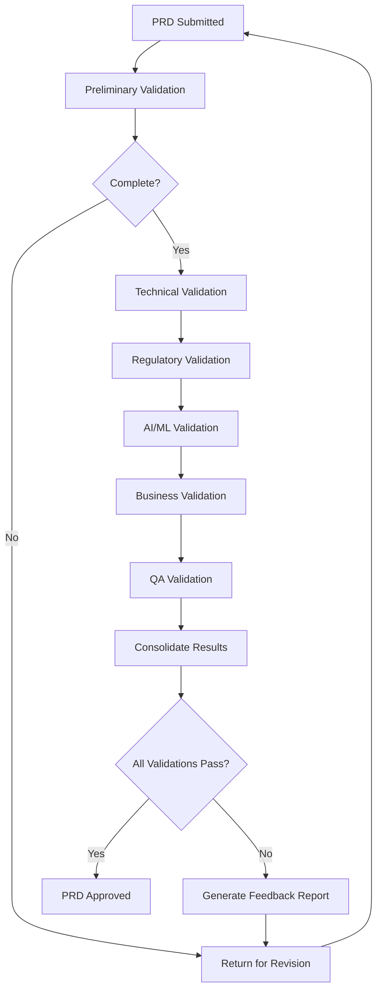

# Instrucciones Operativas: Validar PRD (Product Requirements Document)

## Objetivo
Establecer un proceso sistemático y riguroso para validar PRDs antes de su aprobación final, asegurando que cumplan con todos los estándares técnicos, de negocio, regulatorios y de calidad necesarios para el éxito del desarrollo del producto.

## Contexto del Proceso
Este documento forma parte del flujo de trabajo de AI Product Management, donde múltiples AI Assistants especializados colaboran para realizar una validación integral del PRD desde diferentes perspectivas expertas, garantizando que el documento esté listo para guiar el desarrollo exitoso del producto.

## Roles Involucrados

### Roles de Validación
- **CTO Expert AI Assistant**: Validación técnica y arquitectural
- **Regulatory Expert AI Assistant**: Compliance y aspectos regulatorios
- **AI Research Expert**: Validación de componentes de IA/ML
- **CPO Expert AI Assistant**: Coherencia de negocio y estrategia

### Roles de Apoyo
- **Senior Python Developer Agent**: Revisión de viabilidad técnica
- **QA Expert Agent**: Validación de criterios de testing
- **DevOps Expert Agent**: Revisión de requisitos de infraestructura

## Metodología de Validación

### Fase 1: Validación Preliminar
```markdown
## Pre-Validation Checklist

### Completitud Estructural
- [ ] **Executive Summary presente y completo**
  - Problema claramente definido
  - Propuesta de valor articulada
  - Métricas de éxito específicas
  - Inversión requerida estimada

- [ ] **Contexto y Justificación detallados**
  - Análisis de mercado incluido
  - Feedback de usuarios documentado
  - Alineación estratégica explicada
  - Riesgos de no hacer identificados

- [ ] **Definición de Usuario clara**
  - Personas objetivo definidas
  - User journey mapeado
  - Casos de uso principales documentados

- [ ] **Requisitos Funcionales completos**
  - Funcionalidades core listadas
  - Criterios de aceptación específicos
  - Prioridades asignadas
  - Dependencias identificadas

- [ ] **Requisitos No Funcionales especificados**
  - Performance requirements
  - Security requirements
  - Scalability requirements
  - Compliance requirements

- [ ] **Especificaciones Técnicas detalladas**
  - Arquitectura propuesta
  - Stack tecnológico definido
  - Modelo de datos especificado
  - APIs y endpoints documentados

### Calidad del Contenido
- [ ] **Claridad y Precisión**
  - Lenguaje claro y sin ambigüedades
  - Términos técnicos definidos
  - Ejemplos y diagramas incluidos
  - Referencias y fuentes citadas

- [ ] **Consistencia**
  - Terminología consistente
  - Formato uniforme
  - Numeración correcta
  - Enlaces funcionando

- [ ] **Trazabilidad**
  - Requisitos trazables a objetivos de negocio
  - Criterios de aceptación medibles
  - Métricas de éxito cuantificables
```

### Fase 2: Validación Técnica por CTO Expert

#### 2.1 Arquitectura y Diseño Técnico
```python
# Framework de validación técnica
class TechnicalValidation:
    def __init__(self, prd_content: str):
        self.prd = self.parse_prd(prd_content)
        self.validation_results = {}
    
    def validate_architecture(self) -> ValidationResult:
        """Validar propuesta arquitectural"""
        checks = [
            self.check_scalability_design(),
            self.check_security_architecture(),
            self.check_performance_design(),
            self.check_maintainability(),
            self.check_technology_choices()
        ]
        
        return ValidationResult(
            category="Architecture",
            checks=checks,
            overall_score=self.calculate_score(checks)
        )
    
    def check_scalability_design(self) -> Check:
        """Verificar que el diseño sea escalable"""
        criteria = [
            "Horizontal scaling strategy defined",
            "Database sharding considered",
            "Caching strategy specified",
            "Load balancing approach documented",
            "Microservices boundaries clear"
        ]
        
        return Check(
            name="Scalability Design",
            criteria=criteria,
            status=self.evaluate_criteria(criteria),
            recommendations=self.generate_scalability_recommendations()
        )
    
    def check_security_architecture(self) -> Check:
        """Validar aspectos de seguridad"""
        security_requirements = [
            "Authentication mechanism specified",
            "Authorization model defined",
            "Data encryption at rest and transit",
            "API security measures documented",
            "Compliance requirements addressed"
        ]
        
        return Check(
            name="Security Architecture",
            criteria=security_requirements,
            status=self.evaluate_security(security_requirements),
            recommendations=self.generate_security_recommendations()
        )
```

#### 2.2 Viabilidad Técnica
```markdown
## Technical Feasibility Assessment

### Technology Stack Evaluation
| Component | Proposed Technology | Maturity | Team Expertise | Risk Level | Recommendation |
|-----------|-------------------|----------|----------------|------------|----------------|
| Frontend | React 18 | High | High | Low | ✅ Approved |
| Backend | FastAPI | High | Medium | Low | ✅ Approved |
| Database | PostgreSQL | High | High | Low | ✅ Approved |
| Cache | Redis | High | Medium | Low | ✅ Approved |
| Queue | Celery | Medium | Low | Medium | ⚠️ Consider alternatives |

### Performance Requirements Analysis
```python
class PerformanceValidation:
    def __init__(self, requirements: Dict):
        self.requirements = requirements
    
    def validate_performance_targets(self) -> List[ValidationIssue]:
        issues = []
        
        # Response time validation
        if self.requirements.get('response_time', 0) < 100:
            issues.append(ValidationIssue(
                severity="WARNING",
                message="Response time target very aggressive (<100ms)",
                recommendation="Consider 200-500ms for complex operations"
            ))
        
        # Throughput validation
        throughput = self.requirements.get('throughput', 0)
        if throughput > 10000:
            issues.append(ValidationIssue(
                severity="HIGH",
                message="High throughput requirement needs detailed scaling plan",
                recommendation="Specify caching, CDN, and load balancing strategy"
            ))
        
        return issues
```

### Integration Complexity Assessment
- **External APIs**: [Número y complejidad de integraciones]
- **Third-party Services**: [Dependencias externas críticas]
- **Legacy Systems**: [Sistemas existentes que requieren integración]
- **Data Migration**: [Complejidad de migración de datos]

### Risk Assessment
| Risk Category | Risk Level | Mitigation Strategy |
|---------------|------------|-------------------|
| Technology Risk | Medium | Proof of concept for new technologies |
| Integration Risk | High | Mock services for parallel development |
| Performance Risk | Low | Load testing in early phases |
| Security Risk | Medium | Security review at each milestone |
```

### Fase 3: Validación Regulatoria

#### 3.1 Compliance Assessment (Regulatory Expert)
```python
# Framework de validación regulatoria
class RegulatoryValidation:
    def __init__(self, prd_content: str, industry: str, regions: List[str]):
        self.prd = self.parse_prd(prd_content)
        self.industry = industry
        self.regions = regions
        self.applicable_regulations = self.identify_regulations()
    
    def validate_compliance(self) -> ComplianceReport:
        """Validar cumplimiento regulatorio"""
        validations = []
        
        for regulation in self.applicable_regulations:
            validation = self.validate_regulation(regulation)
            validations.append(validation)
        
        return ComplianceReport(
            industry=self.industry,
            regions=self.regions,
            validations=validations,
            overall_compliance=self.calculate_compliance_score(validations)
        )
    
    def validate_gdpr_compliance(self) -> RegulationValidation:
        """Validación específica para GDPR"""
        gdpr_requirements = [
            "Data processing lawful basis defined",
            "User consent mechanism specified",
            "Data subject rights implementation planned",
            "Data retention policies defined",
            "Privacy by design principles applied",
            "Data breach notification process documented"
        ]
        
        return RegulationValidation(
            regulation="GDPR",
            requirements=gdpr_requirements,
            compliance_status=self.check_gdpr_requirements(),
            gaps=self.identify_gdpr_gaps(),
            recommendations=self.generate_gdpr_recommendations()
        )
```

#### 3.2 Industry-Specific Validation
```markdown
## Industry-Specific Compliance Checklist

### For Cosmetics Industry (EU)
- [ ] **Regulation (EC) No 1223/2009 Compliance**
  - Product safety assessment documented
  - Ingredient restrictions considered
  - Labeling requirements specified
  - CPNP notification process planned

- [ ] **Product Information File (PIF)**
  - Product description and intended use
  - Safety assessment methodology
  - Manufacturing information
  - Proof of product efficacy claims

- [ ] **Responsible Person Requirements**
  - EU responsible person identified
  - Contact information and responsibilities
  - Product liability considerations

### For Financial Services
- [ ] **PCI DSS Compliance**
  - Payment data handling procedures
  - Secure transmission requirements
  - Access control measures
  - Regular security testing planned

- [ ] **Anti-Money Laundering (AML)**
  - Customer due diligence procedures
  - Transaction monitoring systems
  - Suspicious activity reporting
  - Record keeping requirements

### For Healthcare/Medical Devices
- [ ] **FDA/CE Marking Requirements**
  - Device classification determined
  - Quality management system planned
  - Clinical evaluation requirements
  - Post-market surveillance procedures
```

### Fase 4: Validación de IA/ML (AI Research Expert)

#### 4.1 AI/ML Component Validation
```python
# Framework de validación de IA/ML
class AIMLValidation:
    def __init__(self, prd_content: str):
        self.prd = self.parse_prd(prd_content)
        self.ai_components = self.extract_ai_components()
    
    def validate_ai_feasibility(self) -> AIValidationReport:
        """Validar viabilidad de componentes de IA"""
        validations = []
        
        for component in self.ai_components:
            validation = self.validate_ai_component(component)
            validations.append(validation)
        
        return AIValidationReport(
            components=self.ai_components,
            validations=validations,
            overall_feasibility=self.calculate_ai_feasibility(validations),
            recommendations=self.generate_ai_recommendations()
        )
    
    def validate_ml_pipeline(self, component: AIComponent) -> MLValidation:
        """Validar pipeline de ML propuesto"""
        pipeline_checks = [
            self.check_data_requirements(component),
            self.check_model_complexity(component),
            self.check_training_infrastructure(component),
            self.check_inference_requirements(component),
            self.check_model_monitoring(component)
        ]
        
        return MLValidation(
            component=component,
            pipeline_checks=pipeline_checks,
            data_requirements=self.analyze_data_needs(component),
            computational_requirements=self.estimate_compute_needs(component)
        )
    
    def check_ethical_ai_considerations(self) -> EthicalAIReport:
        """Validar consideraciones éticas de IA"""
        ethical_checks = [
            "Bias detection and mitigation planned",
            "Fairness metrics defined",
            "Explainability requirements specified",
            "Privacy preservation measures",
            "Human oversight mechanisms",
            "Algorithmic transparency documented"
        ]
        
        return EthicalAIReport(
            checks=ethical_checks,
            bias_assessment=self.assess_bias_risks(),
            fairness_metrics=self.define_fairness_metrics(),
            explainability_plan=self.create_explainability_plan()
        )
```

#### 4.2 Data Science Validation
```markdown
## Data Science Requirements Validation

### Data Requirements Assessment
| Requirement | Specification | Availability | Quality | Risk |
|-------------|---------------|--------------|---------|------|
| Training Data | 100K labeled samples | 60% available | Medium | High |
| Feature Data | Real-time user behavior | Available via API | High | Low |
| Validation Data | Historical outcomes | Partially available | Low | High |

### Model Performance Expectations
```python
class ModelPerformanceValidation:
    def __init__(self, performance_requirements: Dict):
        self.requirements = performance_requirements
    
    def validate_performance_targets(self) -> List[ValidationIssue]:
        issues = []
        
        # Accuracy expectations
        accuracy_target = self.requirements.get('accuracy', 0)
        if accuracy_target > 0.95:
            issues.append(ValidationIssue(
                severity="WARNING",
                message="Very high accuracy target (>95%) may be unrealistic",
                recommendation="Consider if 90-95% accuracy is acceptable"
            ))
        
        # Latency requirements
        latency_target = self.requirements.get('inference_latency_ms', 0)
        if latency_target < 50:
            issues.append(ValidationIssue(
                severity="HIGH",
                message="Very low latency requirement (<50ms) needs optimization",
                recommendation="Consider model optimization techniques or edge deployment"
            ))
        
        return issues
```

### AI Ethics and Bias Assessment
- **Bias Sources Identified**: [Lista de posibles fuentes de sesgo]
- **Fairness Metrics Defined**: [Métricas específicas para medir equidad]
- **Explainability Requirements**: [Nivel de explicabilidad necesario]
- **Human Oversight Plan**: [Cómo se mantendrá supervisión humana]
```

### Fase 5: Validación de Negocio (CPO Expert)

#### 5.1 Business Value Validation
```python
# Framework de validación de valor de negocio
class BusinessValidation:
    def __init__(self, prd_content: str):
        self.prd = self.parse_prd(prd_content)
        self.business_case = self.extract_business_case()
    
    def validate_business_case(self) -> BusinessValidationReport:
        """Validar caso de negocio"""
        validations = [
            self.validate_market_opportunity(),
            self.validate_value_proposition(),
            self.validate_success_metrics(),
            self.validate_roi_projections(),
            self.validate_competitive_advantage()
        ]
        
        return BusinessValidationReport(
            validations=validations,
            business_score=self.calculate_business_score(validations),
            recommendations=self.generate_business_recommendations()
        )
    
    def validate_success_metrics(self) -> MetricsValidation:
        """Validar métricas de éxito"""
        metrics_checks = []
        
        for metric in self.business_case.success_metrics:
            check = self.validate_metric(metric)
            metrics_checks.append(check)
        
        return MetricsValidation(
            metrics=self.business_case.success_metrics,
            checks=metrics_checks,
            measurability_score=self.assess_measurability(),
            baseline_data_availability=self.check_baseline_data()
        )
```

#### 5.2 Market and User Validation
```markdown
## Market and User Validation Checklist

### Market Analysis Validation
- [ ] **Market Size and Opportunity**
  - TAM (Total Addressable Market) quantified
  - SAM (Serviceable Addressable Market) defined
  - SOM (Serviceable Obtainable Market) realistic
  - Growth projections supported by data

- [ ] **Competitive Analysis**
  - Direct competitors identified
  - Indirect competitors considered
  - Competitive advantages clearly articulated
  - Differentiation strategy defined

- [ ] **Market Timing**
  - Market readiness assessed
  - Technology adoption curve considered
  - Regulatory environment favorable
  - Economic conditions evaluated

### User Research Validation
- [ ] **User Personas**
  - Based on actual user research
  - Pain points validated through interviews
  - Behavioral patterns documented
  - Quantified user segments

- [ ] **User Journey**
  - Current state journey mapped
  - Future state journey designed
  - Pain points and opportunities identified
  - Touchpoints and interactions defined

- [ ] **Value Proposition**
  - User problems clearly defined
  - Solution benefits articulated
  - Value quantified where possible
  - Willingness to pay validated
```

### Fase 6: Validación de Testing y QA

#### 6.1 Testability Assessment (QA Expert Agent)
```python
# Framework de validación de testing
class TestabilityValidation:
    def __init__(self, prd_content: str):
        self.prd = self.parse_prd(prd_content)
        self.test_requirements = self.extract_test_requirements()
    
    def validate_testability(self) -> TestabilityReport:
        """Validar que los requisitos sean testeable"""
        validations = [
            self.validate_acceptance_criteria(),
            self.validate_test_data_requirements(),
            self.validate_test_environment_needs(),
            self.validate_automation_feasibility()
        ]
        
        return TestabilityReport(
            validations=validations,
            testability_score=self.calculate_testability_score(validations),
            test_strategy_recommendations=self.generate_test_strategy()
        )
    
    def validate_acceptance_criteria(self) -> CriteriaValidation:
        """Validar criterios de aceptación"""
        issues = []
        
        for story in self.prd.user_stories:
            for criteria in story.acceptance_criteria:
                if not self.is_testable(criteria):
                    issues.append(TestabilityIssue(
                        story_id=story.id,
                        criteria=criteria,
                        issue="Criteria not testable",
                        suggestion=self.suggest_testable_criteria(criteria)
                    ))
        
        return CriteriaValidation(
            total_criteria=len(self.get_all_criteria()),
            testable_criteria=len(self.get_testable_criteria()),
            issues=issues
        )
```

#### 6.2 Test Strategy Validation
```markdown
## Test Strategy Validation

### Test Coverage Analysis
| Test Type | Coverage Target | Feasibility | Effort Estimate |
|-----------|----------------|-------------|-----------------|
| Unit Tests | >80% | High | 2 weeks |
| Integration Tests | Critical paths | High | 1 week |
| E2E Tests | Happy paths | Medium | 1.5 weeks |
| Performance Tests | Key scenarios | Medium | 1 week |
| Security Tests | OWASP Top 10 | High | 0.5 weeks |

### Test Data Requirements
- **Volume**: [Cantidad de datos de prueba necesarios]
- **Variety**: [Tipos diferentes de datos requeridos]
- **Complexity**: [Complejidad de las relaciones de datos]
- **Privacy**: [Consideraciones de privacidad para datos de prueba]

### Test Environment Needs
- **Infrastructure**: [Recursos de infraestructura necesarios]
- **Third-party Services**: [Servicios externos para testing]
- **Data Refresh**: [Frecuencia de actualización de datos]
- **Isolation**: [Nivel de aislamiento requerido]
```

## Proceso de Validación Integral

### Workflow de Validación


### Validation Scoring System
```python
class ValidationScoring:
    def __init__(self):
        self.weights = {
            'technical': 0.25,
            'regulatory': 0.20,
            'business': 0.25,
            'ai_ml': 0.15,
            'testability': 0.15
        }
    
    def calculate_overall_score(self, validation_results: Dict) -> ValidationScore:
        weighted_scores = {}
        
        for category, weight in self.weights.items():
            if category in validation_results:
                weighted_scores[category] = validation_results[category].score * weight
        
        overall_score = sum(weighted_scores.values())
        
        return ValidationScore(
            overall=overall_score,
            category_scores=weighted_scores,
            threshold=0.75,  # Minimum score for approval
            status="APPROVED" if overall_score >= 0.75 else "NEEDS_REVISION"
        )
```

### Validation Report Template
```markdown
# PRD Validation Report

## Executive Summary
**PRD Title**: [Título del PRD]
**Validation Date**: [Fecha]
**Overall Score**: [X.XX/1.00]
**Status**: [APPROVED/NEEDS_REVISION/REJECTED]

## Validation Results Summary

### Technical Validation (CTO Expert AI Assistant)
- **Score**: [X.XX/1.00]
- **Status**: [PASS/FAIL]
- **Key Issues**: [Lista de issues críticos]
- **Recommendations**: [Recomendaciones principales]

### Regulatory Validation (Regulatory Expert AI Assistant)
- **Score**: [X.XX/1.00]
- **Status**: [PASS/FAIL]
- **Compliance Gaps**: [Gaps identificados]
- **Required Actions**: [Acciones requeridas]

### AI/ML Validation (AI Research Expert)
- **Score**: [X.XX/1.00]
- **Status**: [PASS/FAIL]
- **Feasibility Concerns**: [Preocupaciones de viabilidad]
- **Technical Recommendations**: [Recomendaciones técnicas]

### Business Validation (CPO Expert AI Assistant)
- **Score**: [X.XX/1.00]
- **Status**: [PASS/FAIL]
- **Business Case Strength**: [Fortaleza del caso de negocio]
- **Market Validation**: [Validación de mercado]

### QA Validation (QA Expert Agent)
- **Score**: [X.XX/1.00]
- **Status**: [PASS/FAIL]
- **Testability Issues**: [Problemas de testabilidad]
- **Test Strategy Gaps**: [Gaps en estrategia de testing]

## Detailed Findings

### Critical Issues (Must Fix)
1. **[Issue Category]**: [Descripción del issue]
   - **Impact**: [Alto/Medio/Bajo]
   - **Recommendation**: [Acción recomendada]
   - **Owner**: [Responsable de resolver]

### Important Issues (Should Fix)
[Lista de issues importantes]

### Minor Issues (Nice to Fix)
[Lista de issues menores]

## Approval Conditions
- [ ] All critical issues resolved
- [ ] Regulatory compliance confirmed
- [ ] Technical feasibility validated
- [ ] Business case approved
- [ ] Test strategy finalized

## Next Steps
1. [Acción 1] - Due: [Fecha] - Owner: [Responsable]
2. [Acción 2] - Due: [Fecha] - Owner: [Responsable]
3. [Acción 3] - Due: [Fecha] - Owner: [Responsable]

## Validation Team Sign-off
- [ ] CTO Expert AI Assistant: [Approved/Pending]
- [ ] Regulatory Expert AI Assistant: [Approved/Pending]
- [ ] AI Research Expert: [Approved/Pending]
- [ ] CPO Expert AI Assistant: [Approved/Pending]
- [ ] QA Expert Agent: [Approved/Pending]
```

## Herramientas y Automatización

### Automated Validation Tools
```python
# Herramienta automatizada de validación
class AutomatedPRDValidator:
    def __init__(self):
        self.validators = [
            StructuralValidator(),
            ContentValidator(),
            ConsistencyValidator(),
            CompletenessValidator()
        ]
    
    def validate_prd(self, prd_path: str) -> AutomatedValidationReport:
        """Ejecutar validaciones automatizadas"""
        prd_content = self.load_prd(prd_path)
        results = []
        
        for validator in self.validators:
            result = validator.validate(prd_content)
            results.append(result)
        
        return AutomatedValidationReport(
            prd_path=prd_path,
            validation_results=results,
            overall_score=self.calculate_automated_score(results),
            issues=self.consolidate_issues(results)
        )
    
    def generate_validation_checklist(self, prd_content: str) -> ValidationChecklist:
        """Generar checklist personalizado basado en contenido del PRD"""
        checklist_items = []
        
        # Analizar contenido y generar items específicos
        if self.contains_ai_components(prd_content):
            checklist_items.extend(self.get_ai_validation_items())
        
        if self.contains_payment_processing(prd_content):
            checklist_items.extend(self.get_payment_validation_items())
        
        return ValidationChecklist(items=checklist_items)
```

### Integration with Development Tools
```yaml
# GitHub Actions workflow para validación automática
name: PRD Validation
on:
  pull_request:
    paths: ['docs/prd/*.md']

jobs:
  validate-prd:
    runs-on: ubuntu-latest
    steps:
      - uses: actions/checkout@v3
      
      - name: Setup Python
        uses: actions/setup-python@v4
        with:
          python-version: '3.11'
      
      - name: Install PRD Validator
        run: pip install prd-validator
      
      - name: Run Automated Validation
        run: |
          prd-validator validate docs/prd/ --output validation-report.json
      
      - name: Generate Validation Report
        run: |
          prd-validator report validation-report.json --format markdown > validation-report.md
      
      - name: Comment PR with Results
        uses: actions/github-script@v6
        with:
          script: |
            const fs = require('fs');
            const report = fs.readFileSync('validation-report.md', 'utf8');
            github.rest.issues.createComment({
              issue_number: context.issue.number,
              owner: context.repo.owner,
              repo: context.repo.repo,
              body: report
            });
```

## Mejores Prácticas

### Para Validadores
1. **Objetividad**: Mantener criterios objetivos y consistentes
2. **Constructividad**: Proporcionar feedback constructivo y accionable
3. **Colaboración**: Trabajar en conjunto para resolver issues complejos
4. **Documentación**: Documentar decisiones y rationale

### Para el Proceso
1. **Iterativo**: Permitir múltiples rondas de validación si es necesario
2. **Transparente**: Mantener criterios de validación claros y públicos
3. **Eficiente**: Optimizar el proceso para minimizar tiempo de ciclo
4. **Continuo**: Mejorar el proceso basado en lecciones aprendidas

### Para la Calidad
1. **Estándares Altos**: Mantener estándares altos pero realistas
2. **Consistencia**: Aplicar criterios consistentemente
3. **Mejora Continua**: Actualizar criterios basado en experiencia
4. **Feedback Loop**: Crear loops de feedback para mejorar PRDs futuros

**Recuerda**: La validación efectiva de PRDs es crucial para el éxito del desarrollo de productos. Un PRD bien validado reduce riesgos, mejora la calidad del desarrollo y aumenta las probabilidades de éxito del producto en el mercado.