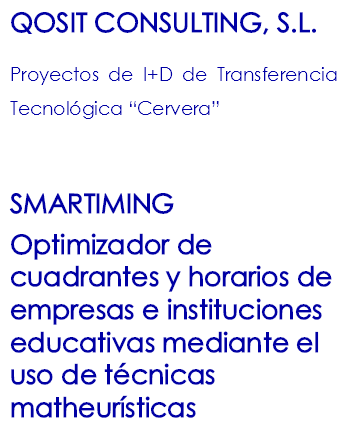
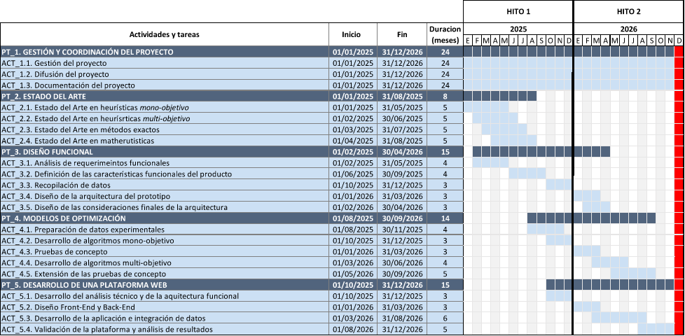

` `4

![C:\Users\PC\AppData\Local\Microsoft\Windows\INetCache\Content.Word\20 01 - word template-07.png]

![ref1]

**ÍNDICE**

[1.	RESUMEN EJECUTIVO	4](#_toc184201994)

[1.1.	PRESENTACIÓN DE LA EMPRESA	4](#_toc184201995)

[1.2.	NECESIDAD DEL PROYECTO	4](#_toc184201996)

[1.3.	OBJETIVO GENERAL DEL PROYECTO	5](#_toc184201997)

[1.4.	RETO TECNOLÓGICO DEL PROYECTO	5](#_toc184201998)

[1.5.	INNOVACIÓN DEL PROYECTO	5](#_toc184201999)

[2.	OBJETIVOS	7](#_toc184202000)

[2.1.	Objetivo general del proyecto	7](#_toc184202001)

[2.2.	Objetivos técnicos específicos del proyecto.	10](#_toc184202002)

[3.	TECNOLOGIA E INNOVACION DEL PROYECTO	11](#_toc184202003)

[3.1.	DESCRIPCION TECNICA	11](#_toc184202004)

[3.1.1.	Necesidad tecnológica	11](#_toc184202005)

[3.1.2.	Antecedentes y adecuación de la empresa	16](#_toc184202006)

[3.1.3.	Descripción de la nueva solución	19](#_toc184202007)

[3.2.	INNOVACION	34](#_toc184202013)

[3.2.1.	INNOVACIONES TECNOLÓGICAS	34](#_toc184202014)

[3.2.2.	DESCRIPCIÓN DEL ESTADO DE DESARROLLO DE LAS NUEVAS TECNOLOGÍAS	37](#_toc184202015)

[3.3.	PLAN DE TRABAJO	38](#_toc184202016)

[3.3.1.	Cronograma	40](#_toc184202017)

[3.3.2.	Descripción de las actividades	41](#_toc184202018)

[3.4.	RESULTADOS E IMPACTO TECNOLOGICO DEL PROYECTO	50](#_toc184202019)

[3.4.1.	Resultados y entregables del proyecto	50](#_toc184202020)

[3.4.2.	Plan de gestión de la propiedad intelectual e indsutrial	53](#_toc184202021)

[3.4.3.	Participación en programas internacionales y Continuidad del proyecto	54](#_toc184202022)

[4.	PLAN DE EXPLOTACIÓN COMERCIAL DEL PROYECTO	54](#_toc184202023)

[4.1.	Características generales del mercado	54](#_toc184202024)

[4.2.	Ventajas y necesidades que cubre el producto	56](#_toc184202025)

[4.3.	Estrategia comercial	59](#_toc184202026)

[4.4.	Viabilidad, Competencia y riesgo comercial	60](#_toc184202027)

[4.5.	Plan de internacionalización	65](#_toc184202028)

[5.	DESCRIPCION Y JUSTIFICACION DEL PRESUPUESTO	65](#_toc184202029)

[5.1.	Personal	66](#_toc184202030)

[5.2.	Colaboraciones Externas	74](#_toc184202031)

[5.2.1.	Colaboración con Centros Públicos de Investigación, Centros Tecnológicos o Centros de Apoyo a la Innovación Tecnológica.	74](#_toc184202032)

[5.2.2.	Colaboraciones Técnicas y Otras Colaboraciones	78](#_toc184202033)

[6.	ASPECTOS SOCIOECONOMICOS, PERSPECTIVA DE GENERO Y SOSTENIBILIDAD	78](#_toc184202034)

[6.1.	Creación de empleo	78](#_toc184202035)

[6.2.	Previsiones de inversión inducida para la empresa	81](#_toc184202036)

[6.3.	Perspectiva de género	81](#_toc184202037)

[6.4.	Inclusión social	82](#_toc184202038)

[6.5.	Impacto medioambiental	83](#_toc184202039)

[6.6.	Otras informaciones	84](#_toc184202040)

1. # **RESUMEN EJECUTIVO**
   1. ## **PRESENTACIÓN DE LA EMPRESA**
**Qosit Consulting, S.L**., con marca comercial OGA.ai, de ahora en adelante **OGA**, es una empresa tecnológica española reconocida por desarrollar soluciones avanzadas de optimización de procesos basadas en Inteligencia Artificial y en Investigación Operativa. La empresa se especializa en ofrecer soluciones tecnológicas que mejoran la eficiencia operativa, reducen costos y permiten una toma de decisiones estratégicas basada en datos. Los servicios principales incluyen optimización de procesos logísticos y de producción, inteligencia artificial aplicada, creación de soluciones de software personalizadas y consultoría en investigación operativa. 

OGA está profundamente comprometida con la investigación y desarrollo (I+D), destinando una parte significativa de sus recursos a proyectos innovadores, muchos de ellos en colaboración con instituciones públicas y centros de investigación. La empresa cuenta con un Consejo Asesor Tecnológico que orienta estratégicamente sus proyectos de innovación. Además, fomenta la transferencia tecnológica y la colaboración entre el sector privado y el académico para acelerar el desarrollo tecnológico. El equipo de OGA está compuesto por más de 60 profesionales altamente cualificados, cuya experiencia y dedicación aseguran la excelencia en los servicios ofrecidos. 

En definitiva, OGA se distingue por su enfoque innovador y su constante compromiso con la investigación y el desarrollo, proporcionando a sus clientes soluciones avanzadas que impulsan su transformación digital y mejoran su competitividad, lo que le convierte en una empresa idónea para desarrollar el presente proyecto.
1. ## **NECESIDAD DEL PROYECTO**
La planificación y programación de horarios (*Timetabling Problem*) es una tarea esencial y compleja en sectores como el transporte público, la educación, la sanidad y la industria. La necesidad de nuevas soluciones ha aumentado con la búsqueda de eficiencia operativa, reducción de costos y mejora en la calidad del servicio. El desarrollo de herramientas efectivas es crucial para optimizar estos procesos, asegurando rapidez y adaptabilidad. Sin embargo, el desarrollo está limitado por la falta de algoritmos capaces de resolver problemas de optimización combinatoria del tipo NP-*hard*. Además, la incorporación de preferencias y deseos de los usuarios finales es vital para evitar el rechazo de los cuadrantes. Los clientes actuales demandan soluciones en la nube, algoritmos eficientes y cuadros de mando sintetizados. 

El proyecto SMARTIMING tiene como objetivo desarrollar una solución innovadora de *timetabling* que optimice los horarios en instituciones educativas mediante métodos híbridos de algoritmos exactos y heurísticas. Esta solución cubrirá la necesidad en el sector educativo para la planificación de horarios y la gestión de recursos y personal, generando cuadrantes óptimos rápidamente y considerando tanto las restricciones obligatorias como las preferencias, mejorando así la satisfacción de alumnos y docentes.
1. ## **OBJETIVO GENERAL DEL PROYECTO**
El objetivo principal de este proyecto **es desarrollar una solución innovadora de optimización para la asignación de horarios (*timetabling*) mediante el uso de matheurísticas avanzadas**, tanto mono-objetivo como multi-objetivo, que permitan resolver de manera rápida y eficiente los problemas de programación de horarios. 

La solución desarrollada presentará una gran adaptabilidad para su utilización en diversos sectores y entidades. Sin embargo, debido a la gran complejidad de los problemas de asignación de horarios en centros educativos, se centrará principalmente en este tipo de instituciones. 
1. ## **RETO TECNOLÓGICO DEL PROYECTO**
OGA se enfrenta a un reto tecnológico significativo al abordar la optimización de cuadrantes y horarios en empresas e instituciones educativas mediante técnicas matheurísticas. El desarrollo de soluciones de *timetabling* está limitado por la falta de algoritmos capaces de resolver problemas de optimización combinatoria del tipo NP*-hard*. Los algoritmos exactos no pueden resolver estos problemas en tiempos limitados, por lo que se usan algoritmos metaheurísticos que mejoran el tiempo, pero sacrifican la calidad de la solución final. Las matheurísticas son técnicas híbridas que aprovechan el potencial de ambos enfoques, balanceando tiempos de resolución y calidad de la solución.

El desarrollo de la herramienta de planificación de horarios presenta retos tecnológicos significativos, como la escalabilidad, que se complica con el aumento de alumnos, profesores, asignaturas y aulas en una institución educativa. La definición de objetivos concretos y su priorización guiarán la búsqueda de la mejor solución posible dentro de las opciones factibles. La validación de restricciones es crucial para asegurar que las soluciones generadas sean factibles y eficientes, respetando restricciones duras y blandas, y gestionando las preferencias de los docentes. La flexibilidad y personalización de la herramienta son desafíos adicionales, ya que la capacidad de la herramienta para adaptarse a las preferencias personalizadas de cada institución y generar múltiples opciones de horarios diversos es fundamental para su éxito.

En definitiva, la solución propuesta por el proyecto SMARTIMING busca superar estos retos mediante el desarrollo de algoritmos matheurísticos innovadores que permitan una planificación y simulación de horarios más eficiente y adaptable.
1. ## **INNOVACIÓN DEL PROYECTO**
El proyecto SMARTIMING se destaca por el uso de novedosos **algoritmos matheurísticos**, una combinación de algoritmos exactos y heurísticas de construcción-exploración. Tal como se expondrá en el estado del arte y de la ciencia (Sección 2.1 de la presente memoria ), no existen en la literatura científica especializada algoritmos mono y multi-objetivo de tipo matheurísticos que aprovechen las fortalezas de ambas estrategias de optimización (algoritmos exactos y algoritmos metaheurísticos) para esta tipología de problemas. Además, estos algoritmos han demostrado ser muy robustos y eficientes en otros problemas de optimización, por lo que están altamente contrastados. 

Por otro lado, destacamos la incorporación de restricciones duras y blandas en la formulación del problema, lo cual ayudará a que las soluciones sean mejor recibidas por los usuarios finales (comunidad educativa, profesores, estudiantes, sindicatos, etc.). Esto hace que el problema final se convierta en un problema de optimización multi-objetivo que balanceará los criterios contrapuestos de, normalmente, la dirección del centro y los profesores. Esta capacidad de optimización avanzada representa además un salto tecnológico significativo en comparación con las herramientas actuales en el mercado, que se analizarán más adelante.

Otra innovación clave es la flexibilidad y personalización de la herramienta. SMARTIMING permite ajustar su comportamiento para adaptarse a las necesidades específicas de cada institución, ofreciendo una solución a medida que supere las limitaciones de personalización de las herramientas existentes en el mercado. Más aún, las herramientas de la competencia requieren de una interacción con el humano muy elevada para guiar a la herramienta hacia una solución factible, pero de pésima o baja calidad final. Este trabajo es agotador para el jefe de estudio o responsable y es una de las innovaciones incorporadas en la herramienta. La flexibilidad de los algoritmos a desarrollar en SMARTIMING es crucial para incorporar y satisfacer todas las demandas de los usuarios, tanto blandas como duras, para así modelar íntegramente el problema, eliminar la interacción con el humano y mejorar así la eficiencia operativa de las instituciones educativas y empresas.

Finalmente, la base tecnológica de SMARTIMING utilizará las últimas tecnologías de Microsoft sobre la plataforma Azure, siguiendo el modelo PaaS. Esto garantiza que el software esté siempre actualizado y supervisado directamente por Microsoft, ofreciendo altos estándares de seguridad y escalabilidad. Además, el uso de .NET Core y Azure SQL asegura un rendimiento óptimo y una integración fluida con otras plataformas, lo que representa una innovación significativa en términos de eficiencia y escalabilidad.

En conclusión, el proyecto SMARTIMING representa un avance significativo en el campo de la planificación de horarios educativos y empresariales. Gracias a sus innovaciones tecnológicas, como el uso de algoritmos matheurísticos y la integración con las últimas tecnologías de Microsoft en la plataforma Azure, SMARTIMING ofrece una solución robusta, flexible y altamente eficiente. Estas características no solo superan las limitaciones de las herramientas actuales en el mercado, sino que también proporcionan una capacidad de adaptación y personalización que es crucial para satisfacer las necesidades específicas de cada institución educativa y empresa.
1. # **OBJETIVOS**
   1. ## **OBJETIVO GENERAL DEL PROYECTO**
El **objetivo principal del proyecto** consiste en el desarrollo de una solución innovadora de optimización para la asignación de horarios (*timetabling*) mediante el uso de matheurísticas avanzadas, tanto mono-objetivo como multi-objetivo, que permitan resolver de manera rápida y eficiente los problemas de programación de horarios. 

La solución desarrollada será adaptable para su uso en diversos sectores y entidades. No obstante, debido a la complejidad de los problemas de asignación de horarios en centros educativos, se enfocará principalmente en este tipo de instituciones. En este contexto, la herramienta SMARTIMING considerará tanto las restricciones estrictas (disponibilidad de aulas, horarios de los profesores, jornada laboral diaria y semanal, compatibilidades entre asignatura y profesor o asignatura y aula, etc.) como los deseos y preferencias de los profesores, estudiantes y demás miembros de la comunidad educativa, con el objetivo de mejorar la calidad de vida en las instituciones y optimizar el uso de los recursos disponibles.

Para lograr este objetivo, se propone un enfoque novedoso basado en el desarrollo de métodos híbridos de algoritmos exactos y heurísticas de construcción-exploración, conocidos en la literatura como **matheurísticas**. Estos métodos combinan la precisión de los algoritmos exactos con la eficiencia de las heurísticas, permitiendo abordar problemas de optimización complejos de manera más efectiva. Además, son muy flexibles a la hora de incorporar y manejar tanto restricciones duras que hay que cumplir obligatoriamente, como restricciones blandas (deseos o preferencias) que sin ser obligatorio su cumplimiento se puede maximizar el cumplimiento de éstas sin pérdida de calidad en el o los criterios de optimización principales.

Objetivos técnicos generales

Con el fin de llevar a cabo el objetivo principal del proyecto que se acaba de describir, OGA establece una serie de objetivos técnicos generales para garantizar la correcta ejecución del proyecto y su éxito:

- **Generación de know-how**: desarrollar una herramienta de planificación y organización de horarios que agilice los procesos y garantice la calidad de los procesos.
- Solución de limitaciones técnicas: abordar las limitaciones actuales en la planificación de horarios mediante el desarrollo de algoritmos matheurísticos innovadores y flexibles.
- **Optimización de recursos**: reducir los costos operativos optimizando el uso de recursos humanos dedicados a la generación de horarios (valor efímero del trabajo), mejorando el uso de las instalaciones (aulas, laboratorios, sales, espacios deportivos...) y, en general, mejorando la eficiencia operativa de los clientes potenciales.
- Desarrollar un prototipo funcional de la solución de optimización para la asignación de horarios, que demuestre la **viabilidad técnica de los algoritmos propuestos**.
- Validar el uso de técnicas avanzadas de optimización para modelar los problemas de programación de horarios, teniendo en cuenta tanto las **restricciones duras** como las preferencias de los usuarios (**restricciones blandas**).
- Validar la capacidad de los **algoritmos multi-objetivo** para encontrar soluciones que equilibren múltiples criterios, como la equidad en la carga de trabajo de los profesores, la satisfacción de los estudiantes y la utilización eficiente de los recursos de la institución educativa.
- **Validar la solución en una serie de centros educativos piloto** (IES Salmedina, en Trebujena (Cádiz) y Colegio Internacional San Francisco de Paula (Sevilla)), evaluando su capacidad para generar horarios óptimos en segundos o minutos, teniendo en cuenta las restricciones y preferencias de los usuarios. 
- Evaluar el **impacto de la solución en la eficiencia operativa de las instituciones educativas**, tanto en términos de tiempo de asignación de horarios como en la mejora de la experiencia de los profesores y estudiantes.

Este enfoque permitirá a las empresas e instituciones educativas optimizar sus procesos de planificación horaria, reduciendo los tiempos y costos asociados, y mejorando su eficiencia y productividad.

Objetivos comerciales

Adicionalmente, analizar y plantear otro tipo de objetivos es de gran relevancia a la hora de valorar el alcance del proyecto en diferentes aspectos, tal como se desglosa a continuación:

- Objetivos generales económicos
  - Potenciar la línea de negocio de la empresa dedicada al desarrollo de actividades de I+D+i para potenciar y aumentar los ingresos anuales de la empresa durante los próximos años.
  - Incorporación de nuevos clientes, soluciones y sectores de actividad para aportar valor añadido a sus clientes.
  - Aumentar la participación en nuevos mercados de la empresa, lo que puede implicar estrategias de marketing, expansión geográfica o desarrollo de nuevos productos.
- Objetivos generales empresariales
  - Establecer sinergias con empresas e instituciones educativas representativas y de calado en la economía regional y nacional, con el objetivo de posicionarse como un socio estratégico de sus clientes.
  - Fortalecer la colaboración con dos grupos de investigación universitarios que poseen el conocimiento y la experiencia previa de haber trabajado en problemas similares y certifiquen la novedad y solvencia de los algoritmos desarrollados, tanto para enfoques mono-objetivo como multi-objetivo. Estas colaboraciones pueden dar luegar a nuevas iniciativas futuras en este u otra línea de interés para todas las partes.

Objetivos estratégicos

Con el desarrollo del proyecto SMARTIMING, OGA no solo buscará mantenerse a la vanguardia del sector, sino también, aumentar su conocimiento científico-tecnológico en el sector, ya que la empresa considera la I+D+i un pilar estratégico que le aporta valor añadido y aumenta su competitividad frente a otras empresas. Así, con la ejecución del presente proyecto de Investigación y Desarrollo, la empresa pretende alcanzar una serie de objetivo estratégicos, los cuales se muestran a continuación:

- Incremento del *know-how* de la compañía con la investigación y desarrollo de nuevos modelos de optimización.
- Transferencia del *know-how* para el desarrollo de una nueva herramienta.
- Fortalecimiento de la colaboración con la Comunidad Científica nacional.
- Aplicabilidad del conocimiento generado en futuros desarrollos de la compañía.
- Establecer sinergias con empresas representativas de diferentes sectores de calado en la economía regional y nacional, con el objetivo de posicionarse como un socio estratégico de sus clientes.
- Posicionar la empresa como un agente aglutinador y transformador de diferentes industrias en su apuesta por la generación y transferencia de conocimiento a entidades públicas o privadas.
- Expansión del modelo de negocio de la empresa a sectores relevantes mediante el desarrollo de nuevos productos y procesos ligados a la mejora de la eficiencia y la reducción de costes operativos, siendo este último uno de los pilares estratégicos en el modelo de negocio y servicios ofrecidos por la empresa.

Por último, Cabe destacar que, en el diseño conceptual del producto, OGA desea utilizar este proyecto de I+D para acelerar aún más su desarrollo y **validar el resultado en dos potenciales usuarios de referencia,** el IES Salmedina (Chipiona, Cádiz) y el Colegio Internacional San Francisco de Paula (Sevilla), que ya han confirmado su interés en participar en las pruebas de concepto (tanto mono-objetivo como multi-objetivo), acelerando la transición desde los actuales niveles de madurez tecnológica (TRL2) al deseado nivel de madurez tecnológica TRL6.

1. ## **OBJETIVOS TÉCNICOS ESPECÍFICOS DEL PROYECTO.** 
Como se ha descrito en el punto anterior, el principal objetivo del proyecto es el desarrollo de una novedosa herramienta de *timetabling* que emplee métodos matheurísticos para la solución de problemas de optimización del tipo NP*-hard*. Así, OGA establece una serie de objetivos técnicos específicos para garantizar la consecución del presente proyecto. Los objetivos específicos aquí presentados proporcionarán una clara visión de los resultados deseados con el desarrollo del proyecto, esto es, el desarrollo de una solución tecnológica que permitirá a los potenciales clientes de la empresa optimizar sus procesos de *timetabling*, reduciendo los tiempos y costes asociados a este proceso. Así, los objetivos técnicos específicos del proyecto son los siguientes, haciendo una relación con los Paquetes de Trabajo (PT) definidos en mayor detalle en el apartado 3.3.2 de la presente memoria: 

**Tabla **1**.** Objetivos técnicos específicos del proyecto

|**PT**|**Objetivos técnicos específicos**|
| :-: | - |
|**PT2**|Generar *know-how* en la empresa acerca de técnicas de optimización mono-objetivo y multiobjetivo, mediante un estudio del estado del arte.|
||Generar *know-how* en la empresa acerca de técnicas de optimización de un solo objetivo mediante técnicas exactas y mediante técnicas matheurísticas, redactando informes detallados sobre el estado del arte de estas técnicas.|
|

**PT3**
|Definir los requisitos funcionales que debe cumplir la solución informática, mediante una recopilación de datos y requisitos de los dos usuarios que validarán la prueba de concepto.|
|**PT3**|Diseño de la arquitectura de software del prototipo, utilizando plataformas de integración continua y entrega continua (CI/CD). |
||Definir mecanismos de ejecución de inferencia de modelos para el producto final|
||
Definir mecanismos de ejecución algorítmica para el producto final

Garantizando la calidad del código utilizando herramientas como SonarQube, que permite identificar errores e incoherencias en el código.
|
|**PT4**|Desarrollar códigos con la primera versión del optimizador mono-objetivo, combinando algoritmos exactos con técnicas heurísticas y garantizando que el algoritmo sea potente y eficiente. |
||Evaluar de forma exhaustiva el algoritmo en entornos controlados mediante la realización de pruebas de concepto. Utilizando *frameworks* como Selenium, que permiten definir y realizar pruebas manera automática.|
||Desarrollo del algoritmo de optimización multiobjetivo, mediante la adaptación, evolución y ampliación de los algoritmos mono-objetivo. Garantizando la robustez del mismo a la hora de lidiar con objetivos conflictivos.|
||Extender las pruebas de concepto a escenarios de operación con múltiples objetivos, incorporando *feedback* del mundo real, para poder evaluar el algoritmo multiobjetivo.|
|**PT5**|Desarrollar procesos que cumplan con las especificaciones técnico-funcionales definidas en fases anteriores|
||Implementar una plataforma web con datos integrados y actualizados en tiempo real|
||Validar la solución software mediante pruebas y simulaciones de usos prácticos reales|

En definitiva, logrando estos objetivos técnicos específicos será posible la consecución del objetivo principal de SMARTIMING, dando como resultado una herramienta rompedora que suponga un salto tecnológico en el sector.
1. # **TECNOLOGIA E INNOVACION DEL PROYECTO**
   1. ## **DESCRIPCION TECNICA**
      1. ### **NECESIDAD TECNOLÓGICA**
Durante muchas décadas, la organización en instituciones educativas, empresas o servicios públicos ha sido una de las principales cuestiones a resolver, más en concreto la elaboración de horarios o cuadrantes de trabajo para meses o años completos teniendo en cuenta múltiples restricciones legales y operativas. La necesidad de asignar recursos limitados, tales como aulas, profesores y equipamiento, de manera eficiente, mientras se cumplen una serie de restricciones y preferencias, ha llevado al desarrollo de una amplia variedad de enfoques y soluciones técnicas. Este problema pertenece a la categoría de problemas de optimización combinatoria conocido como el *timetabling problem,* el cual está demostrado que posee complejidad NP-*hard*, lo que significa que su complejidad computacional crece exponencialmente con los parámetros del problema (número de asignaturas, de docentes, de espacios...), por lo que no se conoce algoritmos que puedan resolver todas las instancias del problema de manera eficiente, ya sea en tiempo o en calidad.

Históricamente, la mayoría de las instituciones elabora sus horarios manualmente o usan algún tipo de soporte digital de baja calidad y poco automatizado (requiere de nuevo de mucha interacción con los usuarios), proceso extremadamente tedioso y propenso a errores, especialmente en organizaciones grandes como universidades, colegios o escuelas de negocio. La introducción de la computación en los años 50 y 60 proporcionó las primeras herramientas necesarias para comenzar a abordar el problema de *timetabling* de forma algo más automatizada y eficiente, siendo uno de los primeros enfoques documentados el desarrollo de algoritmos basados en técnicas de optimización exacta, heurística o metaheurística.

Uno de los principales retos en *timetabling* es la diversidad y especificidad de las restricciones que pueden incluirse en diferentes contextos. Por ejemplo, en el ámbito académico, no sólo se deben considerar las disponibilidades de profesores y aulas, sino también las necesidades curriculares de los estudiantes y posibles solapamientos entre cursos y campus. Esto se complica aún más con restricciones de tiempo parciales, preferencias personales y otros recursos limitados. Además, la aceptación de los horarios resultantes por parte de todos los actores involucrados puede ser tan importante como la optimización técnica del problema.

La mayoría de estos problemas comparten características similares, ya que están definidos por restricciones duras y blandas. Las restricciones duras deben cumplirse estrictamente, y suelen estar relacionados con evitar solapamientos de horarios y no superar las cargas de trabajo establecidas. En cuanto a las restricciones blandas, que son aquellas que es recomendable cumplir, aunque no es necesario hacerlo, suelen tenerse en cuenta en la función objetivo para minimizar su incumplimiento.

En la literatura, se han explorado numerosos enfoques para abordar el problema de *timetabling*. Los métodos exactos, como la programación entera, aunque proporcionan soluciones óptimas, suelen ser inviables para instancias grandes debido a su alta demanda computacional. Por ello, los métodos heurísticos y metaheurísticos han ganado popularidad. Algoritmos como la búsqueda tabú, algoritmos genéticos, *simulated annealing* y técnicas de optimización por enjambre de partículas han demostrado ser eficaces para encontrar soluciones buenas y prácticas en un tiempo razonable[^1].

Numerosas publicaciones han marcado el desarrollo del campo. *Journals* como "*Journal of Scheduling*", "*Annals of Operations Research*" y "*European Journal of Operational Research*" regularmente publican estudios sobre nuevas técnicas y enfoques en *timetabling*. Además, conferencias como la "*International Conference on the Practice and Theory of Automated Timetabling* (PATAT)" ofrecen un foro para que académicos y profesionales compartan sus últimos desarrollos. Grupos de investigación en universidades de todo el mundo continúan explorando este problema desde múltiples perspectivas, contribuyendo tanto al avance teórico como al desarrollo de aplicaciones prácticas que faciliten la resolución de problemas de *timetabling* en contextos reales.

Por tanto, el problema de la programación de horarios es una cuestión compleja y recurrente en diversas instituciones y empresas que se encuentra en una variedad de contextos, incluyendo el ámbito empresarial y el ámbito educativo. Este desafío se ha abordado mediante una variedad de enfoques y tecnologías, que van desde algoritmos heurísticos hasta métodos de optimización basados en Inteligencia Artificial. Por ello, se debe llevar a cabo una exploración de los avances recientes y las tendencias en la resolución de problemas de *timetabling* para reconocer el estado actual.

En primer lugar, es importante volver a destacar que el problema de *timetabling* es reconocido como NP-*hard,* lo que significa que la complejidad de su solución crece exponencialmente con el tamaño del problema[^2]. La complejidad matemática de este problema, y la extensa literatura existente, no han impedido que las aplicaciones del mundo real presenten desafíos que se desvían de las formulaciones estándar del problema, creando una brecha entre la teoría y la práctica[^3]. Para abordar estos desafíos, se ha introducido un marco transdisciplinario que considera las preferencias de los interesados y los recursos organizativos disponibles para optimizar el rendimiento organizacional en las instituciones académicas o empresas en general.

Esto ha llevado a la búsqueda de métodos heurísticos y metaheurísticos que permitan encontrar soluciones satisfactorias en un tiempo computacional razonable. En este sentido, uno de los enfoques más destacados en la investigación reciente es el uso de metaheurísticas, que son estrategias de alto nivel que guían a otras heurísticas para explorar el espacio de soluciones de manera eficiente. Por ejemplo, el algoritmo de búsqueda local híbrida (HLS) ha demostrado ser uno de los mejores para resolver problemas de programación de horarios de cursos universitarios, combinando técnicas como *Hill Climbing*, *Great Deluge* y *Simulated Annealing*[^4]. Este enfoque no solo ha ganado competiciones internacionales, sino que también ha mostrado una robustez considerable en la resolución de instancias del problema.

De igual manera, el algoritmo *hybridized whale optimization algorithm* (WOA), un tipo de metaheurística de inteligencia de enjambre se ha adaptado para la programación de recursos en entornos de computación en nube[^5]. Este algoritmo demuestra un rendimiento superior al de otras heurísticas y metaheurísticas, lo que sugiere su potencial aplicabilidad en escenarios de programación en los que los recursos deben asignarse de forma eficiente.

Por otro lado, la búsqueda tabú adaptativa es otra técnica que ha mostrado ser efectiva para resolver problemas de programación de horarios a gran escala. Esta técnica se adapta durante la búsqueda para mejorar la calidad de las soluciones, como se demostró en un estudio que aplicó el algoritmo a once conjuntos de datos de referencia[^6].

Otra contribución significativa a este campo es el uso de algoritmos evolutivos para la optimización discreta, que incluye los problemas de horarios[^7]. Estos algoritmos simulan el proceso de selección natural para hacer evolucionar las soluciones a lo largo del tiempo. Los últimos avances en este campo incluyen modelos detallados para el análisis del tiempo de ejecución y conocimientos sobre el ajuste y el control de los parámetros, que son cruciales para adaptar los algoritmos evolutivos a los retos específicos del establecimiento de horarios.

En el caso de la programación de horarios universitarios con asignación de profesores, hay estudios que afrontan este problema complejo mediante modelos de programación lineal entera. Un estudio en México mostró que es posible obtener soluciones óptimas con un esfuerzo computacional bajo, utilizando el algoritmo clásico de ramificación y acotamiento[^8]. Otro enfoque interesante en este sentido es el uso de algoritmos de transporte para optimizar la distribución de cursos a profesores, considerando sus campos de interés y calificaciones. Un estudio de caso en el Politécnico Federal de Offa demostró que el uso de un algoritmo desarrollado para esta tarea puede mejorar significativamente la calidad de la enseñanza y ahorrar tiempo y recursos en comparación con los métodos manuales[^9].

En otros ámbitos, como la programación de horarios deportivos, se ha estudiado un sistema de selección de algoritmos basado en técnicas de aprendizaje automático que predice cuál algoritmo es probable que ofrezca el mejor rendimiento dadas las características de una instancia del problema[^10].

Asimismo, la optimización de la programación de horarios universitarios utilizando un enfoque hiperheurístico basado en el optimizador de enjambre de partículas (PSO) es otra técnica prometedora. Este enfoque utiliza PSO como un método de alto nivel que selecciona secuencias de heurísticas de bajo nivel para generar soluciones óptimas[^11].

En resumen, el estado del arte del *timetabling* se caracteriza por la aplicación de técnicas computacionales avanzadas, como la metaheurística, los algoritmos evolutivos, el aprendizaje profundo por refuerzo y la optimización multiobjetivo. Estos métodos se han aplicado con éxito a diversos problemas de programación, lo que demuestra su potencial para abordar las complejas restricciones y objetivos inherentes a la programación de horarios. Sin embargo, es clara la necesidad de incorporar nuevas tecnologías en soluciones más reales, ágiles, que permitan replanificar y simular en minutos, y que aporten un valor añadido al cliente. Así, los clientes cada vez demandan más el uso de soluciones en la nube, que minimizan las necesidades de integración, facilitan y centralizan el acceso a los datos y escalan con las necesidades del cliente, algoritmia más eficiente, aprovechando las últimas novedades en este campo mediante el uso de algoritmos metaheurísticos, y cuadros de mando, que ayuda a los gestores a sintetizar la información y extraer más valor añadido.

Necesidad y ventajas del proyecto

Como se ha ido comentando en la presente memoria, la planificación y programación de horarios es una tarea compleja y esencial en diversos sectores, como el transporte público, la educación y otros servicios. Esta tarea se realiza regularmente, generando picos de estrés y frustración en el equipo humano encargado de realizarlo, pues deben gestionar múltiples restricciones y preferencias. Y una vez finalizado el periodo docente hay que empezar de nuevo prácticamente desde cero. Por ello, la necesidad de desarrollo de nuevas soluciones de *timetabling* se ha incrementado tanto debido a la búsqueda de eficiencia operativa, reducción de costos y mejora en la calidad del servicio ofrecido a los usuarios como la automatización de tareas complejas y repetitivas con un valor efímero. 

Para cubrir con esta necesidad, históricamente se han desarrollado diferentes algoritmos para encontrar diversas soluciones. En el caso de los algoritmos exactos, estos están diseñados para encontrar la solución óptima a un problema de optimización. En el contexto de la generación de horarios, esto significa crear el cuadrante más eficiente posible que cumpla con todas las restricciones y objetivos dados. Estos algoritmos, como la programación entera mixta o la programación lineal, ofrecen resultados garantizados y precisos, pero a menudo a expensas de un alto costo computacional (horas, semanas e incluso años de ejecución hasta finalizar el proceso), especialmente en problemas de gran escala. La novedad de los algoritmos exactos en proyectos de horarios radica en su capacidad para integrar y procesar una gran cantidad de restricciones complejas, proporcionando soluciones que son tanto factibles como globalmente óptimas, lo cual es crucial en entornos regulados y altamente estructurados.

Por su parte, las heurísticas son métodos que buscan soluciones buenas y prácticas a problemas complejos de manera más rápida que los algoritmos exactos, aunque sin garantizar la optimalidad. Estos métodos son especialmente útiles en el desarrollo de horarios debido a la naturaleza NP-*hard* del problema. Innovaciones como la búsqueda tabú, los algoritmos evolutivos (Evolución Diferencial, Particle Swarm, los algoritmos genéticos, algoritmos culturales o meméticos, entre muchos otros) permiten explorar el espacio de soluciones de manera eficiente, adaptándose a cambios y restricciones en tiempo real. La aportación principal de las heurísticas es su capacidad para ofrecer soluciones rápidas y razonablemente efectivas, permitiendo la escalabilidad y la adaptabilidad en entornos dinámicos y en tiempo real. A pesar de los avances en algoritmos heurísticos y metaheurísticos, la complejidad de los problemas NP-*hard* sigue siendo un desafío significativo.

Es aquí donde entran en juego las técnicas matheurísticas, que se definen como **técnicas de optimización que se basan en la interoperación de las metaheurísticas y métodos de programación matemática**[^12]. Las matheurísticas combinan elementos de métodos matemáticos exactos con heurísticas, buscando equilibrar la calidad de las soluciones con la eficiencia computacional. Este enfoque puede incluir la utilización de técnicas heurísticas para generar soluciones iniciales que luego se refinan mediante búsquedas locales exhaustivas usando los métodos exactos, o la integración de componentes exactos en un *framework* heurístico para mejorar la calidad de las soluciones. La novedad de las matheurísticas en la optimización de horarios reside en su capacidad para manejar problemas de tamaño realista y complejidad práctica proporcionando soluciones de alta calidad en tiempos computacionales aceptables. Este enfoque es particularmente valioso en situaciones donde se requiere un equilibrio entre exactitud y tiempo de ejecución, como en la planificación de horarios para grandes corporaciones o sistemas de transporte.

Por tanto, con el presente proyecto se pretende conseguir una nueva solución de *timetabling* que optimice los *slots* de tiempos de cualquier entidad, ya sean personas, espacios, materiales u otro tipo de elemento, desde un enfoque totalmente novedoso consistente en el desarrollo de métodos híbridos de algoritmos exactos y heurísticas de construcción-exploración, es decir, lo que se conoce en la literatura como **matheurística**. De esta forma se podrá cubrir la necesidad existente en diferentes sectores en la planificación de horarios y gestión de recursos y personal mediante el desarrollo de una solución rompedora que sea capaz de resolver problemas de optimización combinatoria del tipo NP-*hard*.
1. ### ` `**ANTECEDENTES Y ADECUACIÓN DE LA EMPRESA**
OGA cuenta con una sólida experiencia en el desarrollo de soluciones tecnológicas innovadoras, lo que la posiciona como un socio ideal para la explotación de los resultados del proyecto SMARTIMING.

Teniendo en cuenta que el proyecto en cuestión tiene como objetivo desarrollar una solución tecnológica que optimice la planificación de horarios y recursos para empresas e instituciones educativas, la empresa ha demostrado su capacidad en proyectos similares a través de su participación en iniciativas de I+D+i, donde ha desarrollado soluciones avanzadas de optimización y planificación.

En este sentido, la empresa ha podido desarrollar diferentes soluciones que le han permitido crecer y asociarse a empresas de diferentes sectores. Con la herramienta *oga.Logistics,* la compañía ha podido colaborar con empresas en las que la logística es clave, como Bidafarma, Danone o Coca-Cola. Por otro lado, con el desarrollo de la solución *oga.Factory* la compañía ofrece un sistema de simulación y optimización de procesos de fabricación complejos, lo que ha conllevado a la colaboración con empresas manufactureras de nivel como Acerinox y Sidenor. 

Las soluciones de OGA ofrecen un nuevo modelo de gestión basado en el dato, en el que la Inteligencia Artificial y la Investigación Operativa confirman su capacidad transformacional, retando sus procesos y planteando nuevas vías de crecimiento y construcción de ventaja competitiva. Para ello, OGA aprovecha todo el potencial de la investigación operativa para acompañar a sus clientes en la creación del futuro de sus organizaciones, gracias a que cuenta con un equipo diverso de profesionales especializados en desarrollo de software, diseño y gestión de infraestructuras y análisis de datos, con una fuerte especialización en las técnicas más vanguardistas de optimización de procesos.

Respecto al campo de la Inteligencia Artificial, la compañía se especializa en el desarrollo de modelos predictivos o prescriptivos que aprenden de manera permanente desde el comportamiento de los datos históricos relacionados con los procesos de negocio objetivos. La empresa trabaja con capacidades tales como Algoritmos supervisados y no supervisados, series temporales, algoritmos de regresión y clasificación y *Deep Learning*.

Asimismo, OGA presenta una vinculación como agente transformador de la industria, con el ámbito académico y de transferencia tecnológica gracias a su Consejo Asesor Tecnológico, el Grupo CÁTEDRA, formado en 2022 por 13 catedráticos de gran renombre nacional e internacional especializados en investigación operativa y en ciencia de datos. OGA es socio colaborador, entre otros, de CESUR y del Clúster Andalucía Aerospace formando parte del Comité de Espacio e Innovación, así como de APD y Club Cámara, de la Cámara de Comercio de Sevilla.

En este sentido, como muestra de que OGA trabaja activamente en la ejecución de proyectos innovadores y de alto valor tecnológico, dentro de su plan estratégico de posicionamiento como proveedor internacional de servicios de alto valor añadido en el ámbito de las nuevas tecnologías digitales, se destacan los siguientes proyectos:

**Tabla **2****. Relación de proyectos significativos de I+D+i

|**Proyecto**|**Título**|**Descripción**|
| - | - | - |
|**VELAVERO**|Plataforma inteligente para la gestión optimizada de tareas asociadas a una flota de vehículos|El propósito del proyecto es desarrollar una solución tecnológica que automatice la planificación eficiente de las tareas de recogida, entrega y traslado de mercancías y/o personas en una empresa logística con flota de vehículos. Esta solución optimizará la asignación de trabajo a cada vehículo y determinará las rutas óptimas, incluyendo horarios de salida y llegada a cada punto, así como el orden de visita a los clientes.|
|**SCHEDULER**|Solución tecnológica que optimiza la asignación de slots de tiempos a recursos críticos asociados a procesos de negocio.|El objetivo del proyecto consiste en el desarrollo de una solución tecnológica que automatiza la asignación optimizada de slots de tiempo a recursos críticos de una organización y a la planificación y ordenación optimizada de estas asignaciones de slots de tiempo, generando los horarios, calendarios y formatos equivalentes de uso práctico y operativo en el cliente.|
|**MOTUS**|Solución inteligente para la mejora de la movilidad urbana sostenible.|Una solución tecnológica diseñada por QOSIT y S3Transportation, cuyo objetivo era analizar los patrones de movilidad en la Isla de la Cartuja de Sevilla, a través del Big Data y la Inteligencia Artificial. MOTUS aplica algoritmos y modelos matemáticos propios sobre los datos de geolocalización anonimizados obtenidos por la app instalada en los dispositivos de los usuarios, con los máximos niveles de seguridad y confidencialidad y la mínima interacción con el usuario, obteniendo información funcional de gran valor en la toma de decisiones relacionadas con estos importantes escenarios. De este modo, MOTUS permitirá, desde la combinación de capacidades tan novedosas como el Big Data y la Inteligencia Artificial, una clara y directa aportación de valor a la sociedad a través de la mejora de la movilidad urbana.|

Así, la empresa ha desarrollado una amplia experiencia en el desarrollo de novedosas soluciones a través tanto de su investigación operativa como del acompañamiento a sus diversos clientes en la mejora de sus procesos organizativos y de gestión. Por tanto, es evidente que la compañía es ideal para el desarrollo del presente proyecto, ya no solo a nivel técnico y de desarrollo, sino también a nivel de explotación de los resultados potenciales asociados a este.
1. ### ` `**DESCRIPCIÓN DE LA NUEVA SOLUCIÓN**
   1. ### **PRINCIPALES CARACTERÍSTICAS FUNCIONALES**
La novedosa herramienta propuesta en el presente proyecto pretende cubrir el mayor número posible de características específicas que pueden venir asociadas a la planificación de horarios de empresas e instituciones educativas. Sin embargo, debido a la complejidad de las restricciones y para hacer una mejor descripción de las principales características funcionales de la herramienta a desarrollar, se tomará como ejemplo el caso de su aplicación a una institución educativa.

El problema que enfrentan las instituciones al planificar los horarios de los profesores se centra en la organización de horarios complejos, dada la diversidad de niveles educativos y las preferencias individuales de los docentes. Los horarios deben coordinar a profesores que enseñan en distintos niveles como primaria, secundaria, bachillerato, formación profesional (FP) y secundaria para adultos. Además, hay un número limitado de aulas con diferentes características, lo que añade más dificultades a la planificación.

Las **entidades** involucradas en el problema de planificación de horario son las siguientes:

- **Profesores**: Se tienen alrededor de 60 profesores con diferentes asignaturas y horarios. Algunos de ellos enseñan en diferentes turnos (mañana, tarde) y edificios, lo que implica desplazamientos.
- **Asignaturas**: Se tienen diferentes asignaturas, impartidas en los varios niveles educativos (secundaria, bachillerato, FP, etc.). La asignación de profesores a asignaturas esta cerrada y no puede ser modificada y las horas de clase de dichas asignaturas se reparten entre esos profesores.
- **Alumnos**: En el centro se tienen aproximadamente 600 repartidos en diferentes cursos, clases y grupos, incluyendo alumnos de educación secundaria, bachillerato, y FP.
- **Edificios**: El centro dispone de diferentes edificios donde se imparten clases, lo que requiere tiempo para el desplazamiento entre ellos.

  **Aulas**: Se tienen aulas de diferentes tipos, comunes y específicas (como laboratorios, talleres de tecnología, música, etc.), que deben asignarse adecuadamente según las asignaturas y su capacidad.

Por otro lado, las **restricciones** que deben cumplir los horarios para poder ser implementados en los centros son:

- **Compatibilidad** de profesor y asignatura: Cada profesor tiene un número específico de horas y asignaturas que debe impartir, que deben ser compatibles con sus preferencias y disponibilidad.
- **Distribución** de horas: Los profesores tienen un límite horas lectivas por semana, más otras horas adicionales asignadas para reuniones, tutorías y otras tareas.
- **Aulas y asignaturas**: Las aulas se asignan en función de la capacidad y las necesidades específicas de las asignaturas, con un límite de estudiantes por clase.
- **Desplazamientos** entre edificios: Para aquellos que enseñan en más de un edificio, es necesario dejar tiempo suficiente para el desplazamiento.

Para medir la calidad de un cuadrante se tienen en cuenta los siguientes **criterios de optimización**:

1. **Minimizar los días en doble turno**: Algunos profesores comparten turnos de mañana y tarde, por lo que el horario debe minimizar los días en que se necesiten en ambos turnos.
1. **Compactación del horario**: Se busca que los horarios de los profesores sean lo más compactos posibles, evitando huecos largos entre clases. Para ello se debe minimizar los tiempos muertos entre clases para los profesores.
1. **Cumplimiento de las preferencias**: Se da prioridad al cumplimiento de las preferencias de los profesores (como comenzar más tarde los lunes, salir antes los viernes o evitar ciertos días), en especial las de mayor antigüedad.
1. **Uniformidad de la carga docente**: Se debe equilibrar la carga lectiva entre los 5 días de la semana, distribuyendo las 18 horas lectivas de manera uniforme.

En resumen, el instituto enfrenta un desafío complejo al crear los horarios de los profesores, con varias restricciones y preferencias que deben ser gestionadas de manera eficiente. Tal como se ha expuesto, el problema es de optimización multi-objetivo, es decir, se desean optimizar varios criterios a la vez, los cuales están generalmente en conflicto (es decir, no es posible mejorar un criterio sin empeorar otros). 

En este sentido, la solución metodológica que se va a desarrollar es del tipo “*divide and conquer*” (divide y vencerás) puesto que estos problemas no se pueden resolver de manera global teniendo en cuenta a la vez todas las variables y restricciones. Esta metodología está demostrada que no pierde optimalidad y además acelera la resolución notablemente. Así, la metodología propuesta consta de **cinco fases a nivel funcional**. Esta herramienta debe incluir la organización de aulas específicas comunes a varios cursos o grados, las incompatibilidades de horarios de los profesores, así como los requisitos curriculares de cada grupo de alumnos. 

1. Uno de los principales retos es la escalabilidad, puesto que organizar zonas comunes se dificulta conforme aumenta el número de alumnos en un centro. Para ello se procurará definir de antemano una serie de objetivos concretos, en una primera fase, que se priorizarán y servirán de guía a la hora de buscar la mejor solución posible dentro de las factibles. 
1. Asimismo, se realizará una comprobación interna para validar que las restricciones introducidas no produzcan incompatibilidades. Esta segunda fase es importante ya que un espacio de búsqueda excesivamente reducido podría suponer resultados de calidad insuficiente y con un coste computacional excesivo. Para ello, en la segunda fase se procesarán los datos y, en caso de estar correcto, se procedería a generar los cuadrantes. En caso contrario se indicaría qué restricciones o parámetros entran en conflicto para que el cliente pueda corregirlas o modificarlas. 
1. En la tercera fase la herramienta abordará la principal funcionalidad de la herramienta: poder encontrar soluciones factibles que no supongan solapes de clases para alumnos o profesores, ni en espacios compartidos, así como respetar el aforo máximo de las aulas. En un problema bien definido, gracias a la validación interna realizada previamente, el coste computacional para encontrar una solución factible debe ser asequible. Dentro del conjunto de posibles soluciones es importante poder elegir aquella o aquellas opciones que mejor se ajusten a las preferencias personalizadas de cada institución. Se intentará generar varios horarios que cumplan los requisitos, pero sean lo más diversos posibles, de modo que al refinar cada uno de ellos se disponga de varias opciones para elegir.
1. La mejora de los horarios generados se lleva a cabo en la cuarta fase, que seguirá manteniendo el cumplimiento de las restricciones duras, que son necesarias para que el horario pueda llevarse a cabo, al mismo tiempo que intenta ajustarse lo más posible a las restricciones blandas (preferencias no estrictamente necesarias para el horario). Algunos ejemplos de esto último podrían ser reducir las horas perdidas entre clase y clase de los profesores o alumnos, permitir que se entre más tarde o salga más temprano algún día de la semana. De este modo los horarios obtenidos previamente darán lugar a soluciones finales, distintas entre sí, para que el cliente pueda escoger, lo que confiera a la herramienta una altísima capacidad de adaptación, suponiendo un salto tecnológico relevante frente a las herramientas presentes en el mercado actualmente.
1. Una vez terminado el proceso de generación de soluciones, se presentan al cliente los resultados para que pueda escoger la solución final si queda satisfecho, o indicar puntos de mejora que tal vez no se mencionaron en un principio. En esta fase cinco de personalización también supone una novedad trascendente, ya que la herramienta permitirá que el cliente pueda modificar o incluir más restricciones, en cuyo caso se volvería a la fase dos para validar los nuevos datos, pasando posteriormente a generar horarios y optimizarlos si las condiciones son adecuadas. Esto permite que la rompedora solución desarrollada presente una gran flexibilidad, haciendo que su potencial utilización en diversas instituciones y/o empresas sea muy alta. 

Si el resultado es satisfactorio se concluiría con la última fase, la exportación de la solución escogida. Esto podría hacerse conectando con la plataforma educativa del centro si tienen alguna, o generando los informes que se estime necesario para que pueda llevarse a la práctica la organización creada.

En definitiva, y tal como se expondrá también en secciones posteriores, las características funcionales de la herramienta que se va a desarrollar con el presente proyecto suponen un salto ambicioso respecto a las tecnologías utilizadas actualmente en la gestión de horarios. La novedad asociada a esta herramienta radica en su capacidad de adaptar y optimizar los horarios de manera escalable, flexible y personalizada, integrando técnicas avanzadas de validación de restricciones y mejora continua.
1. ### **PRINCIPALES CARACTERÍSTICAS TÉCNICAS**
   Como se ha ido describiendo a lo largo de la presente memoria, la solución propuesta se basa en el uso de técnicas matheurísticas para resolver problemas complejos de *timetabling* en entornos educativos, principalmente.  Estas técnicas combinan la rapidez y flexibilidad de los métodos heurísticos con la precisión de las técnicas de optimización matemática exacta, permitiendo abordar problemas de planificación que son típicamente NP-*hard*.

   Así, a nivel técnico se considerarán y evaluarán técnicas matheurísticas que combinan algoritmos metaheurísticos con técnicas de optimización matemática exacta para obtener las características funcionales descritas con anterioridad.

   Para abordar la componente exacta de las técnicas matheurísticas, es fundamental considerar diversas metodologías de resolución de problemas de programación matemática. Estas incluyen la programación lineal entera mixta (MILP, por sus siglas en inglés), así como la programación dinámica y técnicas avanzadas como *Branch and Bound* y *Column Generation*.

   La programación matemática es una disciplina que se centra en la optimización de una función objetivo sujeta a un conjunto de restricciones. Dentro de esta área, la programación lineal** (PL) es una técnica fundamental que se utiliza para maximizar o minimizar una función lineal sujeta a restricciones lineales. La programación entera (PE), por otro lado, es una extensión de la programación lineal donde las variables de decisión deben ser enteras. Esto es crucial en situaciones donde las soluciones fraccionarias no son viables, como en la planificación de horarios o la asignación de tareas. La programación mixta (MIP) combina elementos de la programación lineal y la programación entera, permitiendo que algunas variables sean continuas y otras enteras. Esta flexibilidad es útil en problemas complejos donde se necesita una mayor precisión en la modelización.

   Para resolver problemas de programación matemática más complejos, suele ser necesario recurrir a métodos más avanzados. La programación dinámica es una técnica de optimización que descompone un problema en subproblemas más pequeños y resuelve cada uno de ellos de manera óptima. Esta técnica es especialmente útil en problemas de optimización secuencial, donde las decisiones deben tomarse en una serie de etapas. La programación dinámica se basa en el principio de optimalidad, que establece que una solución óptima a un problema se puede construir a partir de soluciones óptimas de los sus subproblemas.

   Un método de programación dinámica es el algoritmo de ramificación y acotación (*Branch and Bound*). Este algoritmo se utiliza principalmente en programación entera y combinatoria. Explora todas las posibles soluciones de manera sistemática, utilizando límites superiores e inferiores para descartar ramas del árbol de búsqueda que no pueden contener la solución óptima. El proceso de ramificación divide el problema en subproblemas más pequeños, mientras que la acotación utiliza límites para reducir el número de soluciones a considerar, mejorando así la eficiencia del algoritmo.

   Otro método es la generación de columnas (*Column Generation*), una técnica avanzada utilizada para resolver problemas de optimización de gran escala. En lugar de considerar todas las variables de decisión desde el principio, este método comienza con un subconjunto de variables y añade nuevas variables (columnas) iterativamente. Cada iteración resuelve un problema restringido y genera nuevas columnas que pueden mejorar la solución. Este enfoque es particularmente útil en problemas de planificación y asignación de recursos donde el número de variables es muy grande, permitiendo una solución más eficiente y manejable.

   Un ejemplo de cómo resolver problemas de *timetabling* usando métodos exactos consiste en modelar el problema como uno de programación entera mixta[^13], incorporando todas las restricciones duras y blandas. En este caso, los autores resuelven el problema empleando dos *solvers* de programación lineal, Gurobi y CPLEX, conocidos por su eficiencia en la resolución de problemas de optimización. El artículo presenta dos metodologías principales. La primera es un modelo monolítico que incluye todas las restricciones duras y blandas en un solo modelo, aunque se encontró que este enfoque no producía resultados satisfactorios en tiempos razonables. La segunda metodología se basa en la descomposición del problema en seis subproblemas más manejables, lo cual resultó ser más efectivo, encontrando soluciones óptimas o nuevos límites inferiores. 

   Los métodos de programación entera mixta utilizados presentan varias ventajas y desventajas. Entre los pros, destacan la precisión y exactitud que garantizan soluciones óptimas o límites inferiores precisos, lo cual es crucial para problemas complejos como la programación de horarios escolares. Además, estos métodos son flexibles, permitiendo modelar una amplia variedad de restricciones duras y blandas, adaptándose a las necesidades específicas del problema. También permiten una comparabilidad directa con otros enfoques de optimización, proporcionando una base sólida para evaluar la eficacia de diferentes métodos. 

   Sin embargo, estos métodos también presentan varias desventajas significativas. Uno de los mayores inconvenientes es el tiempo de cálculo, ya que los modelos monolíticos pueden requerir tiempos de resolución muy largos, especialmente para problemas de gran escala. La complejidad computacional también es un desafío, ya que la descomposición del problema en subproblemas más manejables puede reducir el tiempo de cálculo, pero aumenta la complejidad del modelo y la necesidad de recursos computacionales avanzados. La escalabilidad es otra limitación, ya que, aunque los métodos MIP son efectivos para problemas de tamaño moderado, su escalabilidad es limitada y la dificultad para encontrar soluciones óptimas en tiempos razonables aumenta con el tamaño del problema. 

   Tras describir en detalle los métodos exactos y su aplicación en la resolución de problemas de optimización, es oportuno describir cómo pueden combinarse con diversas técnicas heurísticas para crear soluciones más eficaces y adaptables. Estas combinaciones, conocidas como técnicas matheurísticas, permiten aprovechar la precisión y robustez de los métodos exactos junto con la flexibilidad y rapidez de las heurísticas. Este enfoque híbrido es especialmente útil para abordar problemas complejos y de gran escala, como la planificación de horarios, donde las soluciones óptimas deben encontrarse en tiempos razonables sin sacrificar la calidad ni la adaptabilidad de las soluciones.

   A la hora de abordar los métodos matheurísticos, es necesario tener en cuenta que existen una gran cantidad de ellos, utilizados para resolver gran variedad de problemas complejos de optimización. A continuación, se detallarán algunos de los más utilizados en la literatura.

   En primer lugar, se valorará el uso de la **técnica de Búsqueda de Vecindario Variable (VNS**) con Programación Lineal. Este algoritmo comienza con una solución inicial, que puede ser generada aleatoriamente o mediante una heurística simple. Se definen varios vecindarios, cada uno representando un conjunto de soluciones cercanas a la solución actual. Para cada vecindario, se formula un subproblema de programación lineal que se resuelve de manera exacta. Esto implica definir un modelo de programación lineal que capture las restricciones y el objetivo del problema dentro del vecindario. Si la solución mejorada no es mejor que la solución actual, se cambia a otro vecindario. Esto se hace sistemáticamente para explorar diferentes regiones del espacio de soluciones. El proceso de búsqueda local y cambio de vecindario se repite hasta que se cumpla un criterio de parada, como un número máximo de iteraciones o una mejora mínima en la solución.

   El problema de la planificación de horarios en escuelas de secundaria ha sido tratado en el pasado utilizando algoritmos de búsqueda de vecindario variable[^14]. Entre las ventajas de este enfoque, se destaca la capacidad de estos algoritmos para encontrar soluciones de alta calidad en tiempos computacionales relativamente bajos. Los algoritmos propuestos incorporan nuevas estructuras de vecindario y rutinas de búsqueda local que permiten una exploración efectiva del espacio de soluciones, logrando superar a los enfoques de vanguardia en la mayoría de las instancias probadas. Además, la flexibilidad de los operadores de vecindario utilizados permite adaptaciones a problemas similares, lo que amplía su aplicabilidad. Sin embargo, aunque estos algoritmos son efectivos, se podría mejorar aún más su rendimiento si se combinan con técnicas exactas. Esto permitiría obtener soluciones de mayor calidad y precisión. 

   A parte de esto, existen varias desventajas y limitaciones en el enfoque presentado. En primer lugar, la parametrización de los algoritmos puede ser compleja y sensible, requiriendo ajustes finos para diferentes instancias del problema, lo que puede limitar su robustez y generalización. La falta de una metodología clara para la selección de parámetros óptimos puede resultar en soluciones subóptimas o en la necesidad de realizar múltiples pruebas experimentales para encontrar configuraciones adecuadas. Además, aunque los algoritmos propuestos son efectivos en la mayoría de los casos, su rendimiento puede degradarse en instancias extremadamente grandes o complejas, donde la exploración del espacio de soluciones se vuelve más desafiante.

   Otra desventaja es la posible falta de consideración de ciertas características y funcionalidades específicas de los problemas de horarios escolares. Una de las principales limitaciones es la falta de atención a las restricciones legales y normativas, como asegurar el número de horas semanales de cada asignatura según el currículo educativo. Además, no se aborda adecuadamente la distribución de las horas de clase a lo largo de la semana para evitar la concentración de materias en un solo día, lo cual es esencial para un aprendizaje equilibrado. Tampoco se contempla la necesidad de pausas apropiadas entre bloques de clases según las normativas de descanso, lo que puede afectar negativamente el bienestar de los estudiantes y profesores.

   Por otro lado, otra técnica matheurística que se valora utilizar es el **Procedimiento de Búsqueda Adaptativa Aleatoria Voraz (GRASP) con Programación Lineal**. Este procedimiento comienza generando una solución inicial mediante un enfoque voraz que selecciona elementos basándose en un criterio de calidad, pero con un componente aleatorio para diversificar las soluciones. Esta solución se obtiene mediante la creación de una lista de candidatos restringida (RCL) y la selección aleatoria de esta lista. Una vez generada la solución inicial, se formula un problema de programación lineal que busca mejorar dicha solución, resolviéndolo para ajustar la solución inicial y maximizar o minimizar el objetivo del problema. Este proceso de construcción y optimización se repite varias veces, cada vez con una nueva solución inicial, para explorar diferentes partes del espacio de soluciones. El mejor resultado encontrado durante estas iteraciones se considera la solución final.

   Utilizar la metodología GRASP para resolver el problema de planificación de horarios en colegios[^15] tiene varias ventajas, como la capacidad de manejar un conjunto complejo de restricciones operativas, pedagógicas y laborales específicas de las instituciones educativas brasileñas. Además, el modelo propuesto es flexible y permite una evaluación eficiente de la función objetivo, lo que resulta en soluciones robustas y eficientes cuando se aplican a datos reales de diferentes instituciones educativas brasileñas.

   Sin embargo, hay varias desventajas y limitaciones en el enfoque presentado. En primer lugar, la parametrización del algoritmo puede ser compleja y sensible a los valores iniciales, lo que puede afectar la robustez y la calidad de las soluciones obtenidas. La técnica de GRASP, aunque efectiva, puede requerir una considerable cantidad de tiempo de cómputo para encontrar soluciones óptimas, especialmente en problemas de gran escala. Además, es necesario mencionar que el algoritmo podría mejorarse si se combina con técnicas de resolución exacta, para así poder obtener soluciones de mayor calidad.

   Además, hay ciertas características que este problema no considera, por ejemplo, no se contempla la optimización del uso de espacios e infraestructura, garantizando la disponibilidad de aulas y laboratorios y evitando asignaciones dobles, lo cual es esencial para el funcionamiento eficiente de una institución educativa. Tampoco se tiene en cuenta es la coordinación del horario entre diferentes niveles y ciclos educativos, como primaria, secundaria y formación profesional, para asegurar el buen reparto de los espacios y la planificación de actividades que involucren a varios niveles.

   Otra técnica que se considerará es la **Búsqueda Tabú con Programación Lineal**, que empieza con una solución inicial y establece una lista tabú para registrar los movimientos recientes y evitar ciclos. En cada iteración, se explora el vecindario de la solución actual formulando un subproblema de programación lineal para evaluar la calidad de la nueva solución. Después de realizar un movimiento, se actualiza la lista tabú para incluirlo, evitando que el algoritmo regrese a soluciones previamente exploradas. Si una solución en la lista tabú es mejor que la mejor solución encontrada hasta ahora, se permite su aceptación, superando la restricción de la lista tabú. Este proceso se repite hasta que se cumpla un criterio de parada, como alcanzar un número máximo de iteraciones o un tiempo límite.

   La búsqueda tabú se utiliza en la literatura para obtener la planificación de horarios en escuelas secundarias[^16]. Entre las ventajas del algoritmo propuesto en dicho artículo, destaca su capacidad para manejar restricciones duras y blandas de manera eficiente, logrando una alta tasa de satisfacción de las restricciones blandas (más del 71% en promedio). La utilización de un modelo de optimización en dos fases permite encontrar soluciones factibles rápidamente y luego mejorar la calidad de estas soluciones. Sin embargo, el algoritmo podría mejorarse si se combinara con métodos exactos, lo que permitiría obtener soluciones aún mejores. Esta combinación sería especialmente útil para aumentar la calidad y precisión de las soluciones obtenidas durante la segunda fase del algoritmo.  

   A parte de esto, el artículo también presenta varias desventajas y limitaciones. En primer lugar, la técnica de búsqueda tabú utilizada puede ser sensible a la parametrización. La elección de parámetros como la duración de la lista tabú y los criterios de aspiración puede influir significativamente en la calidad de las soluciones obtenidas y en el tiempo de cómputo requerido. Además, la robustez del algoritmo puede verse comprometida en escenarios con cambios dinámicos, como la disponibilidad de profesores o aulas, que no se contemplan en el modelo estático presentado. La falta de consideración de estas variaciones puede llevar a soluciones que no sean aplicables en la práctica diaria.

   Otra limitación importante es la posible falta de funcionalidades en el problema de horarios resuelto. Por ejemplo, no se contempla la necesidad de pausas apropiadas entre bloques de clases según las normativas de descanso, lo cual es crucial para el bienestar de los estudiantes y profesores. Tampoco se diversifican las asignaturas para prevenir bloques largos de una sola materia, lo que podría promover un ambiente académico más dinámico y evitar la monotonía. Además, no se consideran las preferencias de los profesores sobre los horarios en los que pueden impartir clases, lo que podría mejorar la satisfacción y eficiencia del personal docente. Otra desventaja es que no se minimizan los desplazamientos excesivos entre aulas, lo que facilitaría el movimiento de estudiantes y docentes entre clases consecutivas.

   Los datos utilizados para evaluar el algoritmo provienen de 15 instancias prácticas de diferentes escalas, lo que proporciona una buena base para validar la efectividad del algoritmo. Sin embargo, la diversidad de los datos podría ser mayor para asegurar que el algoritmo sea aplicable en una variedad más amplia de contextos. La evaluación se centra en la satisfacción de las restricciones blandas y duras, pero no se menciona una validación empírica en un entorno real, lo cual sería un paso importante para confirmar la aplicabilidad práctica del modelo.

   En resumen, estas técnicas proporcionan gran adaptabilidad para ajustarse fácilmente a cambios en los datos, como un mayor número de alumnos, modificación de las asignaturas, o cambios en las restricciones del problema, como la distribución de horas de los profesores o modificaciones de las aulas. Así, para el desarrollo de este proyecto, se utilizarán diversas tecnologías punteras que aseguren su eficiencia y robustez. En primer lugar, se empleará el lenguaje de programación Python 3, conocido por su versatilidad y amplio soporte de bibliotecas científicas. La gestión de bases de datos se realizará mediante SQL, lo que permitirá un manejo eficiente y seguro de la información. Además, el despliegue de la solución se efectuará en la nube de Microsoft Azure, garantizando escalabilidad y alta disponibilidad. La automatización de pruebas se llevará a cabo utilizando Selenium, una herramienta potente para realizar test de regresión y funcionales, asegurando la calidad del software a lo largo de su desarrollo.

   De igual modo, debido a la integración de la programación lineal, las técnicas matheurísticas mejoran significativamente la calidad de las soluciones en comparación con las heurísticas puras. Al generar horarios que se ajustan mejor a las necesidades de todos los involucrados, se mejora la satisfacción de trabajadores, profesores y estudiantes, y se reduce el uso ineficiente de recursos, como aulas y personal. Asimismo, aunque los métodos exactos pueden ser lentos para problemas grandes, las técnicas matheurísticas los utilizan de manera estratégica, aplicándolos solo a subproblemas donde pueden tener el mayor impacto, lo cual reduce significativamente los tiempos de cálculo en comparación con intentar resolver el problema completo de manera exacta. Tal y como se comentaba anteriormente, una de las dificultades a la hora de trabajar con algoritmos matheurísticos es la **configuración de parámetros**. Para solucionar esto se ha planteado utilizar un configurador de parámetros automático, que son herramientas diseñadas para optimizar los parámetros de algoritmos de manera automatizada. Estos configuradores buscan la mejor combinación de parámetros que maximice el rendimiento de un algoritmo en un conjunto específico de problemas o instancias. 

   Existen diferentes configuradores de parámetros: ParamILS es un método de búsqueda local iterativa que explora el espacio de configuraciones de parámetros. Comienza con una configuración inicial y realiza pequeñas modificaciones para encontrar configuraciones que mejoren el rendimiento. Si se encuentra una mejor configuración, se actualiza y el proceso se repite. Este método es sencillo y efectivo para problemas con espacios de búsqueda discretos y continuos. SMAC (*Sequential Model-based Algorithm Configuration*) utiliza modelos predictivos para guiar la búsqueda de configuraciones óptimas. Construye un modelo de superficie de respuesta que predice el rendimiento de diferentes configuraciones y utiliza este modelo para seleccionar configuraciones prometedoras, evaluando su rendimiento real. Es eficiente para problemas con espacios de búsqueda grandes y complejos, y puede manejar configuraciones de parámetros continuos y categóricos. GGA (*Gender-based Genetic Algorithm*) es un algoritmo genético que utiliza una estrategia basada en géneros para la configuración de algoritmos. Mantiene dos poblaciones separadas (masculina y femenina) que evolucionan de manera independiente, y las mejores configuraciones de cada población se cruzan para generar nuevas configuraciones. Este método combina la exploración global y la explotación local de manera efectiva, siendo robusto frente a la diversidad de configuraciones. irace (*Iterated Racing*) es un procedimiento iterativo de carreras para la configuración de algoritmos. Evalúa un conjunto de configuraciones en una serie de carreras, eliminando las configuraciones menos prometedoras en cada iteración. Las configuraciones restantes se refinan y se evalúan en nuevas carreras. Este método es eficiente en términos de tiempo de cómputo y puede manejar múltiples objetivos de optimización. 

   Con la implementación de estas técnicas avanzadas, se esperan mejoras significativas en la eficiencia y calidad de las soluciones generadas. La optimización precisa de parámetros permitirá una mejor adaptación a los problemas específicos, reduciendo tiempos de cálculo y aumentando la precisión y relevancia de las soluciones.

   En definitiva, las tecnologías utilizadas en este proyecto son novedosas porque combina lo mejor de ambos “mundos”: la rapidez de las heurísticas y la precisión de la optimización matemática. Esta combinación permite encontrar soluciones de alta calidad en tiempos razonables, lo cual es crucial para problemas NP-*hard*. Sin embargo, presente una dificultada relevante, que radica en la implementación y ajuste de los algoritmos matheurísticos para que se adapten a las características específicas del problema, como los recursos disponibles, capacidad de las instalaciones (aulas en el caso de instituciones educativas), las características de las aulas especiales y los diferentes edificios que pueden formar los centros educativos y/o las empresas. 
1. ### **ASPECTOS DIFERENCIALES MÁS SIGNIFICATIVOS Y RIESGOS TECNOLÓGICOS POTENCIALES**
   En línea con lo descrito previamente en la presente memoria, la herramienta SMARTIMING, que se desarrollará en este proyecto, presenta una serie de **características innovadoras que la diferencian significativamente del estado del arte actual**. 

   En comparación con las soluciones existentes, esta herramienta no solo busca optimizar la asignación de recursos y la planificación de horarios, sino que también incorpora tecnologías avanzadas que representan un salto tecnológico importante en el sector.

   Entre los principales aspectos diferenciales significativos de la herramienta a desarrollar, destaca la **integración de técnicas matheurísticas**. La herramienta utilizará técnicas matheurísticas, que combinan la rapidez y flexibilidad de los métodos heurísticos con la precisión de las técnicas de optimización matemática exacta1. Este enfoque híbrido permite abordar problemas de planificación complejos, típicamente NP-*hard*, de manera más eficiente y efectiva que las soluciones actuales basadas únicamente en heurísticas o métodos exactos.

   Otro de los aspectos diferenciales de la solución es su **escalabilidad y flexibilidad**. Una de las principales innovaciones de esta herramienta es su capacidad para escalar y adaptarse a diferentes contextos y tamaños de problemas. La herramienta está diseñada para manejar un gran número de restricciones y preferencias, lo que la hace adecuada para instituciones educativas, empresas y otros sectores que requieren una planificación de recursos compleja.

   Por otro lado, la herramienta se diferencia respecto al actual Estado del Arte en otro aspecto, la **validación y mejora continua.** La solución incluye un proceso de validación interna que asegura que las restricciones introducidas no produzcan incompatibilidades, y un proceso de mejora continua que ajusta las soluciones generadas para cumplir con las preferencias personalizadas de cada institución. Esto garantiza que las soluciones finales sean tanto factibles como óptimas desde el punto de vista del usuario.

   Asimismo, el uso de **algoritmos avanzados** es otra de las características diferenciales de la herramienta. Se implementarán algoritmos avanzados como la Búsqueda de Vecindario Variable (VNS) con Programación Lineal, el Procedimiento de Búsqueda Adaptativa Aleatoria Voraz (GRASP) con Programación Lineal, y la Búsqueda Tabú con Programación Lineal. Estos algoritmos permiten explorar el espacio de soluciones de manera eficiente y mejorar la calidad de las soluciones en comparación con los métodos tradicionales.

   Por otra parte, otro de los aspectos diferenciales de la solución es el desarrollo de **una interfaz de usuario intuitiva y personalizable**. La herramienta contará con una interfaz de usuario intuitiva que, en el caso específico de las instituciones educativas, permitirá a los usuarios: 

1. Optimización Automática de Horarios y Espacios. La aplicación contará con un algoritmo inteligente que optimice los horarios y la asignación de espacios de manera automática, teniendo en cuenta tanto las restricciones de los estudiantes como las preferencias de los profesores (aunque estas no sean restricciones rígidas). El sistema puede generar múltiples alternativas para que los usuarios elijan la que mejor se ajuste a sus necesidades.
1. Interfaz Intuitiva y Visual. La interfaz será simple pero visualmente atractiva, permitiendo que los usuarios (estudiantes, profesores, administradores) puedan ver claramente los horarios, los espacios asignados y las preferencias en un formato fácil de entender (como una vista tipo calendario o matriz). Además, deben poder ver las modificaciones en tiempo real de manera clara y sencilla.
1. Gestión de Preferencias de Profesores. A pesar de que las preferencias de los profesores son restricciones "flexibles", la aplicación debe permitir a los docentes indicar sus preferencias (por ejemplo, horarios específicos, días de la semana o espacios de clase) y tratarlas como "preferencias de optimización", permitiendo que se cumplan en la medida de lo posible, sin comprometer demasiado la optimización general.
1. Simulación y Comparación de Escenarios. Los usuarios deben poder simular diferentes escenarios de asignación de horarios y espacios, comparando cómo diferentes elecciones impactan en la distribución de clases y el cumplimiento de las preferencias. Esto les permitirá tomar decisiones informadas sin necesidad de repetir procesos manualmente.
1. Optimización Multicriterio con Prioridades**.** Implementar un sistema de optimización multi-objetivo que permita asignar diferentes pesos a las distintas preferencias y restricciones. Esto puede incluir la satisfacción de las preferencias de los profesores, la minimización de los conflictos de horarios de los estudiantes, la maximización del uso de los espacios, entre otros. De esta forma, la aplicación tendrá en cuenta diversos factores y ajustará los resultados según las prioridades establecidas por los usuarios o administradores.
1. Notificaciones y Alertas Inteligentes. El sistema debe ser capaz de enviar notificaciones automáticas sobre cambios relevantes, como modificaciones en los horarios, cambios en las asignaciones de espacios o la posibilidad de ajustes debido a cambios de última hora. Además, alertas sobre posibles conflictos o ineficiencias en la distribución de horarios y espacios, para que los usuarios puedan intervenir si es necesario.
1. Funcionalidad de Arrastre y Suelta (Drag & Drop). Para mejorar la experiencia del usuario, se podría incorporar una función de arrastrar y soltar (drag & drop) que permita a los administradores o coordinadores ajustar manualmente los horarios y las asignaciones de espacios de manera fácil. Esto brindaría control sobre el proceso, pero siempre bajo la lógica de optimización establecida previamente.
1. Accesibilidad y Uso en Múltiples Dispositivos. La aplicación debe ser accesible desde diferentes dispositivos (computadoras, tabletas y teléfonos móviles) y ser completamente adaptable a diferentes tamaños de pantalla. Además, debe cumplir con principios de accesibilidad para asegurar que usuarios con discapacidad puedan interactuar con ella sin dificultades (por ejemplo, soporte para lectores de pantalla, colores contrastantes, etc.). Estas funcionalidades no solo hacen que la aplicación sea eficiente en la optimización, sino también atractiva y fácil de usar para todos los actores involucrados, desde los estudiantes hasta los administradores y los propios profesores.

Sin embargo, estos aspectos diferenciales suponen también una serie de **riesgos tecnológicos potenciales** debido a su innovación, lo que supone una serie de dificultades y posibles problemáticas a la hora de ejecutar este proyecto. Entre ellas destaca: 

- La complejidad de la implementación, ya que la implementación de técnicas matheurísticas es compleja y requiere un ajuste fino de los algoritmos y sus parámetros para que se adapten a las características específicas del problema. Esto incluye la integración de componentes exactos en un *framework* heurístico y la generación de soluciones iniciales que luego se refinan mediante métodos exactos.
- Otro riesgo tecnológico es la alta demanda computacional. Aunque las técnicas matheurísticas mejoran la calidad de las soluciones, también pueden ser computacionalmente intensivas, especialmente cuando se aplican a problemas de gran escala. Esto puede requerir recursos computacionales significativos y optimizaciones adicionales para asegurar tiempos de respuesta aceptables.
- De igual modo, la adaptabilidad a cambios en los datos también supone una dificultad adicional en el desarrollo de la solución. La herramienta debe ser capaz de adaptarse fácilmente a cambios en los datos, como un mayor número de alumnos, modificación de las asignaturas, o cambios en las restricciones del problema. Esto implica un diseño flexible y robusto que pueda manejar variaciones en tiempo real sin comprometer la calidad de las soluciones.
- Por otro lado, otra problemática relevante será la aceptación por parte de los usuarios. La aceptación de la herramienta por parte de los usuarios es crucial para su éxito. Es necesario asegurar que la interfaz de usuario sea intuitiva y que las soluciones generadas sean percibidas como valiosas y efectivas por los usuarios finales.

Así pues, la herramienta incorpora tecnologías novedosas que no han sido ampliamente adoptadas en el sector. Esto representa un riesgo tecnológico, ya que la falta de precedentes puede dificultar la predicción de todos los posibles problemas y desafíos que puedan surgir durante la implementación y el uso de la herramienta.

En resumen, la herramienta de *timetabling* que se desarrollará en el presente proyecto de I+D representa un **avance significativo respecto al estado del arte actual**, gracias a la integración de técnicas matheurísticas, su escalabilidad y flexibilidad, y su capacidad de validación y mejora continua. Sin embargo**, también presenta desafíos tecnológicos importantes que deben ser abordados para asegurar su éxito**. La complejidad de implementación, la alta demanda computacional, la adaptabilidad a cambios en los datos, la aceptación por parte de los usuarios y la innovación tecnológica son factores críticos que deben ser considerados y gestionados cuidadosamente a lo largo del desarrollo del proyecto.
1. ### **CROQUIS GENERAL INICIAL O DIAGRAMA DE BLOQUES (NO DEFINITIVO) DEL PRODUCTO O PROCESO**
   En la siguiente figura se puede observar un croquis general inicial del proceso que va a seguir la solución a desarrollar para poder llevar a cabo la generación y optimización de horarios:

   

1. ###  **PUNTOS CRÍTICOS DEL PROYECTO**
   Un proyecto de las características que se han ido describiendo a lo largo de la presente memoria supone un salto tecnológico considerable, lo que conlleva a afrontar unos riesgos tecnológicos inherentes en esta tipología de proyectos. Por tanto, es necesario saber reconocer los puntos críticos de la ejecución del proyecto para poder garantizar su correcta ejecución. Estos puntos críticos abarcan tanto aspectos técnicos como organizativos, y su identificación y gestión adecuada son esenciales para mitigar riesgos y garantizar la viabilidad del proyecto. En este sentido, a continuación, se describirán los **principales puntos críticos del proyecto, que van alineados con los principales retos tecnológicos** descritos en el apartado previo:

   En primer lugar, y el punto crítico más relevante es la complejidad de la implementación de las técnicas matheurísticas. Tal y como se ha ido describiendo a lo largo del presente documento, estas técnicas combinan elementos de métodos matemáticos exactos con heurísticas, lo que requiere un ajuste fino de los algoritmos para que se adapten a las características específicas del problema. La integración de componentes exactos en un *framework* heurístico y la generación de soluciones iniciales que luego se refinan mediante métodos exactos son procesos complejos que pueden presentar desafíos significativos durante la implementación. Esto hace que tanto el análisis de los requerimientos funcionales, como el diseño de la arquitectura y el desarrollo de algoritmos mono y multi-objetivo supongan el principal punto crítico del proyecto, para así conseguir una correcta implementación de la técnicas matheurísticas.

   En esta misma línea, las técnicas matheurísticas, aunque mejoran la calidad de las soluciones, pueden ser computacionalmente intensivas, especialmente cuando se aplican a problemas de gran escala. Esto puede requerir recursos computacionales significativos y optimizaciones adicionales para asegurar tiempos de respuesta aceptables. La alta demanda computacional es un punto crítico que debe ser gestionado adecuadamente para evitar cuellos de botella y asegurar la eficiencia del sistema, por lo que se debe de tener en cuenta durante el desarrollo del presente proyecto, sobre todo en las etapas de diseño funcional y desarrollo de modelos de optimización.

   De igual forma, otro punto crítico en estas etapas es que se debe tener en cuenta que la herramienta debe ser capaz de adaptarse fácilmente a cambios en los datos o cambios en las restricciones del problema. Esto implica un diseño flexible y robusto que pueda manejar variaciones en tiempo real sin comprometer la calidad de las soluciones. La adaptabilidad a cambios en los datos es un punto crítico que requiere una planificación cuidadosa y una arquitectura de sistema que soporte la flexibilidad necesaria

   Por último, y como se ha descrito con anterioridad, otro punto crítico del proyecto es la necesidad de asegurar que la interfaz de usuario sea intuitiva y que las soluciones generadas sean percibidas como valiosas y efectivas por los usuarios finales. La falta de aceptación por parte de los usuarios puede comprometer la viabilidad del proyecto, por lo que es esencial involucrar a los usuarios en el proceso de desarrollo y realizar pruebas de usabilidad para asegurar que la herramienta cumpla con sus expectativas.

   En resumen, los puntos críticos del proyecto de desarrollo de la nueva herramienta de gestión de calendarios incluyen la complejidad de la implementación, la alta demanda computacional, la adaptabilidad a cambios en los datos, y la aceptación por parte de los usuarios. La identificación y gestión adecuada de estos puntos críticos son esenciales para mitigar riesgos y asegurar el éxito del proyecto.
1. ## **INNOVACION**
   1. ### **INNOVACIONES TECNOLÓGICAS**
El proyecto SMARTIMING se destaca en el mercado de planificación de horarios educativos gracias a sus innovaciones tecnológicas que superan a las herramientas existentes. A diferencia de algunos de sus principales competidores, como aSc TimeTables, KronoWin, Peñalara GHC, HorW, Untis, Rediker y Bullet solution, SMARTIMING será una solución integral y avanzada que abordará las limitaciones y desafíos actuales.

La principal innovación tecnológica del proyecto, como se ha descrito con anterioridad en la presente memoria, es el uso de algoritmos matheurísticos, diseñados para ser robustos frente a datos inconsistentes, es decir, frente a restricciones y preferencias de los usuarios imposible de cumplir. Es aquí donde una gestión eficiente de las restricciones blandas es crítica. En este punto, la competencia simplemente alerta de la inconsistencia y debe ser el humano el que manualmente modifique el problema relajando sus expectativas para ver si así se encuentran soluciones factibles. Con SMARTIMING, se modelará el problema de forma que se facilite el trabajo de los usuarios analizando todas las combinaciones posibles y proponiendo al jefe de estudio o persona responsable un pool de soluciones factibles balanceado calidad y cumplimiento de preferencias. 

Además, SMARTIMING se destaca por su facilidad de uso y aprendizaje. Su interfaz de usuario intuitiva y su completa documentación permitirán a los usuarios aprender y utilizar el software de manera eficiente. Los algoritmos matheurísticos también proporcionan retroalimentación útil, ayudando a los usuarios a mejorar la calidad de los datos y las restricciones del horario.

La flexibilidad y personalización son otras de las novedades clave de SMARTIMING. Los algoritmos matheurísticos permiten ajustar el comportamiento del software para adaptarse a las necesidades específicas de cada institución, ofreciendo una solución a medida que supera las limitaciones de personalización de herramientas como aSc TimeTables y Peñalara GHC3.

En términos de eficiencia y escalabilidad, la solución será capaz de manejar problemas de programación de gran escala y encontrar soluciones de alta calidad en un tiempo razonable. Esto lo convierte en una opción ideal para instituciones de cualquier tamaño, desde pequeñas escuelas hasta grandes universidades.

Otra innovación significativa es la base tecnológica de SMARTIMING, que utiliza las últimas tecnologías de Microsoft sobre la plataforma Azure, siguiendo el modelo PaaS. Esto garantiza que el software esté siempre actualizado y supervisado directamente por Microsoft, ofreciendo altos estándares de seguridad y escalabilidad. Además, el software está desarrollado sobre .NET Core y su información se gestiona y almacena en Azure SQL, lo que asegura un rendimiento óptimo y una integración fluida con otras plataformas.

En la tabla adjunta se puede observar una comparación de las principales características funcionales de los productos competidores frente a la solución que se desarrollará en el presente proyecto:

**Tabla **3**.** Cuadro comparativo con los principales productos competidores

||**Interfaz de usuario**|**Flexibilidad y personalización**|**Integración con otros sistemas**|**Eficiencia y escalabilidad**|
| :-: | :-: | :-: | :-: | :-: |
|**aSc TimeTables**|Intuitiva, pero funciones avanzadas requieren versión premium|Limitada, especialmente para recursos compartidos|No disponible|Limitada a instituciones pequeñas y medianas|
|**KronoWin**|Anticuada, curva de aprendizaje media-alta|Alta, pero requiere manejo hábil|Limitada|Alta, pero requiere manejo hábil|
|**Peñalara GHC**|Compleja, excesiva para centros pequeños|Alta, pero difícil de usar|Limitada|Alta, pero difícil de usar|
|**HorW**|Alta personalización, compleja para instituciones grandes|Alta, pero compleja|No disponible|Alta, pero compleja|
|**Untis**|Sobrecargada, curva de aprendizaje pronunciada|Alta, pero requiere módulos adicionales|Disponible, pero costosa|Alta, pero costosa|
|**Rediker**|Integral, pero puede ser redundante|Alta, pero puede ser redundante|Integral|Alta, pero puede ser redundante|
|**Bullet solution**|Moderna, curva de aprendizaje intermedia|Limitada|Limitada|Alta|
|**SMARTIMING**|**Intuitiva, fácil de usar y aprender**|**Alta, ajustable a necesidades específicas**|**Alta, basada en tecnologías de Microsoft**|**Alta, maneja problemas de gran escala**|

Por tanto, las innovaciones principales en el desarrollo de esta herramienta se destacan por su capacidad para manejar situaciones complejas en la gestión de horarios. Una característica distintiva es su capacidad para integrar algoritmos avanzados de investigación operativa que no solo realizan la planificación, sino que también optimizan los horarios y los recursos a través de iteraciones sucesivas. Este enfoque permite una rápida adaptación a cambios en las condiciones o a la disponibilidad de nuevos datos, mejorando progresivamente la calidad de las soluciones.

Otra funcionalidad innovadora es la incorporación de técnicas matheurísticas avanzadas. Estas técnicas combinan la rapidez y flexibilidad de los métodos heurísticos con la precisión de la optimización matemática exacta, permitiendo encontrar soluciones de alta calidad en tiempos razonables. Además, la herramienta estará diseñada para gestionar de manera eficiente una variedad de restricciones y preferencias, desde la disponibilidad de recursos humanos hasta la compatibilidad de horarios. La flexibilidad para ajustar estas restricciones permite una planificación personalizada que se adapta a las necesidades específicas de cada usuario o institución educativa.

Así, la consecución del proyecto implicaría un impacto significativo no solo sobre la situación actual de OGA sino también sobre el estado del arte actual de las tecnologías de *timetabling,* mediante el* desarrollo de un completo sistema de gestión de recursos humanos, máquinas, turnos, usos, compatibilidad y otras restricciones. Este innovador sistema de optimización no sólo recogerá y almacenará datos, sino que también utilizará algoritmos avanzados de investigación operativa para analizar los cuadrantes de horarios y usos de los recursos involucrados. Además, la transferencia de conocimientos se llevará a cabo mediante la difusión de los resultados a través de publicaciones científicas y eventos académicos, lo que supondrá que el proyecto tenga una fuerte presencia en ámbitos de investigación.

Todo ello supondrá un avance y una ventaja aplicable en diferentes ámbitos y para diferentes actores, como las propias entidades participantes, así como terceras empresas que se beneficiarán directamente de los resultados o nuevos avances.

Por tanto, el desarrollo del proyecto SMARTIMING supondrá el diseño de una solución rompedora que trabajará sobre complejos conjuntos de datos, combinando los datos de empleados y máquinas no solo laborales sino también con una compleja gestión de compatibilidad e incompatibilidad que ayuden y faciliten la conciliación laboral y familiar. A partir de modelos y algoritmos de Optimización de Procesos (Investigación Operativa), será posible generar modelos *ad-hoc* para optimizar y simular el resultado de diferentes escenarios hipotéticos. 
1. ### **DESCRIPCIÓN DEL ESTADO DE DESARROLLO DE LAS NUEVAS TECNOLOGÍAS**
El estado de desarrollo de las tecnologías para la planificación de horarios educativos a nivel nacional e internacional se encuentra en una fase de madurez funcional, aunque enfrenta importantes retos en términos de adaptabilidad, integración y escalabilidad. Las soluciones actuales han evolucionado para ofrecer herramientas prácticas, pero su desarrollo tecnológico muestra áreas clave que no han avanzado al ritmo de las necesidades de las instituciones modernas.

Analizando la evolución de la **usabilidad**, la mayoría de las herramientas en el mercado mencionadas han alcanzado un nivel aceptable en la funcionalidad básica, pero su desarrollo en términos de interfaz de usuario y experiencia es desigual. Algunas soluciones ofrecen interfaces intuitivas diseñadas para facilitar la adopción inicial, como aSc TimeTables, pero muchas otras, como KronoWin o Peñalara GHC, aún utilizan interfaces complejas que no se adaptan a usuarios con menos formación técnica.

En términos de **flexibilidad**, el desarrollo de estas tecnologías ha permitido cierta personalización en la configuración de restricciones y parámetros. Sin embargo, la mayoría de las soluciones, como Untis y Bullet Solution, requieren módulos adicionales o ajustes manuales complejos, lo que refleja una tecnología que aún no está completamente adaptada a las demandas específicas de cada institución educativa.

Respecto a la **integración** con otros sistemas de gestión educativa, este es un aspecto en el que el desarrollo tecnológico de estas herramientas muestra deficiencias significativas. Soluciones como Rediker y Untis han dado pasos en esta dirección, pero generalmente con limitaciones que incluyen altos costos o configuraciones complejas. Esto refleja una brecha en el desarrollo hacia una verdadera interoperabilidad.

Otro punto relevante en cuanto al estado de desarrollo de las tecnologías del mercado es la **escalabilidad y la gestión de la complejidad del problema** a enfrentar. Su bien todas responden de forma satisfactoria a escenarios simples como puede ser una escuela pequeña, su capacidad de manejar problemas a gran escala sigue siendo limitada. Herramientas como Peñalara GHC y HorW pueden gestionar problemas más grandes, pero a costa de requerir una configuración técnica avanzada y tiempos de procesamiento elevados. 

En términos de madurez tecnológica, el estado actual de las herramientas mencionadas se encentra en niveles intermedios, generalmente entre 5 y 7. Son soluciones que están implementadas en entornos operativos reales, pero que aún enfrentan limitaciones para abordar problemas más complejos o exigentes.
1. ## **PLAN DE TRABAJO** 
El presente proyecto de investigación y desarrollo está estructurado en cinco Paquetes de Trabajo, con sus respectivas actividades, dotando a la actual actuación de una estructura ordenada que permita alcanzar los objetivos fijados inicialmente y asegurar el éxito de su desarrollo.

No obstante, la gestión y el control de las actividades se llevará a cabo teniendo en cuenta las sinergias entre las tareas, retroalimentándose entre sí y optimizando el tiempo. Además, esta gestión permitirá realizar ajustes y modificaciones en función de los resultados obtenidos, aumentando así la flexibilidad y capacidad de reacción del proyecto ante circunstancias imprevistas.

Así, para garantizar el adecuado desarrollo y cumplimiento de los objetivos del proyecto de investigación y desarrollo, es recomendable seguir la planificación predefinida y detallada que se presenta a continuación.

El presente proyecto se plantea con una duración de **24 meses**, cuyas actividades se llevarán a cabo en cinco Paquetes de Trabajo dentro de **dos hitos de ejecución**. El primer hito comienza el 01/01/2025, con el inicio del proyecto, y finaliza el 31/12/2025. Este hito engloba actividades de los cinco Paquetes de Trabajo y al final de este hito se espera haber conseguido desarrollar la arquitectura funcional del software y desarrollar los primeros códigos de algoritmos de optimización mono-objetivo. Por su parte, el segundo hito comienza el 01/01/2026 y finaliza el 31/12/2026. Al final de este hito se espera conseguir el desarrollo final de la plataforma web a través de las dos pruebas de concepto llevadas a cabo en institutos públicos y colegios privados, además de la difusión de los resultados conseguidos durante el trascurso del proyecto.

Todas y cada una de las actividades desarrolladas en el presente proyecto están diseñadas para la consecución de los objetivos técnicos detallados previamente en la presente memoria.

85

` `40

![C:\Users\PC\AppData\Local\Microsoft\Windows\INetCache\Content.Word\20 01 - word template-07.png]

![ref1]
1. ### ` `**CRONOGRAMA**

**Figura **2****. Cronograma del proyecto
` `448

![C:\Users\PC\AppData\Local\Microsoft\Windows\INetCache\Content.Word\20 01 - word template-07.png]![C:\Users\PC\AppData\Local\Microsoft\Windows\INetCache\Content.Word\20 01 - word template-07.png]

` `48

![ref1]	
1. ### ` `**DESCRIPCIÓN DE LAS ACTIVIDADES**

A continuación, se detallan los Paquetes de Trabajo a desarrollar en el presente proyecto, con sus respectivas actividades y los resultados esperados en cada una de ellas:

|**PT 1: Gestión y coordinación del proyecto**||||
| - | :- | :- | :- |
|**INICIO**|01/01/25|**FIN**|31/12/26|
|**Entidad coordinadora**|OGA|||
|**Entidades participantes**|OGA, URJC, UPO|||
|**Descripción**|
Este Paquete de Trabajo engloba todas las tareas que son transversales al resto de actividades del proyecto, supervisando, gestionando y coordinándolas, además de participar en su difusión.

La planificación del proyecto sigue una mezcla de modelos de organización *scrum* y *waterfall* que permite tener una referencia de los objetivos a cumplir, pero a la vez ser ágil en cuanto al trabajo diario, teniendo como objetivo fundamental tener resultados verificables al final de cada *sprint* de dos semanas. Cada uno de estos *sprints* se gestionará en función de las prioridades establecidas por el responsable del proyecto, que desempeñará el papel de *product owner*. Estas tareas prioritarias se ordenarán en el *product backlog*, al que se incorporarán en forma de historias de usuario.

En cuanto a la difusión de resultados, está prevista la asistencia a congresos científicos y de transferencia nacionales e internacionales.
|||
|**Actividad 1.1. Gestión del proyecto**||||
|
Esta actividad se centrará en la gestión y supervisión de las tareas realizadas por los grupos de trabajo multidisciplinares. Además, se realizarán tareas de evaluación de desviaciones, identificación de riesgos y aplicación de medidas preventivas y correctoras. Al mismo tiempo, se llevarán a cabo las reuniones de coordinación necesarias.

**Resultados esperados:** Se espera alcanzar los objetivos parciales (análisis, diseño, desarrollo y pruebas en laboratorio, captura de datos reales, modelos calibrados y pruebas de concepto en entornos controlados) en tiempo y forma a través de sesiones quincenales de seguimiento.
||||
|**Actividad 1.2. Difusión del proyecto**||||
|
En cuanto a la divulgación de resultados científicos, está prevista la asistencia a congresos nacionales e internacionales sobre Investigación Operativa, Optimización, *Scheduling* and *Timetabling*, Computación Evolutiva y otros temas relacionados. También está previsto asistir a la feria anual de transferencia «Transfiere» en febrero-marzo en Málaga y a otras ferias similares a nivel nacional (Inproinnova, *Smart City* Expo, u otros congresos relacionados donde la generación de horarios u horarios sea crítica, como *Hospitality Innovation Planet*, por ejemplo). También está prevista su difusión a través de las redes sociales.

**Resultados esperados:** Por un lado, se espera publicar al menos 2 artículos relacionados con la matheurística propuesta, su versión mono-objetivo y su extensión para un escenario multiobjetivo, en una revista de impacto, y las aplicaciones reales en revista como Expert Systems With Applications (ESWA). 

Por otro lado, se espera asistir al menos a 4 congresos nacionales o internacionales y a 3 ferias «Transfiere». Todo ello se difundirá también a través de las redes sociales de la OGA, la Universidad de Valencia y la Universidad Pablo de Olavide.
||||
|**Actividad 1.3. Documentación del proyecto**||||
|
Es crucial para el éxito del proyecto que todo lo realizado esté correctamente documentado. Dado que hay 3 grupos de inviestigación implicados (OGA y los grupos de investigación), donde un equipo depende del trabajo previo realizado por otro equipo, es crítico que los diseños, desarrollos, web, *front end*, etc., estén correctamente documentados en informes técnicos y funcionales, manuales de usuario, etc.

**Resultados esperados:** Informes técnicos y funcionales, manuales de usuario, códigos, estructura y dependencias de bases de datos, estructura de modelos, etc.
||||

|**PT 2: Investigación del Estado del Arte**||||
| - | :- | :- | :- |
|**INICIO**|01/01/25|**FIN**|31/08/25|
|**Entidad coordinadora**|OGA|||
|**Entidades participantes**|OGA, URJC, UPO|||
|**Descripción**|En este Paquete de Trabajo se agrupan las actividades relacionadas con la investigación científica pura, en los campos de la investigación operativa y en el tema específico del diseño una matemática multiobjetivo. Así, se llevarán a cabo las siguientes actividades:|||
|**Actividad 2.1. Estado del Arte en heurísticas mono-objetivo**||||
|
Esta Actividad se centrará en investigar el estado del arte de las técnicas de investigación operativa aplicadas a la optimización de problemas mono-objetivo. Con ello, se espera elegir, para esta modalidad de optimización, los dos algoritmos que sean los mejores candidatos para un análisis más detallado. Los objetivos principales de esta Actividad son:

- Conocer el estado del arte científico y tecnológico en el campo de la investigación operativa mono-objetivo.

- Encontrar los dos mejores algoritmos o metodologías candidatos para la optimización de procesos mono-objetivo, discerniendo entre un mínimo de al menos cuatro alternativas.

**Resultados esperados:** Un informe detallado sobre los avances actuales en las técnicas de optimización mono-objetivo. Esto debe incluir una revisión de la literatura, identificando al menos cuatro algoritmos prometedores y discutiendo sus puntos fuertes y débiles.

De igual forma, se espera conseguir un informe de análisis de los dos mejores algoritmos seleccionados. Deberá incluir una evaluación comparativa basada en criterios como la eficiencia y la precisión, con estudios de casos o simulaciones que demuestren su rendimiento en aplicaciones prácticas.
||||
|**Actividad 2.2. Estado del Arte en heurísticas multiobjetivo**||||
|
En esta Actividad se investigará el estado del arte de las técnicas de investigación operativa aplicadas a la optimización de problemas multiobjetivo, con especial énfasis en los problemas de generación de horarios y cuadrantes. Con ello, se espera elegir, para esta modalidad de optimización, los dos algoritmos que sean los mejores candidatos para un análisis más detallado. Los objetivos principales de esta Actividad son: 

- Conocer el estado del arte científico y tecnológico en el campo de la investigación operativa multiobjetivo.

- Encontrar los dos mejores algoritmos o metodologías candidatos para la optimización de procesos multiobjetivo, discerniendo entre un mínimo de al menos cuatro alternativas. 

- Evaluar la escalabilidad y rendimiento de los algoritmos seleccionados en aplicaciones reales.

**Resultados esperados:** Un documento detallado que resuma el estado del arte en técnicas de optimización multiobjetivo, incluyendo una visión general de los algoritmos y metodologías más relevantes. Este informe deberá incluir una comparación de al menos cuatro algoritmos diferentes, destacando sus puntos fuertes y débiles y su aplicabilidad a diversos tipos de problemas multiobjetivo.

Asimismo, se espera conseguir un informe que presente el análisis detallado de los dos mejores algoritmos candidatos seleccionados a partir de la revisión bibliográfica inicial. Este informe debe incluir evaluaciones de rendimiento, evaluaciones de escalabilidad y estudios de casos o ejemplos de aplicaciones en el mundo real. 

Además, deberá ofrecer recomendaciones para futuras investigaciones o posibles mejoras de los algoritmos seleccionados.
||||
|**Actividad 2.3. Estado del Arte en métodos exactos**||||
|
Por su parte, en esta Actividad se investigará el estado del arte de las técnicas de investigación operativa aplicadas a la optimización de problemas mono-objetivo mediante algoritmos exactos. Así, se elegirá para cada categoría, los dos algoritmos que sean los mejores candidatos para un análisis más detallado. Los objetivos principales son: 

- Conocer el estado del arte científico y tecnológico en el campo de la investigación operativa mono-objetivo mediante algoritmos exactos. 

- Encontrar los dos mejores algoritmos o metodologías candidatos para la optimización de procesos mono-objetivo, discerniendo entre un mínimo de al menos cuatro alternativas.

**Resultados esperados:** Un informe detallado sobre los avances actuales en las técnicas de optimización de un solo objetivo mediante algoritmos exactos. Esto debe incluir una revisión de la literatura, identificando al menos cuatro algoritmos prometedores y discutiendo sus puntos fuertes, como la precisión, la optimalidad garantizada y la robustez. 

De igual forma, se obtendrá un informe de análisis de los dos mejores algoritmos exactos seleccionados, que deberá incluir una evaluación comparativa basada en criterios como la eficiencia, la precisión y la complejidad computacional, con estudios de casos o simulaciones que demuestren su rendimiento en aplicaciones prácticas.

Asimismo, se espera conseguir un informe que documente la aplicación de los algoritmos seleccionados, incluidos los resultados de las pruebas y el análisis del rendimiento en situaciones reales. En él también se ofrecerán ideas y recomendaciones sobre posibles mejoras y futuras líneas de investigación, haciendo hincapié en los puntos fuertes de los algoritmos exactos a la hora de proporcionar soluciones precisas y óptimas.
||||
|**Actividad 2.4. Estado del Arte en matheurística**||||
|
Por último, en esta Actividad se llevará a cabo la investigación del estado del arte de las técnicas de investigación operativa aplicadas a la optimización de problemas mono-objetivo mediante algoritmos matemáticos. Por ello, se elegirá para cada categoría, los dos algoritmos que sean los mejores candidatos para un análisis más detallado. Así, los principales objetivos de esta Actividad son: 

- Conocer el estado del arte científico y tecnológico en el campo de la investigación operativa mono-objetivo mediante matheurística. 

- Encontrar los dos mejores algoritmos o metodologías candidatos para la optimización de procesos mono-objetivo, discerniendo entre un mínimo de al menos cuatro alternativas.

**Resultados esperados:** Un informe detallado sobre los avances actuales en las técnicas de optimización de un único objetivo mediante algoritmos matemáticos. Esto debe incluir una revisión de la literatura, identificando al menos cuatro algoritmos prometedores y discutiendo sus puntos fuertes y débiles.

De la misma manera, se espera desarrollar un informe de análisis de los dos mejores algoritmos matemáticos seleccionados. Deberá incluir una evaluación comparativa basada en criterios como la eficiencia y la precisión, con estudios de casos o simulaciones que demuestren su rendimiento en aplicaciones prácticas. 

Asimismo, se obtendrá otro informe que documente la aplicación de los algoritmos seleccionados, incluidos los resultados de las pruebas y el análisis de rendimiento en escenarios reales. También debe aportar ideas y recomendaciones sobre posibles mejoras y futuras líneas de investigación.
||||

|**PT 3: Diseño funcional**||||
| - | :- | :- | :- |
|**INICIO**|01/02/25|**FIN**|30/04/26|
|**Entidad coordinadora**|OGA|||
|**Entidades participantes**|OGA|||
|**Descripción**|En este Paquete de Trabajo se incluyen las actividades relacionadas con la recopilación de datos y requisitos de dos usuarios potenciales, el IES Salmedina, en Trebujena (Cádiz) y Colegio Internacional San Francisco de Paula (Sevilla), las expectativas funcionales del software que se va a desarrollar teniendo en cuenta esta información y experiencia, la propuesta de arquitectura de software para las pruebas de concepto y la propuesta de arquitectura de software para un hipotético producto acabado.|||
|**Actividad 3.1. Análisis de requerimientos funcionales**||||
|
En esta Actividad se investigarán y analizarán los requisitos funcionales que debe cumplir la solución informática para resultar atractiva a los potenciales clientes. Para ello, se realizará una exhaustiva recopilación de requisitos de los dos usuarios que se han ofrecido para validar la prueba de concepto, con el objetivo de conocer las características funcionales esperadas por los potenciales usuarios finales para poder utilizar el desarrollo final en su entorno.

**Resultados esperados:** Conocimiento funcional del problema, así como de los requisitos técnicos a implementar.
||||
|**Actividad 3.2. Definición de las características funcionales del producto**||||
|
Una vez conocidos los requisitos expresados por los dos usuarios potenciales, añadir a ellos los que, gracias a su conocimiento experto, OGA considere relevantes para definir de forma definitiva el conjunto de requisitos funcionales que debe cumplir el software para esta prueba de concepto. Con ello, se conseguirá definir un conjunto realista de características que el software debe incluir para la prueba de concepto, además de definir un conjunto hipotético de características que el software debe cubrir para futuras mejoras sobre este proyecto.

**Resultados esperados**: Definición funcional del producto, incluida toda la documentación y los diagramas necesarios.
||||
|**Actividad 3.3. Recopilación de datos**||||
|
Por su parte, en esta Actividad se realizará la recopilación de datos significativos de entornos reales para ambos usuarios potenciales sobre los que se llevarán a cabo pruebas de concepto que servirán de referencia para medir el ahorro previsto tras la optimización del proceso. El objetivo es recopilar datos realistas de la Empresa 1 y la Empresa 2 y del entorno operativo sin procesamiento adicional.

**Resultados esperados:** Conocimiento del proceso actual (*as-is*) y métricas de calidad actuales de las programaciones realizadas por el experto humano.
||||
|**Actividad 3.4. Diseño de la arquitectura del prototipo**||||
|
Por otro lado, en la Actividad 3.4 se procederá al diseño de la arquitectura de software necesaria para realizar cómodamente pruebas de concepto en los entornos de producción reales, aunque limitados, de los dos usuarios potenciales. Así, se llevará a cabo:

- Definición de mecanismos de configuración de software para la prueba de concepto.

- Definición de mecanismos de comunicación de software para la prueba de concepto.

- Definición de mecanismos de ejecución de inferencia de modelos para la prueba de concepto.

- Definición de las bibliotecas de software que se utilizarán y su conformidad con las restricciones de licencia para la prueba de concepto.

- Definición de mecanismos de ejecución algorítmica para la prueba de concepto.

- Definición de mecanismos de prueba de software para la prueba de concepto.

**Resultados esperados**: Visión completa de la arquitectura SW.
||||
|**Actividad 3.5. Diseño de las consideraciones finales de la arquitectura**||||
|
Por último, aunque la finalidad del presente proyecto es validar los desarrollos en una prueba de concepto en entorno relevante, en esta Actividad se diseñará la arquitectura que conceptualmente debe tener el producto final comercializable, aunque sea de forma aproximada, para detectar posibles inconsistencias con el diseño previo. Así, los objetivos de esta Actividad son:

- Diseñar la arquitectura de software que idealmente debería tener el software cuando esté listo para producción.

- Detectar incoherencias con el diseño de la prueba de concepto y evaluar si es necesario reformularlo en algún aspecto.

Para conseguir estos objetivos será necesario:

- Definir mecanismos de configuración del software para el producto final.

- Definir mecanismos de comunicación software para el producto final.

- Definir mecanismos de ejecución de inferencia de modelos para el producto final.

- Definir las bibliotecas de software que se utilizarán y su conformidad con las restricciones de licencia para la prueba de concepto.

- Definir mecanismos de ejecución algorítmica para el producto final.

- Definir mecanismos de prueba de software para el producto final.

- Detectar y mitigar cualquier incoherencia en el diseño de la prueba de concepto con estas propuestas si es necesario.

**Resultados esperados:** Análisis de posibles incoherencias y plan de contingencia.
||||

|**PT 4: Modelos de optimización**||||
| - | :- | :- | :- |
|**INICIO**|01/08/25|**FIN**|30/09/26|
|**Entidad coordinadora**|OGA|||
|**Entidades participantes**|OGA, URJC, UPO|||
|**Descripción**|En este Paquete de Trabajo se agrupan las tareas relacionadas con los modelos de optimización usando metaheurísticas mono-objetivo y multiobjetivo y matheurísticas. Se llevarán a cabo las siguientes actividades:|||
|**Actividad 4.1. Preparación de datos experimentales**||||
|
La preparación de datos experimentales es fundamental para el éxito de cualquier proyecto de investigación y desarrollo. Este proceso implica la recopilación, limpieza y estructuración de datos para asegurar su calidad y utilidad en análisis subsiguientes. La novedad en esta etapa radica en el desarrollo de métodos automatizados y algoritmos avanzados que permiten un tratamiento más eficiente y preciso de grandes volúmenes de datos, aumentando la fiabilidad de los experimentos. Esta tarea es crucial, ya que datos bien preparados son la base para obtener resultados experimentales válidos y reproducibles, esenciales para el avance científico y tecnológico.

**Resultados esperados:** Conocimiento completo de las entidades, atributos y relaciones entre entidades que componen la arquitectura de la base de datos de la prueba de concepto.
||||
|**Actividad 4.2. Algoritmo de optimización mono-objetivo**||||
|
El algoritmo de optimización mono-objetivo se centra en mejorar la eficiencia del proceso mediante la optimización de la función objetivo que finalmente se haya seleccionado como prioritaria. En este sentido, la novedad del presente proyecto radica en el uso de técnicas avanzadas de Investigación Operativa que permiten hibridar algoritmos exactos en ciertos procesos o fases internas de una heurística superior, es decir, desarrollando algoritmos matheurísticos potentes, robustos e innovadores.

**Resultados esperados**: Códigos desarrollados con la primera versión del optimizador mono-objetivo.
||||
|**Actividad 4.3. Pruebas de concepto**||||
|
Esta Actividad se centra en realizar demostraciones en entornos controlados de escenarios relevantes donde planificar miles de tareas para cientos de trabajadores, generando cuadrantes de calidad para todos ellos. Esto permite hacer una evaluación exhaustiva y acelerada de los desarrollos antes de la producción a escala. Esta tarea es esencial para mitigar riesgos, ajustar parámetros y garantizar que la matheurística propuesta cumpla con las expectativas antes de su implementación completa.

**Resultados esperados:** Calendarios de los trabajadores y métricas de calidad y mejora con respecto a la situación de partida.
||||
|**Actividad 4.4. Algoritmo de optimización multiobjetivo**||||
|
En esta Actividad se llevará a cabo la adaptación y evolución de los algoritmos mono-objetivo para enfoques de criterios múltiples, generalmente en conflicto. Este enfoque no solo enriquece la visión y el entendimiento del problema, sino que también proporciona un marco más robusto para la toma de decisiones en entornos inciertos donde pueden coincidir múltiples actores en la toma de decisiones. 

**Resultados esperados**: Códigos desarrollados con la versión ampliada del optimizador anterior capaces de optimizar múltiples funciones objetivo.
||||
|**Actividad 4.5. Extensión de las pruebas de concepto**||||
|
Por último, se llevará a cabo la extensión de las pruebas de concepto, lo que implica llevar las validaciones iniciales hacia escenarios de operación con múltiples objetivos a optimizar, aumentando su complejidad y escala. Esta fase es novedosa al incorporar *feedback* del mundo real tempranamente en el ciclo del desarrollo, permitiendo ajustes ágiles y mejoras continuas. Este proceso es fundamental para asegurar que los desarrollos no solo sean técnicamente factibles, sino también comercialmente exitosos. Ampliar las pruebas de concepto reduce el tiempo de comercialización y aumenta la probabilidad de adopción en el mercado, lo que es esencial para el éxito a largo plazo de las innovaciones tecnológicas.

**Resultados esperados:** Comprensión más profunda de la resolución de conflictos entre las distintas funciones-objetivo consideradas.
||||

|**PT 5: Desarrollo de una plataforma web**||||
| - | :- | :- | :- |
|**INICIO**|01/10/25|**FIN**|31/12/26|
|**Entidad coordinadora**|OGA|||
|**Entidades participantes**|OGA, URJC, UPO|||
|**Descripción**|El objetivo de este último Paquete de Trabajo es el desarrollo de una plataforma web, que estaría alojada en la nube de OGA, integraría y actualizaría en tiempo real todas las fuentes de datos, los modelos de simulación y calibración y los cuadros de mando diseñados.|||
|**Actividad 5.1. Análisis técnico y desarrollo de arquitectura funcional**||||
|
En esta primera fase se realizará un análisis de la situación técnica actual para enfocar y sentar las bases del entregable final. Asimismo, se llevará a cabo un intenso proceso de documentación para conocer las soluciones tecnológicas existentes orientadas a la generación de planificaciones complejas con múltiples funciones objetivo y cientos de restricciones para definir cuáles serán los objetivos técnicos sobre los que basar los desarrollos *front-end*. 

El primer paso en este diseño será establecer los parámetros de control hardware y software que garanticen la recogida de datos tanto del ERP de la empresa, optimizando el flujo y almacenamiento de la información.

Hay que tener en cuenta que esta primera fase de análisis y la segunda de diseño técnico será una de las más críticas dentro de este último paquete, ya que cualquier fallo en esta fase se arrastrará al final del desarrollo del sistema, lo que conllevaría la no consecución de los objetivos previstos. Por ello, en esta fase se tendrá especial cuidado en analizar y calcular todas las particularidades básicas del proyecto.

**Resultados esperados:** Documentación con el análisis técnico-funcional, así como el desarrollo de la Arquitectura Funcional.
||||
|**Actividad 5.2. Diseño de *front-end* y *back-end* de aplicaciones**||||
|
El primer paso en este diseño será realizar un conjunto de diagramas de flujo de los procesos a centralizar e integrar para conceptualizar los nuevos módulos a desarrollar para la gestión del producto. Por ello, en esta fase se tendrá especial cuidado en analizar y calcular todas las particularidades básicas del proyecto, así como el diseño funcional de los componentes a desarrollar. Una vez que el diseño esté listo, se realizará un estudio de las características que puedan causar algún inconveniente en el desarrollo de las pruebas previstas en la Actividad 3.5.

**Resultados esperados**: Como resultado de esta fase, se obtendrán diferentes diseños técnicos, que se irán modificando a lo largo del proyecto, en función de los resultados obtenidos durante la construcción y las pruebas, gracias a la retroalimentación de las fases.
||||
|**Actividad 5.3.** **Desarrollo de aplicaciones e integración de datos**||||
|
En esta fase se utilizará el conjunto de diseños realizados en la fase anterior para desarrollar los procesos necesarios que conformarán la nueva solución software. Estos desarrollos deberán cumplir adicionalmente las especificaciones definidas en la fase anterior para cubrir todos los objetivos técnico-funcionales propuestos. 

Durante esta fase se profundizará en el desarrollo de los módulos que formarán parte de la novedosa solución desarrollada en el presente proyecto, de acuerdo con los diseños y descripciones definidos en las fases anteriores. Específicamente, se desarrollarán los procesos entre los sistemas para la inducción de paquetes, pruebas del sistema y su respectivo control.

**Resultados esperados**: Plataforma web con datos integrados, actualizados en tiempo real (si es necesario).
||||
|**Actividad 5.4. Validación de plataformas y análisis de resultados**||||
|
Una vez construida la solución, se someterá a las pruebas necesarias para validar el trabajo desarrollado, con el fin de verificar que la solución software desarrollada se comporta correctamente y cumple con los objetivos del proyecto. 

Posteriormente, se realizarán pruebas piloto en las que se simularán usos prácticos reales. 

Al finalizar las pruebas, se realizará un informe en el que se describirán los resultados obtenidos en las pruebas y las medidas correctoras a desarrollar. De esta forma, a partir de las nuevas especificaciones, es posible realizar cambios en el diseño de la solución software, corrigiendo los errores no encontrados en las fases anteriores. Toda la información obtenida hasta este punto será analizada para determinar si se cumple el objetivo principal del proyecto o si es necesaria una nueva evolución del mismo.

Por último, se realizará la validación del trabajo, analizando los objetivos propuestos al inicio de la ejecución del proyecto y las conclusiones obtenidas al final del mismo.

**Resultados esperados:** Plataforma web totalmente validada una vez realizados los cambios o depuraciones detectados durante la fase de pruebas.
||||

` `85

![C:\Users\PC\AppData\Local\Microsoft\Windows\INetCache\Content.Word\20 01 - word template-07.png]

![ref1]

Fases críticas del proyecto

Dada la duración del proyecto propuesta, el equipo humano involucrado y la complejidad científica y técnica a la que se enfrenta, es absolutamente relevante detectar las fases críticas del proyecto para ser capaz de desarrollar un **plan de contingencia robusto y fiable** que asegure que los objetivos definidos del proyecto se alcancen de forma óptima. De esta forma se podrá gestionar y superar cualquier posible problema, obstáculo inesperado o dificultad que pueda surgir durante todo el del proyecto. Así, se será capaz de identificar no solo los posibles riesgos del proyecto durante el diseño del plan de riesgos y contingencias sino también definiendo actividades de mitigación, asegurando la disposición de soluciones alternativas que favorezcan el correcto avance del proyecto y evitar, en la medida de lo posible, incidentes mayores en caso de que algún riesgo llegue a activarse.

Las actividades relacionadas con la gestión de riesgos y contingencias formarán parte de las responsabilidades de la Dirección del Proyecto. Dentro del Paquete de Trabajo 1, la actividad de Gestión del Proyecto es esencial para diseñar y gestionar los riesgos y contingencias a lo largo del ciclo de vida del proyecto del proyecto:

**Tabla **4**.** Fases críticas del proyecto

|**PT**|**Situación de Riesgo**|**Probabilidad**|**Impacto**|**Contingencia**|
| - | - | - | - | - |
|**Todos**|Retrasos fruto de la coordinación con los organismos de investigación colaboradores|Baja|Medio|Llevar a cabo reuniones bisemanales para asegurar la comunicación efectiva y llevar un seguimiento de cada actividad|
|**Todos**|Presupuesto inadecuado|Bajo|Alto|Se realizará una reevaluación detallada del presupuesto actual, identificando posibles áreas de sobrecostes y oportunidades de ahorro. Se implementará un proceso de revisión continua del presupuesto para ajustar las asignaciones de recursos según las necesidades.|
|**Todos**|Expansión inesperada del alcance del proyecto|Bajo|Medio|Se establecerá un proceso formal de gestión de cambios que incluya la evaluación y aprobación de cualquier modificación en el alcance del proyecto, definiendo claramente los pasos necesarios para solicitar, evaluar, aprobar y documentar los cambios en el alcance.|
|**PT2**|Retraso en el estudio del Estado del Arte|Baja|Alto|
Agilizar al máximo la búsqueda de información, hacer uso de herramientas en línea para evitar pérdidas de información, contar con 

más de un equipo informático y establecer una comunicación estrecha entre todos los integrantes del equipo
|
|**PT3**|Recopilación de datos ineficiente|Media|Media|Establecer una estrategia de recopilación de datos de entornos reales y relevantes para asegurar su calidad y adecuación para las pruebas de concepto que se realizaran en actividades posteriores|
|**PT4 y PT5**|Elección de herramientas inapropiadas para el desarrollo del software|Bajo|Medio|
Realizar una evaluación exhaustiva de las herramientas disponibles antes de su implementación.

Se establecerán criterios claros para la selección de herramientas y la capacitación del equipo en su uso adecuado.
|
|**PT3, PT4 y PT5**|Obtención de resultados de poco valor o poco relevantes.|Bajo|Alto|Planificación adecuada de los estudios y análisis a realizar. Tener en cuenta los posibles errores asociados a la investigación a nivel de diseño de algoritmos. Monitorización de todos los procesos a realizar.|

1. ## **RESULTADOS E IMPACTO TECNOLOGICO DEL PROYECTO**
   1. ### **RESULTADOS Y ENTREGABLES DEL PROYECTO**
En la siguiente tabla figuran los principales resultados esperados por cada una de las actividades definidas, que ya han sido descritos en el apartado anterior en mayor medida:

**Tabla **5****. Resultados esperados en cada una de las actividades

|**PT1**|**ACTIVIDAD**|**RESULTADO**|
| :-: | :-: | :-: |
|**PT1**|ACT\_1.1|Alcanzar los objetivos parciales (análisis, diseño, desarrollo y pruebas en laboratorio, captura de datos reales, modelos calibrados y pruebas de concepto en entornos controlados) en tiempo y forma a través de sesiones quincenales de seguimiento.|
||ACT\_1.2|Publicar al menos 2 artículos relacionados con la matheurística propuesta, su versión mono-objetivo y su extensión para un escenario multiobjetivo, en una revista de impacto, y las aplicaciones reales en revista como Expert Systems With Applications (ESWA).|
||ACT\_1.3|Informes técnicos y funcionales, manuales de usuario, códigos, estructura y dependencias de bases de datos, estructura de modelos, etc.|
|**PT2**|ACT\_2.1|
Informe detallado sobre los avances actuales en las técnicas de optimización mono-objetivo. 

Informe de análisis de los dos mejores algoritmos seleccionados. Deberá incluir una evaluación comparativa basada en criterios como la eficiencia y la precisión, con estudios de casos o simulaciones que demuestren su rendimiento en aplicaciones prácticas.
|
||ACT\_2.2|
Documento detallado que resuma el estado del arte en técnicas de optimización multiobjetivo, incluyendo una visión general de los algoritmos y metodologías más relevantes. Este informe deberá incluir una comparación de al menos cuatro algoritmos diferentes, destacando sus puntos fuertes y débiles y su aplicabilidad a diversos tipos de problemas multiobjetivo.

Informe que presente el análisis detallado de los dos mejores algoritmos candidatos seleccionados a partir de la revisión bibliográfica inicial. Este informe debe incluir evaluaciones de rendimiento, evaluaciones de escalabilidad y estudios de casos o ejemplos de aplicaciones en el mundo real. 
|
||ACT\_2.3|
Informe detallado sobre los avances actuales en las técnicas de optimización de un solo objetivo mediante algoritmos exactos. Esto debe incluir una revisión de la literatura, identificando al menos cuatro algoritmos prometedores y discutiendo sus puntos fuertes, como la precisión, la optimalidad garantizada y la robustez. 

Informe de análisis de los dos mejores algoritmos exactos seleccionados, que deberá incluir una evaluación comparativa basada en criterios como la eficiencia, la precisión y la complejidad computacional, con estudios de casos o simulaciones que demuestren su rendimiento en aplicaciones prácticas.

Informe que documente la aplicación de los algoritmos seleccionados, incluidos los resultados de las pruebas y el análisis del rendimiento en situaciones reales.
|
||ACT\_2.4|
Informe detallado sobre los avances actuales en las técnicas de optimización de un único objetivo mediante algoritmos matemáticos. Esto debe incluir una revisión de la literatura, identificando al menos cuatro algoritmos prometedores y discutiendo sus puntos fuertes y débiles.

Informe de análisis de los dos mejores algoritmos matemáticos seleccionados. Deberá incluir una evaluación comparativa basada en criterios como la eficiencia y la precisión, con estudios de casos o simulaciones que demuestren su rendimiento en aplicaciones prácticas. 

Informe que documente la aplicación de los algoritmos seleccionados, incluidos los resultados de las pruebas y el análisis de rendimiento en escenarios reales. También debe aportar ideas y recomendaciones sobre posibles mejoras y futuras líneas de investigación.
|
|**PT3**|ACT\_3.1|Conocimiento funcional del problema, así como de los requisitos técnicos a implementar.|
||ACT\_3.2|Definición funcional del producto, incluida toda la documentación y los diagramas necesarios.|
||ACT\_3.3|Conocimiento del proceso actual (*as-is*) y métricas de calidad actuales de las programaciones realizadas por el experto humano.|
||ACT\_3.4|Visión completa de la arquitectura SW.|
||ACT\_3.5|Análisis de posibles incoherencias y plan de contingencia.|
|**PT4**|ACT\_4.1|Conocimiento completo de las entidades, atributos y relaciones entre entidades que componen la arquitectura de la base de datos de la prueba de concepto.|
||ACT\_4.2|Códigos desarrollados con la primera versión del optimizador mono-objetivo.|
||ACT\_4.3|Calendarios de los trabajadores y métricas de calidad y mejora con respecto a la situación de partida.|
||ACT\_4.4|Códigos desarrollados con la versión ampliada del optimizador anterior capaces de optimizar múltiples funciones objetivo.|
||ACT\_4.5|Comprensión más profunda de la resolución de conflictos entre las distintas funciones-objetivo consideradas.|
|**PT5**|ACT\_5.1|Documentación con el análisis técnico-funcional, así como el desarrollo de la Arquitectura Funcional.|
||ACT\_5.2|Diferentes diseños técnicos, que se irán modificando a lo largo del proyecto, en función de los resultados obtenidos durante la construcción y las pruebas, gracias a la retroalimentación de las fases.|
||ACT\_5.3|Plataforma web con datos integrados, actualizados en tiempo real (si es necesario).|
||ACT\_5.4|Plataforma web totalmente validada una vez realizados los cambios o depuraciones detectados durante la fase de pruebas.|

Asimismo, en la siguiente tabla se presentan los entregables definidos para cada uno de los paquetes de trabajo:

**Tabla **6****. Entregables del proyecto

|**PT1**|**ID**|**ENTREGABLES**|
| :-: | :-: | :-: |
|**PT1**|E1.1|Actas de las reuniones celebradas|
||E1.2|Artículos de impacto, presentaciones en congresos y/o dossiers para ferias de transferencia.|
||E1.3|Informes técnicos y funcionales, manuales de usuario, códigos, estructura y dependencias de bases de datos, estructura de modelos, etc.|
|**PT2**|E2.1|Informe detallado sobre los avances actuales en los enfoques de mono-objetivo, multiobjetivo, exactos y en la matematización.|
||E2.2|Informe de análisis comparativo sobre los mejores enfoques publicados recientemente.|
|**PT3**|E3.1|Informe interno con la información recopilada|
||E3.2|Informe interno con los requisitos funcionales|
||E3.3|Documento técnico con el estado actual de las empresas y los niveles de calidad alcanzados por el ser humano.|
||E3.4|Documento técnico con la arquitectura SW|
||E3.5|Informe interno con el análisis de posibles inconsistencias y plan de contingencia|
|**PT4**|E4.1|Conjuntos de datos para la prueba de conceptos e informe técnico sobre su estructura|
||E4.2|Algoritmo de optimización mono-objetivo (código)|
||E4.3|Informe interno con conocimientos sobre el grado de alcance y satisfacción de los usuarios potenciales con las soluciones propuestas.|
||E4.4|Algoritmo de optimización multiobjetivo (código)|
||E4.5|Informe interno con profundización en la resolución de conflictos entre las distintas funciones objetivo consideradas.|
|**PT5**|E5.1|Documentación con el análisis técnico-funcional así como el desarrollo de la Arquitectura Funcional|
||E5.2|Documentación técnica con diseños, diagramas de flujo, arquitectura, bases de datos, etc.|
||E5.3|Plataforma web (códigos)|
||E5.4|Documentos con las pruebas de validación indicando la fecha de la prueba, el resultado obtenido y la medida de contención implementada, en los casos correspondientes.|

1. ### **PLAN DE GESTIÓN DE LA PROPIEDAD INTELECTUAL E INDSUTRIAL**
Con el objetivo de proteger los resultados del proyecto, OGA tendrá en cuenta una serie de consideraciones para poder proteger la **propiedad intelectual del presente proyecto**, además de para llevar a cabo la explotación de los resultados. Así, se considerarán los siguientes aspectos:

- Debido a la imposibilidad de registrar patentes de software en Europa, todo el código fuente se registrará en el Registro de la Propiedad Intelectual o similar, para proteger a OGA frente a futuras reclamaciones de propiedad intelectual.
- Acuerdos de confidencialidad: se debe establecer acuerdos de confidencialidad con los empleados y colaboradores que tengan acceso al código fuente y otros activos intelectuales de la empresa.
- La validación del programa informático mediante pruebas de concepto en usuarios finales debería impulsar su desarrollo para acercarlo a la fase de comercialización. Esto podría hacerse con la posible financiación directa de estos usuarios finales, así como con subvenciones de I+D o fondos europeos, en su caso.
- Auditorías Regulares: se deberán realizar auditorías periódicas de propiedad intelectual para asegurarse de que se estén protegiendo adecuadamente los activos intelectuales de la empresa.
- Concientización sobre Propiedad Intelectual: se capacitará al personal de la empresa en temas de propiedad intelectual y confidencialidad para garantizar la protección de los activos intelectuales del proyecto en todo momento.
- Respaldo documental: mantener registros detallados de los procesos de desarrollo, pruebas y validación del software, así como de los acuerdos de confidencialidad, registros de propiedad intelectual y auditorías realizadas.

Adicionalmente, se plantea establecer alianzas estratégicas y acuerdos contractuales que refuercen derechos y establezcan cláusulas de confidencialidad y propiedad intelectual con socios comerciales y proveedores clave. De esta forma, estas medidas, en su conjunto, proporcionarán una defensa integral contra la copia, reproducción no autorizada y competencia desleal, asegurando que se pueda maximizar el valor de la innovación de OGA en el mercado global mientras se protegen sus intereses comerciales a largo plazo.
1. ### **PARTICIPACIÓN EN PROGRAMAS INTERNACIONALES Y CONTINUIDAD DEL PROYECTO**
A lo largo de su recorrido, OGA ha demostrado una notable capacidad para gestionar equipos y colaborar con grupos nacionales e internacionales en proyectos de I+D+i. En los últimos ocho años, ha liderado diversas iniciativas en colaboración con universidades y empresas privadas, tanto nacionales como internacionales. Un ejemplo destacado es el proyecto CDTI IDI-20201074, finalizado en noviembre de 2021, en colaboración con la Universidad Rey Juan Carlos y la Universidad Pablo de Olavide. Además, entre 2018 y 2020, OGA desarrolló la innovadora solución MathIT.Scheduler, también en colaboración con estas universidades (Proyecto CDTI con referencia IDI-20181262).

Recientemente, OGA ha recibido el sello de «PYME Innovadora» otorgado por el Ministerio de Ciencia e Innovación, lo que refuerza su compromiso con la innovación y la colaboración continua con diferentes universidades y centros tecnológicos. La empresa trabaja actualmente con diversas empresas nacionales e internacionales, como ROCHE Pharma, Chep, Persán, Mercadona, entre otras, destacando la colaboración de más de diez años con ROCHE Pharma, con sede en Basilea, Suiza.

Subrayar también en este ámbito que OGA ha puesto en marcha junto con la Universidad Rey Juan Carlos (URJC) una cátedra universitaria de cuatro años en Inteligencia Artificial y Desarrollo Sostenible, tras la reciente concesión (febrero 2024) por el Ministerio para la Transformación Digital y de la Función Pública como parte del plan Cátedras ENIA, alcanzando la quinta posición de las 24 concedidas.

Con el desarrollo de la novedosa herramienta de *timetabling* SMARTIMING, OGA prevé una mayor participación en programas internacionales de I+D. El desarrollo de esta solución permitirá abrir nuevas oportunidades de colaboración con socios internacionales. La participación en ferias y eventos internacionales será clave para mostrar los resultados del proyecto, conectar con nuevos clientes y socios potenciales, y conocer las últimas tendencias del mercado. Estas actividades aumentarán la visibilidad de SMARTIMING en otros mercados y regiones, generando nuevas oportunidades de negocio y colaboración.

En definitiva, la trayectoria de OGA en proyectos de I+D+i y su reciente reconocimiento como PYME Innovadora, junto con el desarrollo de SMARTIMING, posicionan a la empresa para una participación destacada en programas internacionales de I+D en el futuro cercano.
1. # **PLAN DE EXPLOTACIÓN COMERCIAL DEL PROYECTO**
   1. ## **CARACTERÍSTICAS GENERALES DEL MERCADO**
La necesidad del mercado de nuevas soluciones tecnológicas en el ámbito del *timetabling* es un tema de interés creciente en diversos sectores, incluyendo la educación, el transporte y la gestión de recursos humanos, entre otros. La creación de horarios eficientes es un desafío complejo que implica la consideración de múltiples factores y restricciones, y donde la tecnología puede desempeñar un papel crucial para optimizar procesos y resultados. Las tendencias actuales en este campo se centran en la integración de enfoques de optimización multiobjetivo, la aplicación de técnicas de inteligencia computacional y la adaptación de algoritmos para abordar la incertidumbre y la complejidad de los problemas de programación horaria.

En el contexto educativo, por ejemplo, la elaboración de horarios es una tarea que requiere la coordinación de recursos limitados, como aulas y profesores, con las necesidades de un gran número de estudiantes. Las soluciones tecnológicas en este ámbito buscan maximizar la utilización de los recursos disponibles, minimizar los conflictos de horarios y satisfacer las preferencias de los involucrados, todo ello en un marco de eficiencia y equidad[^17].

En el sector del transporte, el *timetabling* es igualmente crítico. La planificación de horarios de trenes, autobuses y aviones debe tener en cuenta no solo las limitaciones operativas y de infraestructura, sino también las expectativas de los usuarios en cuanto a puntualidad y frecuencia de los servicios. La implementación de soluciones tecnológicas avanzadas en este campo puede contribuir a mejorar la experiencia del usuario y optimizar el uso de los activos de transporte.

En la gestión de recursos humanos, la elaboración de horarios de trabajo es una tarea que impacta directamente en la satisfacción laboral y la productividad. Las soluciones de *timetabling* deben equilibrar las necesidades operativas de la empresa con las preferencias y restricciones de los empleados, lo que puede ser particularmente desafiante en entornos de trabajo flexibles o con turnos rotativos.

Así, el mercado actual muestra una clara necesidad de soluciones tecnológicas innovadoras en el ámbito del *timetabling* que sean capaces de abordar la complejidad y dinamismo de la elaboración de horarios en diversos sectores. La tecnología ofrece oportunidades significativas para mejorar la eficiencia y satisfacción en la gestión de horarios, pero su adopción requiere un enfoque estratégico y considerado que tenga en cuenta tanto las capacidades técnicas de las soluciones como los factores humanos y organizativos involucrados.

Por tanto, debido a la gran capacidad de aplicación y adaptación de los sistemas de *timetabling*, con el resultado del presente proyecto se conseguirá tener presencia en una gran variedad de sectores, variando desde instituciones educativas como universidades o institutos, hasta instituciones públicas o privadas de transporte, como redes de metro, trenes, autobuses o aerolíneas, haciendo que el mercado objetivo del proyecto sea amplio. 

De igual forma, es necesario destacar su relevancia en otras industrias productivas como la manufacturera o la automoción, siendo capaz de optimizar considerablemente la gestión del personal, recursos e instalaciones. La planificación y organización horaria en la industria son aspectos cruciales que impactan directamente en la efectividad organizacional y la productividad. En el contexto actual de globalización y avances tecnológicos, la gestión del tiempo se considera uno de los principios de gestión más efectivos, reconociendo la importancia de factores como la planificación estratégica, la organización y la responsabilidad personal en la respuesta a eventos estresantes en el personal de las organizaciones[^18].

En este sentido, la planificación y organización horaria en la industria son fundamentales para mejorar la productividad y la eficiencia operativa. Los avances en algoritmos de optimización, modelos matemáticos y técnicas de inteligencia artificial han permitido abordar con éxito los desafíos de la programación en diversos contextos industriales, desde la gestión de la demanda energética hasta la optimización de la producción y la logística, demostrando la relevancia de estos enfoques en la industria moderna[^19]. Por tanto, es evidente que la solución desarrollada con el presente proyecto supondrá un punto diferencial en el mercado de software de planificación horaria, aportando una serie de avances y ventajas a los clientes que decidan comprar esta novedosa solución.

Asimismo, el mercado de las herramientas de *timetabling* continua con su crecimiento. Se espera que el mercado global de software de gestión de horarios alcance un valor significativo en los próximos años, impulsado por la creciente demanda en instituciones educativas y empresas. En particular, se prevé que el mercado mundial de software de programación registrará una tasa de crecimiento anual compuesta (CAGR) del 10,2% de 2020 a 2027[^20].
1. ## **VENTAJAS Y NECESIDADES QUE CUBRE EL PRODUCTO**
Como se ha ido describiendo a la largo de la presente memoria, la planificación de horarios es un componente crítico en la gestión de operaciones de diversas industrias, incluyendo la manufactura, la educación, la salud y el transporte. En el contexto de las empresas desarrolladoras de software, la planificación de horarios se ha convertido en un área de interés debido a la necesidad de optimizar recursos y mejorar la eficiencia operativa. Es por ello por lo que OGA, con el desarrollo de este proyecto, aboga por ofrecer una rompedora solución en el mercado que se diferencie respecto a la competencia. En este sentido, a continuación, se llevará a cabo un análisis de la competencia, centrándose específicamente en herramientas para instituciones educativas, para conocer las soluciones que ofrecen y en qué se diferencia respecto a la solución que será desarrollada en SMARTIMING.

Uno de los principales competidores es aSc TimeTables, una solución popular a nivel mundial para la creación de horarios que principalmente es utilizada por instituciones pequeñas y medianas. Su interfaz es intuitiva y permite generar horarios de forma rápida, aunque algunas de sus funciones avanzadas requieren de la versión premium cuyo coste es bastante elevado. Además, carece de un módulo que permita organizar el horario de un profesor sustituto o para gestionar ausencias puntuales de un profesor en tiempo real. Respecto a su uso en instituciones de mayor envergadura, su nivel de personalización de las restricciones puede quedarse corto, pues sus opciones de personalización de restricciones no abarcan la organización de recursos compartidos, como puede ser un laboratorio de un instituto.

Otro de los competidores analizados es KronoWin, que destaca por su flexibilidad a la hora de incluir restricciones, teniendo un amplio rango de variables relacionadas con la planificación escolar. También cuentan con una validación automatizada para evitar solapamientos y comprobar la viabilidad del horario generado. Sin embargo, su interfaz es bastante anticuada y su soporte técnico es limitado, lo cual limita su evolución frente a la de la competencia. Dicha interfaz tiene una curva de aprendizaje media-alta, lo cual dificulta sacarle el máximo partido a la herramienta, puede ser necesario un manejo hábil para flexibilizar restricciones y eliminar algunos criterios hasta obtener un horario factible.

Una alternativa muy utilizada en España es Peñalara GHC, Generador de Horarios de Centros, que ofrece flexibilidad en la definición de restricciones y preferencias. Al igual que con KronoWin, una de sus debilidades es la dificultad en el uso de esta herramienta, sus funcionalidades pueden resultar excesivas para centros pequeños. Permite generar informes para analizar la eficiencia de los horarios generados, su integración con otros sistemas es limitada, quedándose corta en la sincronización con plataformas de gestión escolar y bases de datos externas.

Otra herramienta española es HorW, que ha extendido su influencia hasta Latinoamérica. Su nivel de personalización del horario es alto, con el aumento en complejidad de uso que eso supone, y permite exportar informes detallados sobre la carga docente y el uso de los recursos del centro. Al igual que Peñalara, tiene la desventaja de no tener una forma sencilla para integrarse con otras plataformas o sistemas externos. Además, su uso en instituciones grandes puede volverse complejo, lo que podría requerir más tiempo y recursos para configurar y ajustar horarios de manera eficiente.

A nivel europeo, Untis es una herramienta utilizada en instituciones principalmente en Alemania, Austria y Suiza. Su configuración permite adaptarse a centros pequeños, medianos o grandes y sí permite la integración con sistemas de gestión escolar. Esto hace que su interfaz quede algo sobrecargada y pueda resultar compleja para nuevos usuarios. Tiene una curva de aprendizaje pronunciada y supone un consumo considerable de recursos que puede no estar al alcance de la infraestructura del centro. Cabe destacar que muchas de sus funcionalidades, como la gestión de sustituciones o la asignación de clases son parte de módulos adicionales, que suponen un aumento del coste inicial.

Por otro lado, los principales clientes de Rediker software se encuentran en Estados Unidos, aunque también se extienden a otros países angloparlantes. Aparte de la gestión de horarios, se incluyen funcionalidades para administrar las calificaciones y la asistencia entre otras, que la convierten en una solución integral. Esto hace que el costo sea más elevado, y puede ser redundante respecto a otras plataformas de gestión educativas que estuviesen ya en uso. Debe tenerse en cuenta el aumento de complejidad que supone añadir funcionalidades adicionales más allá de lo necesario para la creación y gestión de los horarios del curso escolar. 

Por su parte, la plataforma de software Bullet solution es de origen portugués y también tiene un uso extendido por España, generalmente sus clientes son universidades o escuelas técnicas, no tanto centros de educación secundaria. Su interfaz es moderna, permitiendo hacer ajustes sencillos a los horarios, con una curva de aprendizaje intermedia. Se puede acceder desde la nube para poder gestionar horarios sin necesidad de instalar el software, también permite importar y exportar datos, aunque su capacidad de integración con plataformas de administración escolar es limitada. No tiene una gama amplia de módulos adicionales, lo cual puede hacer que se quede corto en aspectos como la sustitución de profesores.

En el mercado existen cantidad de alternativas para la generación de horarios de instituciones educativas, pero como puede verse ninguna destaca sobre las demás, pues todas tienen inconvenientes, así como puntos fuertes. El equilibrio entre facilitar el uso de la herramienta haciendo una interfaz sencilla, pero sin tener por ello unas funcionalidades limitadas es de los principales problemas. También un exceso en la cantidad de restricciones permitidas puede provocar que el tiempo de búsqueda se alargue más de lo deseado, o que incluso se llegue a un problema no factible.

La solución desarrollada por este proyecto presentará varias ventajas respecto a los competidores analizados gracias al diseño de algoritmos matheurísticos. Entre ellas se pueden destacar:

1. Optimización de los datos introducidos: Los algoritmos matheurísticos serán diseñados para ser robustos frente a datos incompletos o imprecisos. Por ejemplo, podrían utilizar técnicas de aprendizaje automático para predecir valores faltantes o corregir errores en los datos introducidos.
1. Facilidad de uso y aprendizaje: un diseño de interfaz de usuario intuitivo y una buena documentación pueden hacer que el software sea más fácil de aprender y usar. Además, los algoritmos matheurísticos pueden ser diseñados para proporcionar retroalimentación útil al usuario, ayudándole a entender cómo mejorar la calidad de los datos introducidos y las restricciones del horario.
1. Flexibilidad y personalización: los algoritmos matheurísticos pueden ser altamente flexibles y personalizables, permitiendo al usuario ajustar el comportamiento del algoritmo para adaptarse a sus necesidades específicas.
1. Eficiencia y escalabilidad: los algoritmos matheurísticos son conocidos por su eficiencia y escalabilidad. Pueden manejar problemas de programación de gran escala y encontrar soluciones de alta calidad en un tiempo razonable.

Asimismo, otra de las ventajas que presentará la solución SMARTIMING es que estará basado en las últimas tecnologías de Microsoft sobre su plataforma Azure, siguiendo el modelo PaaS, que garantiza que todo el software sobre el que funciona tiene las últimas actualizaciones y está supervisado directamente por Microsoft. El producto es totalmente escalable y no depende de la potencia del equipo donde se utilice, ya que toda la ejecución ocurre en los potentes servidores de Microsoft, contando con altos estándares de seguridad incorporados en la propia plataforma. Tecnológicamente el software está desarrollado sobre .NET Core (lenguaje especialmente optimizado para el desarrollo en la nube) y su información se gestiona y almacena en Azure SQL.

Por tanto, quedan clarificadas las ventajas de la solución propuesta en el presente proyecto frente a sus principales competidores, suponiendo un salto tecnológico interesante en su mercado.
1. ## **ESTRATEGIA COMERCIAL**
OGA sigue una estrategia comercial centrada en la sostenibilidad y la innovación. Sus dos pilares tecnológicos son la Inteligencia Artificial (*Machine* *Learning* y *Deep* *Learning*) y la Investigación Operativa (Optimización de Procesos).

La compañía ha dado un salto cualitativo para convertir la inteligencia artificial en el eje vertebrador de los sistemas de organización y rentabilidad tanto de empresas privadas como de servicios públicos. Las *data-driven solutions* de OGA para predecir demandas, optimizar procesos, reducir costes, identificar ineficiencias, prevenir riesgos y, en definitiva, ayudar a alcanzar los objetivos de negocio, son creadas por su equipo multidisciplinar de matemáticos, ingenieros informáticos, ingenieros de telecomunicaciones, científicos de datos, analistas y consultores de negocio y gestores de proyectos. Con un marco metodológico para abarcar los 360 grados de los procesos de gestión de grandes operaciones críticas para los clientes, y mediante la integración de algoritmos de *machine learning*, *deep learning* y optimización, implementados sobre gemelos digitales que se crean, prueban y perfeccionan mediante prototipos rápidos y pruebas de concepto hasta que la hiperpersonalización de todo el modelo valida su plena viabilidad para optimizar procesos críticos en escenarios particulares. 

El equipo de OGA asume el rol de socio estratégico para la digitalización avanzada de sus procesos. Esa dinámica de interacción durante largos periodos de tiempo está dando recíprocamente sus frutos trabajando para grandes compañías privadas como Coca-Cola, Iberdrola, Acerinox, Bidafarma, Indra, Heineken, Roche, Navantia, INERCO, Scalpers, AGQ Labs, Iturri o Experis, y para organismos públicos como Ministerio de Defensa, Junta de Andalucía y Ayuntamiento de Sevilla.

En la actualidad, OGA cuenta con diferentes soluciones, como oga.Logistics y oga.Retail que hiperpersonalizan escenarios reales de alta complejidad en diferentes sectores estratégicos, por lo que su estrategia está bien definida para los futuros resultados industriales derivados de su participación en el presente proyecto. Por tanto, la adecuación de la empresa para la explotación de los resultados del proyecto SMARTIMING es evidente. OGA cuenta con una sólida experiencia en el desarrollo de soluciones tecnológicas innovadoras, además de que cuenta con una gran variedad de clientes públicos y privados que demuestra su presencia en diferentes sectores gracias a su gran capacidad de adaptación, lo que supone una ventaja a la hora de comercializar esta nueva solución tecnológica.
1. ## **VIABILIDAD, COMPETENCIA Y RIESGO COMERCIAL**
OGA cuenta con más de diez años de experiencia en el sector, lo que le ha permitido establecer una amplia cartera de clientes. Esto demuestra la capacidad de la empresa para acceder a nuevos clientes objetivo y disponer de una extensa red comercial. Sin embargo, existe un riesgo comercial asociado al presente proyecto debido a la incertidumbre sobre su aceptación en el mercado actual y los resultados que pueda proporcionar.

A pesar de esto, la compañía confía en la viabilidad de la solución desarrollada, ya que comprende las necesidades del mercado gracias a su vasta experiencia. 

Dado que los principales clientes serán instituciones educativas, es crucial que OGA demuestre la innovación que implica la implementación de esta solución en la planificación y gestión de horarios y recursos. Por lo tanto, corresponde al equipo técnico y comercial superar este desafío y mostrar a los clientes el avance cualitativo e innovador que representa el nuevo sistema desarrollado en el presente proyecto.

En consecuencia, OGA, basándose en su experiencia, comprende tanto las oportunidades como las dificultades que encontrará al introducir el producto final en el mercado, permitiéndole ser optimista respecto a los resultados esperados.

A continuación, se desglosan los principales riesgos comerciales o de mercado detectados, así como los posibles planes de contingencia propuestos por la empresa para la superación de los mismos:

**Tabla **7****. Riesgos comerciales asociados al proyecto

|**Riesgos identificados**|**Probabilidad**|**Impacto**|**Plan de contingencia**|
| :-: | :-: | :-: | :-: |
|Existencia de herramientas tecnológicas con la misma tecnología prevista de la herramienta propuesta en el proyecto propuesto.|BAJA|ALTO|No se conoce la existencia de ninguna solución tecnológica con la misma tecnología y utilidad que la solución tecnológica propuesta, aunque existen otras herramientas comerciales con enfoques diferentes que se constituyen la competencia al producto a desarrollar.|
|Resistencia del mercado potencial en la aceptación de la solución tecnológica|MEDIO|MEDIO|OGA cuenta con un amplio abanico de clientes tecnológicos y dilatada experiencia en la generación de las mejores soluciones de negocio basadas en datos para transformar positivamente los procesos críticos de todo tipo de organizaciones. Las dos pruebas de concepto realizadas avalarían a Smartiming, mitigando el riesgo notablemente. |
|Adaptación de la solución tecnológica a las necesidades específicas de los clientes.|MEDIO|MEDIO|OGA establecerá un proceso detallado para recopilar y analizar los requisitos específicos de cada institución educativa, designando un equipo especializado en la recopilación y análisis de requisitos, que pueda trabajar estrechamente con los clientes para entender sus necesidades únicas.|
|Coste final de la solución tecnológica inasumible por los clientes potenciales|MEDIO|ALTO|OGA deberá establecer un presupuesto asumible para los potenciales clientes para asegurar su éxito comercial, más aún para las instituciones públicas. |
|Adaptación al mercado de la solución tecnológica y la posibilidad de plagio por la competencia.|ALTO|ALTO|OGA implementará estrictas medidas de secreto industrial. Esto incluye la limitación del acceso a información crítica, acuerdos de confidencialidad con empleados y colaboradores, y procedimientos de seguridad robustos para proteger su propiedad intelectual de divulgaciones no autorizadas. Adicionalmente, la empresa plantea establecer alianzas estratégicas y acuerdos contractuales que refuerzan sus derechos y establecen cláusulas de confidencialidad y propiedad intelectual con socios comerciales y proveedores clave. |

Por otro lado, en términos de competencia, el mercado de soluciones de *timetabling* y optimización de cuadrantes cuenta con una serie de actores que ofrecen productos competidores con SMARTIMING, ya descritos a nivel funcional previamente en la presente memoria. A continuación, se presenta un análisis detallado de las empresas competidoras más significativas y su posición relativa en el mercado global, así como una comparación de sus desarrollos, cuotas de mercado, precios, y características principales:

- **Untis**: 
  - **Desarrollo**: Untis es una solución robusta de origen europeo que se utiliza principalmente en Alemania, Austria y Suiza. Es conocida por su capacidad para manejar una gran variedad de restricciones horarias y su integración con sistemas de gestión escolar.
  - **Cuota de mercado**: Untis tiene una fuerte presencia en Europa central, donde lidera el mercado con una cuota aproximada del 30% en el sector educativo.
  - **Tendencia y Precios**: Untis está creciendo lentamente en otros mercados fuera de Europa central. Sus precios son elevados, lo cual puede representar una barrera para instituciones más pequeñas. La tendencia muestra un enfoque hacia la mejora de la integración de sus módulos adicionales.
  - **Prestaciones y asistencia técnica**: Aunque cuenta con muchas funcionalidades, la complejidad de su interfaz requiere una capacitación específica. La asistencia técnica es buena, pero debido a la dificultad de la herramienta, muchos usuarios encuentran problemas en su uso cotidiano.
  - **Puntos fuertes**: Capacidad avanzada para manejar restricciones complejas y fuerte integración con sistemas de gestión.
  - **Puntos débiles**: Interfaz sobrecargada y difícil para usuarios sin experiencia, lo que reduce la tasa de adopción en nuevos mercados.
- **Peñalara GHC**: 
  - **Desarrollo**: Peñalara GHC es una herramienta española especialmente orientada a la planificación educativa. Se destaca por su capacidad para generar informes detallados y analizar la eficiencia de los horarios generados.
  - **Cuota de mercado**: Tiene una participación importante en el mercado español, con una cuota estimada del 25% dentro de las instituciones educativas.
  - **Tendencia y Precios**: Los precios son relativamente accesibles para la mayoría de las instituciones, lo cual facilita su adopción. Sin embargo, su capacidad de expansión internacional ha sido limitada.
  - **Prestaciones y asistencia técnica**: Ofrece una alta capacidad de personalización, aunque la integración con otras plataformas de gestión escolar es limitada. La asistencia técnica está bien valorada por los usuarios.
  - **Puntos fuertes**: Alta capacidad de personalización y generación de informes detallados.
  - **Puntos débiles**: Limitada integración con otras plataformas y falta de expansión internacional.
- **aSc TimeTables**: 
  - **Desarrollo**: aSc TimeTables es una de las herramientas de timetabling más populares a nivel mundial, orientada principalmente a instituciones pequeñas y medianas.
  - **Cuota de mercado**: Posee una cuota importante a nivel global, con presencia en más de 60 países, especialmente en Europa del Este.
  - **Tendencia y Precios**: Su modelo de precios es competitivo, con una versión gratuita que permite a los usuarios probar las funcionalidades básicas. La tendencia indica un crecimiento sostenido, especialmente en mercados emergentes.
  - **Prestaciones y asistencia técnica**: Cuenta con una interfaz intuitiva y fácil de usar, pero carece de funcionalidades avanzadas para la gestión de recursos complejos, como sustituciones o espacios compartidos. La asistencia técnica es limitada a través de foros y documentación en línea.
  - **Puntos fuertes**: Facilidad de uso y precio competitivo.
  - **Puntos débiles**: Falta de funcionalidades avanzadas y soporte técnico limitado.
- **KronoWin**: 
  - **Desarrollo**: KronoWin, con sede en Alemania, ofrece una alta flexibilidad en la definición de restricciones, aunque su interfaz es anticuada.
  - **Cuota de mercado**: Su cuota de mercado es moderada, con presencia principalmente en Alemania y países vecinos. Su crecimiento se ha estancado debido a su interfaz poco moderna.
  - **Tendencia y Precios**: Los precios son asequibles, pero el valor percibido por el usuario es limitado debido a la necesidad de contar con soporte especializado para su uso.
  - **Prestaciones y asistencia técnica**: Ofrece buenas opciones de personalización, pero su interfaz y la falta de un soporte integral limitan su adopción.
  - **Puntos fuertes**: Flexibilidad en la definición de restricciones.
  - **Puntos débiles**: Interfaz desactualizada y falta de asistencia técnica robusta.
- **Bullet Solution**: 
  - **Desarrollo**: Esta plataforma de software, originaria de Portugal, está orientada al mercado universitario y escuelas técnicas.
  - **Cuota de mercado**: Tiene una cuota significativa en el sector universitario de Portugal y una expansión moderada hacia otros países de habla portuguesa.
  - **Tendencia y Precios**: Los precios son competitivos, y su interfaz moderna permite un acceso en la nube, lo cual facilita la adopción por instituciones con menos recursos.
  - **Prestaciones y asistencia técnica**: Aunque la interfaz es moderna, la capacidad de integración con otros sistemas educativos es limitada, y la asistencia técnica se centra principalmente en los mercados locales.
  - **Puntos fuertes**: Interfaz moderna y gestión en la nube.
  - **Puntos débiles**: Capacidad de integración limitada y soporte técnico enfocado solo en mercados locales.

SMARTIMING se posiciona como una herramienta innovadora que busca superar las barreras identificadas en las soluciones existentes en el mercado, ofreciendo una mayor flexibilidad, escalabilidad y facilidad de uso. Además, su enfoque en la automatización de procesos, la optimización mediante matheurísticas y su integración con tecnologías de vanguardia aseguran que pueda satisfacer las necesidades de una amplia gama de usuarios, desde instituciones educativas hasta empresas que busquen optimizar la planificación de recursos humanos y logísticos. El uso de Microsoft Azure y el enfoque en una interfaz moderna e intuitiva permiten superar las barreras que enfrentan los competidores actuales, como la rigidez de la interfaz o la falta de integración.
1. ## **PLAN DE INTERNACIONALIZACIÓN**
El proyecto “Optimizador de cuadrantes y horarios de empresas e instituciones educativas mediante el uso de técnicas matheurísticas” tiene un impacto potencial significativo en los mercados globales y la posibilidad de abrir nuevos mercados. Este impacto es crucial para el éxito del proyecto y los resultados previstos tras su finalización. Comprender e identificar el tamaño del mercado potencial y explorar la expansión internacional son aspectos fundamentales que la empresa debe considerar.

La estrategia de difusión del proyecto incluye tanto la ejecución como la fase posterior al desarrollo de la solución tecnológica de planificación de la producción en la industria manufacturera. Se prevé la introducción de la solución propuesta y sus resultados en diferentes mercados a través de una estrategia de difusión y presentación del proyecto. Inicialmente, la difusión se enfocará en visibilizar el proyecto ante los públicos destinatarios, en ferias y congresos a nivel internacional. Una vez generados los desarrollos técnicos, el enfoque se dirigirá a la comunidad investigadora, organizaciones de investigación y los principales representantes de la industria.

La participación en eventos internacionales se llevará a cabo de forma progresiva a medida que avanza el proyecto. La difusión se centrará en la presentación de los resultados relacionados con la solución tecnológica de planificación de producción industrial, mediante actividades de difusión específicas para todos los públicos. La estrategia prevé la participación del consorcio en proyectos nacionales e internacionales.

De esta forma, se buscará el interés de posibles inversores y clientes a nivel internacional, lo que conllevaría al aumento del impacto y tamaño del proyecto, accediendo a nuevos mercados y aumentando sus oportunidades de mercado.
1. # **DESCRIPCION Y JUSTIFICACION DEL PRESUPUESTO**
El presupuesto del presente proyecto se resume:

**Tabla **8**.** Resumen del presupuesto por partidas**.**

|**Partida**|**Hito 1**|**Hito 2**|**Total**|
| :-: | :-: | :-: | :-: |
|**Gastos de personal**|` `160.030,00 € |` `188.332,00 € |` `**348.362,00 €** |
|**Colaboraciones**|` `36.000,00 € |` `36.000,00 € |` `**72.000,00 €** |
|**Gastos generales**|` `19.412,00 € |` `22.845,00 € |` `**42.257,00 €** |
|**Otros gastos**|2\.000 €|2\.000 €|` `**4.000,00 €** |
|**Auditoría**|2\.000 €|2\.000 €|4\.000 €|
|**TOTAL**|**217.442 €**  |**249.177 €** |**466.619 €** |

1. ## **PERSONAL**

|**NOMBRE**|**María Reyes Mailló Oliva**|
| :- | :- |
|**TITULACIÓN**|Licenciada en Física|
|**PUESTO**|Project Manager|
|**FORMACIÓN/EXPERIENCIA PREVIA**|Jefe de Proyecto Senior con amplia experiencia en la gestión de proyectos de TI en diversos sectores, liderando equipos multidisciplinarios y facilitando la implementación de soluciones efectivas. Fuerte orientación a la mejora continua de procesos y al cumplimiento de objetivos de alto impacto, combinada con habilidades avanzadas en tecnologías de la información. Reconocido por su capacidad para coordinar múltiples *stakeholders* y manejar proyectos complejos, asegurando una entrega de calidad y optimizando los recursos.|
|**ACTIVIDADES EN LAS QUE PARTICIPA**|
ACT\_1.1. Gestión del proyecto

ACT\_1.2. Difusión del proyecto

ACT\_1.3. Documentación del proyecto
|

|**NOMBRE**|**Adolfo García González**|
| :- | :- |
|**TITULACIÓN**|Grado en Física|
|**PUESTO**|Optimization Scientist|
|**FORMACIÓN/EXPERIENCIA PREVIA**|Cuenta con un Máster Oficial en Inteligencia Artificial. Experiencia en modelar y resolver problemas de optimización para crear soluciones a problemas reales.|
|**ACTIVIDADES EN LAS QUE PARTICIPA**|
ACT\_2.1. Estado del Arte en heurísticas mono-objetivo

ACT\_2.2. Estado del Arte en heurísrticas multi-objetivo

ACT\_2.3. Estado del Arte en métodos exactos

ACT\_2.4. Estado del Arte en matherutisticas

ACT\_4.1. Preparación de datos experimentales

ACT\_4.2. Desarrollo de algoritmos mono-objetivo

ACT\_4.3. Pruebas de concepto

ACT\_4.4. Desarrollo de algoritmos multi-objetivo

ACT\_4.5. Extensión de las pruebas de concepto
|

|**NOMBRE**|**Jonathan Romero Santos**|
| :- | :- |
|**TITULACIÓN**|Grado en desarrollo de aplicaciones informáticas|
|**PUESTO**|Software Development Lead|
|**FORMACIÓN/EXPERIENCIA PREVIA**|Más de una década de experiencia en el mundo de las tecnologías, especializándose en el ecosistema Microsoft/Azure y con un profundo interés en una amplia gama de tecnologías. Cuenta con varias certificaciones de Microsoft: Microsoft Certified Professional (MCP), Microsoft Certified Solutions Developer - App Builder (MCSD)y Microsoft Certified: Azure AI Fundamentals, entre otros.|
|**ACTIVIDADES EN LAS QUE PARTICIPA**|
ACT\_5.1. Desarrollo del análisis técnico y de la aquitectura funcional

ACT\_5.2. Diseño Front-End y Back-End 

ACT\_5.3. Desarrollo de la aplicación e integración de datos

ACT\_5.4. Validación de la plataforma y análisis de resultados
|

|**NOMBRE**|**Carlos Cayeiro Mancera**|
| :- | :- |
|**TITULACIÓN**|Grado en desarrollo de aplicaciones informáticas|
|**PUESTO**|Software Developer|
|**FORMACIÓN/EXPERIENCIA PREVIA**|Desarrollador de software full-stack con experiencia en aplicaciones .NET en diversos sectores de TI, como banca e inteligencia artificial, desde 2017, con participación activa en la gestión de infraestructura en la nube, poniendo énfasis en la integración y entrega continua. Desarrollador de SQL competente, responsable de todos los aspectos de diseño, creación y mantenimiento de bases de datos, con un enfoque constante en mejorar sus habilidades y ampliar sus conocimientos en soluciones de TI.|
|**ACTIVIDADES EN LAS QUE PARTICIPA**|
ACT\_5.1. Desarrollo del análisis técnico y de la aquitectura funcional

ACT\_5.2. Diseño Front-End y Back-End 

ACT\_5.3. Desarrollo de la aplicación e integración de datos

ACT\_5.4. Validación de la plataforma y análisis de resultados
|

|**NOMBRE**|**Ignacio Moya Señas**|
| :- | :- |
|**TITULACIÓN**|Doctor en Computer Science|
|**PUESTO**|Optimization Consultant|
|**FORMACIÓN/EXPERIENCIA PREVIA**|Doctor en Computer Science por la Universidad de Granada, cuenta con amplia experiencia en diversos grupos de investigación a nivel nacional y europeo. Amplia experiencia en en la calibración y validación de modelos mediante metaheurísticas y algoritmos evolutivos de optimización multiobjetivo.|
|**ACTIVIDADES EN LAS QUE PARTICIPA**|
ACT\_1.2. Difusión del proyecto

ACT\_1.3. Documentación del proyecto

ACT\_2.1. Estado del Arte en heurísticas mono-objetivo

ACT\_2.2. Estado del Arte en heurísrticas multi-objetivo

ACT\_2.3. Estado del Arte en métodos exactos

ACT\_2.4. Estado del Arte en matherutisticas

ACT\_3.1. Análisis de requerimientos funcionales

ACT\_3.2. Definición de las características funcionales del producto

ACT\_3.3. Recopilación de datos

ACT\_3.4. Diseño de la arquitectura del prototipo

ACT\_3.5. Diseño de las consideraciones finales de la arquitectura

ACT\_4.1. Preparación de datos experimentales

ACT\_4.2. Desarrollo de algoritmos mono-objetivo

ACT\_4.3. Pruebas de concepto
|

|**NOMBRE**|**Sergio López Rosas**|
| :- | :- |
|**TITULACIÓN**|Técnico Superior Administración de Sistemas Informáticos|
|**PUESTO**|DevOps Engineer|
|**FORMACIÓN/EXPERIENCIA PREVIA**|Cuenta con más de 15 años de experiencia en la administración y mantenimiento de sistemas informáticos. Además, durante su experiencia profesional ha podido especializarse en la administración de infraestructuras de Microsoft, migraciones de dominio, migraciones de datacenter a entornos virtualizados Hyper-V, VMWare, administración de sistemas de hiperconvergencia, etc**.**|
|**ACTIVIDADES EN LAS QUE PARTICIPA**|
ACT\_3.1. Análisis de requerimientos funcionales

ACT\_3.2. Definición de las características funcionales del producto

ACT\_3.3. Recopilación de datos

ACT\_3.4. Diseño de la arquitectura del prototipo
|

|**NOMBRE**|**Rubén Gordaliza**|
| :- | :- |
|**TITULACIÓN**|Grado en Ingeniería Matemética|
|**PUESTO**|Optimization Consultant|
|**FORMACIÓN/EXPERIENCIA PREVIA**|Graduado en Ingeniería Matemática por la rama de economatemáticas, cuenta con experiencia en el machine learning y análisis de bases de datos, además de en matemática aplicada.|
|**ACTIVIDADES EN LAS QUE PARTICIPA**|
ACT\_2.1. Estado del Arte en heurísticas mono-objetivo

ACT\_2.2. Estado del Arte en heurísrticas multi-objetivo

ACT\_2.3. Estado del Arte en métodos exactos

ACT\_2.4. Estado del Arte en matherutisticas

ACT\_4.1. Preparación de datos experimentales

ACT\_4.2. Desarrollo de algoritmos mono-objetivo

ACT\_4.3. Pruebas de concepto

ACT\_4.4. Desarrollo de algoritmos multi-objetivo

ACT\_4.5. Extensión de las pruebas de concepto
|

|**NOMBRE**|**Alfonso Aguado Jiménez**|
| :- | :- |
|**TITULACIÓN**|Técnico Superior en Comercio Internacional|
|**PUESTO**|Consultant Business Analyst|
|**FORMACIÓN/EXPERIENCIA PREVIA**|Experiencia de más de 3 años como Business Analyst y Operations Manager, desarrollando diversas *skills* en análisis de datos, estrategias de desarrollo de ventas, planificación y organización.|
|**ACTIVIDADES EN LAS QUE PARTICIPA**|
ACT\_5.1. Desarrollo del análisis técnico y de la aquitectura funcional

ACT\_5.2. Diseño Front-End y Back-End 

ACT\_5.3. Desarrollo de la aplicación e integración de datos

ACT\_5.4. Validación de la plataforma y análisis de resultados
|

|**NOMBRE**|**Isabel Méndez Fernández**|
| :- | :- |
|**TITULACIÓN**|Doctora en Matemáticas|
|**PUESTO**|Optimization Scientist|
|**FORMACIÓN/EXPERIENCIA PREVIA**|
Doctora en investigación operativa con experiencia en proyectos de investigación relacionados con la optimización de rutas y horarios. 

Conocimientos en los campos relacionados con el estudio del estado del arte, el modelado de problemas, la aplicación de técnicas de resolución exactas y aproximadas, el uso de diferentes lenguajes de programación y el análisis de resultados.
|
|**ACTIVIDADES EN LAS QUE PARTICIPA**|
ACT\_2.1. Estado del Arte en heurísticas mono-objetivo

ACT\_2.2. Estado del Arte en heurísrticas multi-objetivo

ACT\_2.3. Estado del Arte en métodos exactos

ACT\_2.4. Estado del Arte en matherutisticas

ACT\_3.1. Análisis de requerimeintos funcionales

ACT\_3.2. Definición de las características funcionales del producto

ACT\_3.3. Recopilación de datos

ACT\_3.4. Diseño de la arquitectura del prototipo

ACT\_3.5. Diseño de las consideraciones finales de la arquitectura

ACT\_4.1. Preparación de datos experimentales

ACT\_4.2. Desarrollo de algoritmos mono-objetivo

ACT\_4.3. Pruebas de concepto

ACT\_4.4. Desarrollo de algoritmos multi-objetivo

ACT\_4.5. Extensión de las pruebas de concepto

ACT\_5.4. Validación de la plataforma y análisis de resultados
|

|**NOMBRE**|**Nueva Contratación**|
| :- | :- |
|**TITULACIÓN**|Máster o Graduado en Matematicas/Computer Science o similares|
|**PUESTO**|Optimization Scientist|
|**FORMACIÓN/EXPERIENCIA PREVIA**|Deseable experiencia en proyectos de investigación de optimización matemática, desarrollo de modelos matemáticos, diseño y aplicación de algoritmos metahurísiticos, etc.|
|**ACTIVIDADES EN LAS QUE PARTICIPA**|
ACT\_2.1. Estado del Arte en heurísticas mono-objetivo

ACT\_2.2. Estado del Arte en heurísrticas multi-objetivo

ACT\_2.3. Estado del Arte en métodos exactos

ACT\_2.4. Estado del Arte en matherutisticas

ACT\_3.1. Análisis de requerimientos funcionales

ACT\_3.2. Definición de las características funcionales del producto

ACT\_3.3. Recopilación de datos

ACT\_3.4. Diseño de la arquitectura del prototipo

ACT\_3.5. Diseño de las consideraciones finales de la arquitectura

ACT\_4.1. Preparación de datos experimentales

ACT\_4.2. Desarrollo de algoritmos mono-objetivo

ACT\_4.3. Pruebas de concepto

ACT\_4.4. Desarrollo de algoritmos multi-objetivo

ACT\_4.5. Extensión de las pruebas de concepto

ACT\_5.1. Desarrollo del análisis técnico y de la arquitectura funcional

ACT\_5.2. Diseño Front-End y Back-End 

ACT\_5.3. Desarrollo de la aplicación e integración de datos

ACT\_5.4. Validación de la plataforma y análisis de resultados
|

|**NOMBRE**|**Nueva contratación**|
| :- | :- |
|**TITULACIÓN**|Doctorado Matematicas/Computer Science o similares|
|**PUESTO**|Optimization scientist|
|**FORMACIÓN/EXPERIENCIA PREVIA**|Deseable experiencia en proyectos de investigación de optimización matemática, desarrollo de modelos matemáticos, diseño y aplicación de algoritmos metahurísiticos, etc.|
|**ACTIVIDADES EN LAS QUE PARTICIPA**|
ACT\_2.1. Estado del Arte en heurísticas mono-objetivo

ACT\_2.2. Estado del Arte en heurísrticas multi-objetivo

ACT\_2.3. Estado del Arte en métodos exactos

ACT\_2.4. Estado del Arte en matherutisticas

ACT\_3.1. Análisis de requerimientos funcionales

ACT\_3.2. Definición de las características funcionales del producto

ACT\_3.3. Recopilación de datos

ACT\_3.4. Diseño de la arquitectura del prototipo

ACT\_3.5. Diseño de las consideraciones finales de la arquitectura

ACT\_4.1. Preparación de datos experimentales

ACT\_4.2. Desarrollo de algoritmos mono-objetivo

ACT\_4.3. Pruebas de concepto

ACT\_4.4. Desarrollo de algoritmos multi-objetivo

ACT\_4.5. Extensión de las pruebas de concepto

ACT\_5.1. Desarrollo del análisis técnico y de la arquitectura funcional

ACT\_5.2. Diseño Front-End y Back-End 

ACT\_5.3. Desarrollo de la aplicación e integración de datos

ACT\_5.4. Validación de la plataforma y análisis de resultados
|

En las siguientes tabas se hace un resumen del total de horas del equipo técnico y del presupuesto del personal por PT y total:

**Tabla **9**.** Total de horas del equipo técnico de OGA para este proyecto

|**NOMBRE**|**HORAS HITO 1**|**HORAS HITO 2**|**HORAS TOTALES**|
| :-: | :-: | :-: | :-: |
|**Perfil 1: María Reyes Mailló Oliva**|350|350|700|
|**Perfil 2: Adolfo García González**|400|600|1000|
|**Perfil 3: Jonathan Romero Santos**|100|550|650|
|**Perfil 4: Carlos Cayeiro Mancera**|100|550|650|
|**Perfil 5: Ignacio Moya Señas**|475|125|600|
|**Perfil 6: Sergio López Rosas**|100|100|200|
|**Perfil 7: Rubén Gordaliza**|400|600|1000|
|**Perfil 8: Alfonso Aguado Jiménez**|100|500|600|
|**Perfil 9: Isabel Méndez Fernández**|600|400|1000|
|**Perfil 10: Nueva Contratación**|1800|1750|3550|
|**Perfil 11: Nueva Contratación**|1800|1750|3550|

**Tabla **10**.** Desglose de los gastos de personal por hitos y grupo de titulación.

|**Categoría**|**Hito 1**|**Hito 2**|**Totales**||||||
| :-: | :-: | :-: | :-: | :- | :- | :- | :- | :- |
||**Coste hora (€/h)**|**Horas**|**Importe**|**Coste hora (€/h)**|**Horas**|**Importe**|||
|**PT\_1**|||||||||
|**Doctores**|25,5|50|1\.275,00 €|-|-|0,00 €|1\.275,00 €||
|**Titulados universitarios**|32|350|11\.200,00 €|32|350|11\.200,00 €|22\.400,00 €||
|**Otras titulaciones**|-|-|- €|-|-|- €|- €||
|**PT\_2**|||||||||
|**Doctores**|27,83|750|20\.872,50 €|-|-|- €|20\.872,50 €||
|**Titulados universitarios**|22|700|15\.400,00 €|-|-|- €|15\.400,00 €||
|**Otras titulaciones**|-|-|- €|-|-|- €|- €||
|**PT\_3**|||||||||
|**Doctores**|27,83|1250|34\.787,50 €|27,83|700|19\.481,00 €|54\.268,50 €||
|**Titulados universitarios**|22|850|18\.700,00 €|22|550|12\.100,00 €|30\.800,00 €||
|**Otras titulaciones**|19|100|1\.900,00 €|19|100|1\.900,00 €|3\.800,00 €||
|**PT\_4**|||||||||
|**Doctores**|27,83|625|17\.393,75 €|27,83|875|24\.351,25 €|41\.745,00 €||
|**Titulados universitarios**|22|850|18\.700,00 €|22|1750|38\.500,00 €|57\.200,00 €||
|**Otras titulaciones**|-|-|- €|-|-|- €|0,00 €||
|**PT\_5**|||||||||
|**Doctores**|32|200|6\.400,00 €|29|700|20\.300,00 €|26\.700,00 €||
|**Titulados universitarios**|26|400|10\.400,00 €|26|1750|45\.500,00 €|55\.900,00 €||
|**Otras titulaciones**|30|100|3\.000,00 €|30|500|15\.000,00 €|18\.000,00 €||

1. ## **COLABORACIONES EXTERNAS**
   1. ### **COLABORACIÓN CON CENTROS PÚBLICOS DE INVESTIGACIÓN, CENTROS TECNOLÓGICOS O CENTROS DE APOYO A LA INNOVACIÓN TECNOLÓGICA.**
En el marco del presente proyecto, OGA ha establecido acuerdos de colaboración con dos grupos de investigación destacados: el liderado por el Dr. Jesús Sánchez-Oro Calvo en la Universidad Rey Juan Carlos (URJC) y el liderado por el Dr. Alfredo García Hernández-Díaz en la Universidad Pablo de Olavide (UPO). Ambos acuerdos están orientados a cubrir actividades específicas y complementarias del plan de trabajo de OGA, garantizando la incorporación de conocimiento científico de vanguardia y una adecuada ejecución técnica del proyecto.

**Universidad Rey Juan Carlos (URJC)**

El Grupo GRAFO (Grupo de Investigación en Algoritmos de Optimización) de la URJC, liderado por el Dr. Jesús Sánchez-Oro, aporta una sólida experiencia en metaheurísticas, optimización combinatoria y métodos exactos, áreas donde OGA no puede aportar tanto personal especializado. Este equipo ha destacado por su producción científica de alto impacto (más de 300 publicaciones indexadas en *Journal Citation Report*, más de 30 tesis doctorales dirigidas, más de 300 asistencias a congresos nacionales e internacionales...) y su participación y dirección en decenas de proyectos avanzados de I+D, complementando las capacidades de OGA con su dominio técnico en algoritmos de optimización y análisis de datos. Además, el grupo dispone de equipamiento avanzado (súper computadoras de alto rendimiento) y acceso a infraestructura universitaria para simulación y validación experimental, aspectos críticos que potencian el desarrollo y validación de soluciones innovadoras en el marco del proyecto.

Participación en el proyecto:

El equipo de la URJC participa en actividades técnicas y de documentación esenciales para el éxito del proyecto, incluyendo:

- Actividad 1.2. Difusión del proyecto, en congresos nacionales e internacionales así como la publicación de resultados en revistas científicas de alto impacto.
- Actividad 1.3. Documentación del proyecto. Es crucial para el éxito del proyecto que todo lo realizado esté correctamente documentado. Dado que hay varios equipos implicados (OGA como líder y dos grupos de investigación universitarios) y dado que el trabajo de un equipo depende del trabajo previo realizado por los otros, es crítico que los diseños, desarrollos, web, front end, etc., estén correctamente documentados en informes técnicos y funcionales, manuales de usuario, etc.
- Actividad 2.1. Estado del arte de metaheurísticas mono-objetivo, centrado en los últimos 5 años y relacionado con los objetivos del proyecto.
- Actividad 2.3. Estado del arte de los métodos exactos, centrado en los últimos 5 años y relacionado con los objetivos del proyecto.
- Actividad 4.1. Procesamiento y preparación de datos
- Actividad 4.2. Algoritmos de optimización basados en métodos exactos y matheurísticos.
- Actividad 4.3. Pruebas de concepto
- Actividad 5.1. Análisis técnico y desarrollo de la arquitectura funcional
- Actividad 5.4. Validación de la plataforma y análisis de resultados

Las tareas específicas que llevará a cabo en cada una de ellas se pueden resumir de la siguiente manera:

- Difusión y documentación del proyecto:
  - Presentación de resultados en congresos nacionales e internacionales.
  - Publicación de los avances en revistas científicas de alto impacto.
  - Elaboración de documentación técnica detallada, manuales de usuario y guías funcionales.
- Revisión del estado del arte:
  - Investigación en metaheurísticas mono-objetivo y métodos exactos, centrándose en los avances de los últimos cinco años y su relación con los objetivos del proyecto.
- Procesamiento de datos y desarrollo de algoritmos:
  - Procesamiento y preparación de datos para los modelos del proyecto.
  - Diseño de algoritmos de optimización basados en métodos exactos y matheurísticos.
  - Realización de pruebas de concepto para verificar la viabilidad de las soluciones propuestas.
- Validación técnica y análisis de resultados:
  - Análisis y diseño de la arquitectura funcional del sistema.
  - Validación de la plataforma tecnológica y evaluación de los resultados obtenidos.

**Universidad Pablo de Olavide (UPO)**

El grupo de la UPO, liderado por el Dr. Alfredo García Hernández-Díaz aporta experiencia avanzada en metaheurísticas multiobjetivo, matheurísticas y optimización aplicada, campos complementan al equipo de OGA, en especial en el campo de la optimización multiobjetivo. Reconocido por su trayectoria investigadora en algoritmos de última generación y validación experimental, este equipo complementa las habilidades internas de OGA con conocimiento profundo en optimización multiobjetivo y diseño de algoritmos complejos. Otro punto a destacar del grupo en la capacidad demostrada que tiene trabajando en problemas reales, con multitud de contratos art. 83 LOU y art. 60 LOSU con empresas privadas y públicas. Además, el grupo cuenta con infraestructura especializada y herramientas avanzadas para pruebas de concepto y análisis técnico, fortaleciendo la capacidad de desarrollo del proyecto y garantizando resultados científicos y técnicos de excelencia.

Participación en el proyecto:

El equipo de la UPO contribuye con actividades científicas y técnicas complementarias a las realizadas por la URJC, enfocándose en:

OGA solicita al grupo de investigación de la Universidad Pablo de Olavide liderado por el Dr. Alfredo García Hernández-Díaz participar en las siguientes actividades y tareas (la enumeración coincide con la utilizada en la memoria técnica de OGA):

- Actividad 1.2. Difusión del proyecto, en congresos nacionales e internacionales así como la publicación de resultados en revistas científicas de alto impacto.
- Actividad 1.3. Documentación del proyecto. Es crucial para el éxito del proyecto que todo lo realizado esté correctamente documentado. Dado que hay varios equipos implicados (OGA como líder y dos grupos de investigación universitarios) y dado que el trabajo de un equipo depende del trabajo previo realizado por los otros, es crítico que los diseños, desarrollos, web, front end, etc., estén correctamente documentados en informes técnicos y funcionales, manuales de usuario, etc.
- Actividad 2.2. Estado del arte en metaheurísticas multiobjetivo, centrado en los últimos 5 años y relacionado con los objetivos del proyecto.
- Actividad 2.4. Estado del arte de métodos matheurísticos, relacionadas con los objetivos del proyecto
- Actividad 4.1. Procesamiento y preparación de datos
- Actividad 4.2. Algoritmo de optimización mono-objetivo
- Actividad 4.3. Prueba de concepto
- Actividad 4.4. Algoritmo de optimización multi-objetivo
- Actividad 4.5. Prueba de concepto
- Actividad 5.1. Análisis técnico y desarrollo de la arquitectura funcional
- Actividad 5.4. Validación de la plataforma y análisis de resultados

Las tareas específicas que llevará a cabo en cada una de ellas se pueden resumir de la siguiente manera:

- Difusión y documentación del proyecto:
  - Publicación y presentación de resultados en entornos académicos y científicos.
  - Elaboración de documentación técnica y funcional alineada con los estándares del proyecto.
- Revisión del estado del arte:
  - Investigación en metaheurísticas multiobjetivo.
  - Análisis de métodos matheurísticos avanzados.
- Desarrollo y pruebas de algoritmos:
  - Implementación de algoritmos de optimización mono-objetivo y multiobjetivo.
  - Realización de pruebas de concepto que validen los algoritmos desarrollados.
- Validación técnica y análisis de resultados:
  - Participación en el diseño y análisis técnico de la arquitectura funcional del sistema.
  - Validación y análisis de los resultados obtenidos en la plataforma final.

En definitiva, este enfoque conjunto con estos dos grupos de investigación asegurará una transferencia efectiva de conocimiento y un desarrollo técnico sólido, fortaleciendo la capacidad de innovación de OGA.

En términos de coste, estas colaboraciones se resumen de la siguiente manera:

**Tabla **11**.** Coste colaboraciones por actividad e hito

||**URJC**|**UPO**|
| :- | :-: | :-: |
|**ACT\_1.1**|-|-|
|**ACT\_1.2**|4\.000,00 €|3\.000,00 €|
|**ACT\_1.3**|1\.000,00 €|1\.000,00 €|
|**ACT\_2.1**|3\.000,00 €|-|
|**ACT\_2.2**|-|3\.000,00 €|
|**ACT\_2.3**|3\.000,00 €|-|
|**ACT\_2.4**|-|3\.000,00 €|
|**ACT\_3.1**|-|-|
|**ACT\_3.2**|-|-|
|**ACT\_3.3**|-|-|
|**ACT\_4.1**|4\.000,00 €|2\.000,00 €|
|**ACT\_4.2**|3\.000,00 €|3\.000,00 €|
|**ACT\_5.1**||3\.000,00 €|
|**HITO 1**|**18.000,00 €**|**18.000,00 €**|
|**ACT\_1.1**|-|-|
|**ACT\_1.2**|5\.000,00 €|6\.000,00 €|
|**ACT\_1.3**|2\.000,00 €|2\.000,00 €|
|**ACT\_3.4**|-|-|
|**ACT\_3.5**|-|-|
|**ACT\_4.3**|7\.000,00 €|2\.000,00 €|
|**ACT\_4.4**|-|3\.000,00 €|
|**ACT\_4.5**|-|3\.000,00 €|
|**ACT\_5.2**|-|-|
|**ACT\_5.3**|-|-|
|**ACT\_5.4**|4\.000,00 €|2\.000,00 €|
|**HITO 2**|**18.000,00 €**|**18.000,00 €**|
|**TOTAL**|**36.000,00 €**|**36.000,00 €**|

1. ### **COLABORACIONES TÉCNICAS Y OTRAS COLABORACIONES**
Por último, se incluye el gasto destinado a la auditoría necesaria para la justificación del gasto realizado para cada uno de los hitos del proyecto.

En este concepto, y aunque la empresa auditora no se encuentre determinada en la situación actual, se estima un importe de 2.000,00 € para auditar cada uno de los hitos ejecutados. Puesto que el proyecto tendrá dos hitos, el gasto previsto será de 4.000,00€.

A continuación, se muestra la tabla resumen del presupuesto para esta partida:

**Tabla **12****. Presupuesto de otras colaboraciones

|**AUDITORÍA**|**PRESUPUESTO**|
| :-: | :-: |
|**HITO 1**|2\.000 €|
|**HITO 2**|2\.000 €|
|**TOTAL**|**4.000 €**|

1. # **ASPECTOS SOCIOECONOMICOS, PERSPECTIVA DE GENERO Y SOSTENIBILIDAD**
   1. ## **CREACIÓN DE EMPLEO**
El presente proyecto SMARTIMING “Optimizador de cuadrantes y horarios de empresas e instituciones educativas mediante el uso de técnicas matheurísticas” será desarrollado en las instalaciones propias de OGA, ubicadas en Sevilla (España). Por tanto, el análisis del incremento del tejido industrial y la creación de empleo resultante del proyecto debe hacerse a nivel de Sevilla y Andalucía, principalmente.

La comunidad autónoma de Andalucía es una de las CCAA con mayor porcentaje de desempleo en España. Según el Instituto Nacional de Estadística (INE), cuenta con un 17,77 % de paro tras el primer trimestre del año 2024, siendo la tercera región con mayor tasa de paro tras Ceuta y Melilla. Por su parte, la provincia de Sevilla cuenta con 15,69 % en el cuarto trimestre de 2023. Teniendo en cuenta que la media nacional es de12,29 %, tanto la tasa de desempleo en Andalucía como la de Sevilla superan considerablemente la tasa media a nivel nacional, por lo que se evidencia la problemática de esta situación. En la figura adjunta, se puede observar las diferentes tasas de paro por provincia en el último trimestre de 2023, evidenciando la alta tasa de desempleo de las provincias andaluzas frente al resto de las provincias.

Analizando la actual situación del tejido industrial andaluz, se puede comprobar que la repartición de las empresas en los diferentes sectores económicos que conforman el tejido empresarial de Andalucía presenta una distribución desigual. Como se puede observar en la figura adjunta, las empresas del sector *Comercio* representan un 21,4 % del total, mientras que el sector de *Industria, energía, agua y gestión de residuos* solo un 4,8 % y el sector *Información y comunicaciones* un 1,5%, según el INE.

En términos de empleo, también se observa una distribución desigual entre los diferentes sectores. El sector de *Administración pública, educación y salud* presenta un porcentaje del 23,4 %, mientras que el sector de *Información y comunicaciones* un 2 % y el de *Industria, energía, agua y gestión de residuos* un 8,5 %, como figura en la imagen adjunta.

QOSIT, con su marca *OGA*, empresa líder del presente proyecto, pertenece al sector de *Información y comunicaciones*, que representa un 1,5 % sobre el total de empresas y un 2% de la fuerza laboral de la comunidad andaluza. 

En base a estos datos, es clara la necesidad de brindar soporte a todas aquellas iniciativas de índole público y privado cuya actividad garantice la generación de actividad económica y en consecuencia la creación de puestos de empleo y la reducción de la tasa de empleo. 

En este sentido, la ejecución del proyecto SMARTIMING contribuirá a la generación de empleo gracias a la necesidad de contratación de 2 empleados para poder desarrollar correctamente todas las actividades diseñadas y alcanzar los objetivos propuestos. Así, se contratará preferiblemente a un/a graduado/a con máster en Computer Science o algún ámbito similar y a un/a doctorado/a en esta misma rama de conocimiento, priorizando aquellos aspirantes que cuenten con experiencia en la modelización matemática, técnicas de optimización, etc. Ambos empleados formarán parte activa del área de Investigación Operativa de la empresa y tendrán participación directa en la gran mayoría de las actividades del presente proyecto, como se describe en el punto 5.1 de la presente memoria. De esta forma, aunque sea a pequeña escala, el presente proyecto está contribuyendo a la creación de empleo cualificado en la provincia de Sevilla.

En definitiva, la ejecución del proyecto objeto de esta solicitud no solo implica el uso de personal interno de la empresa, sino que también generará puestos de empleo en la propia compañía para la ejecución de este, además de contribuir al crecimiento de OGA que podrá generar empleo en el futuro.
1. ## **PREVISIONES DE INVERSIÓN INDUCIDA PARA LA EMPRESA**
Teniendo en cuenta la naturaleza del presente proyecto, este va a tener un **impacto directo desde el punto de vista socioeconómico** en la compañía ya que gracias al presente proyecto se logrará desarrollar un nuevo producto para el portfolio de OGA.

El personal de OGA está más que capacitado para llevar a cabo el desarrollo del proyecto. Sin embargo, una vez desarrollada la nueva herramienta de *timetabling*, es de esperar que la compañía requiera de **nuevo personal para poder hacer frente a las necesidades de los potenciales clientes Estimamos la creación de hasta 4 puestos directos más: desarrollo de negocio y comunicación, marketing y técnico con el que dar soporte**. Es decir, el desarrollo de la herramienta creará nuevas relaciones con clientes a los que se les debe ofrecer un servicio personalizado y de calidad, por lo que es probable que la empresa necesite ampliar su personal para poder ofrecer el mejor de los servicios, potenciando las capacidades de la solución desarrollada.

Asimismo, el conocimiento adquirido con la ejecución del presente proyecto podrá ser aplicado para el desarrollo de herramientas de resolución de problemas reales complejos que, hasta el momento, no se hayan podido desarrollar. Por tanto, con los resultados de este desarrollo y de los futuros proyectos de la compañía se crearán nuevas herramientas y soluciones que contribuyan al crecimiento de la compañía, lo que conllevará a su vez a la necesidad de aumentar la cantidad de personal disponible para llevar a cabo las investigaciones y abastecer las nuevas oportunidades de mercado. 

Así, gracias a este crecimiento y expansión de la compañía será capaz de abordar nuevos mercados para captar potenciales clientes a los que ofrecer las soluciones desarrolladas.
1. ## **PERSPECTIVA DE GÉNERO**
En términos generales, la empresa está implementando acciones para fomentar la inclusión de mujeres en su equipo y avanzar hacia la igualdad de género. Reconocer la relevancia de la diversidad de género en el entorno laboral es esencial para formar equipos más equitativos y promover un ambiente de trabajo inclusivo.

Algunas medidas concretas que podrían ayudar a la empresa a avanzar hacia la igualdad de género incluyen:

- Implementar políticas de contratación inclusivas, asegurando que los procesos de selección sean objetivos y equitativos.
- Realizar evaluaciones imparciales de los puestos de trabajo para medirlos con perspectiva de género, garantizando la ausencia de discriminación directa e indirecta entre géneros.
- Ofrecer capacitación en igualdad de género: proporcionar formación y sensibilización en igualdad para todos los empleados, con el fin de crear una cultura empresarial que valore y respete la diversidad.
- Establecer programas de mentoría y desarrollo profesional que ayuden a las mujeres empleadas a desarrollar sus habilidades y avanzar en sus carreras dentro de la empresa.
- Si se detectan desigualdades, diseñar planes con medidas correctoras para asignar un nivel retributivo igualitario.
- Promover la flexibilidad laboral: garantizar opciones de trabajo flexible, como horarios flexibles o teletrabajo, que permitan conciliar responsabilidades laborales y familiares.

Adoptando estas y otras iniciativas, la empresa puede lograr importantes progresos en su camino hacia la igualdad de género y fomentar un ambiente de trabajo más inclusivo y justo para todo su personal.

En cuanto a este proyecto, OGA contará con la participación de 2 mujeres frente a 7 hombres, a parte de las 2 nuevas contrataciones que se tiene previsto realizar para la ejecución del proyecto, donde se priorizará la contratación de mujeres para equiparar el número de trabajadores entre hombres y mujeres. Por otro lado, la empresa implementará varias acciones que promuevan la inclusión de la perspectiva de género en su desarrollo, entre las cuales se encuentran:

- Equidad en participación y beneficios: es esencial asegurar que tanto hombres como mujeres dispongan de las mismas oportunidades para involucrarse en el proyecto y que los beneficios derivados del mismo se distribuyan equitativamente.
- Incorporar la perspectiva de género en el diseño del proyecto: esto supone elaborar un proyecto que considere objetivamente los roles laborales, buscando garantizar la ausencia de discriminación directa e indirecta entre géneros. 
- Evaluación del impacto de género: llevar a cabo un análisis de impacto de género para comprender cómo el desarrollo del proyecto puede tener efectos diferenciados en hombres y mujeres, considerando las tecnologías empleadas e identificando las diferencias existentes entre ellos debido a sus características físicas y fisiológicas.

Estas medidas contribuirán a garantizar que el proyecto tenga en cuenta la perspectiva de género y promueva la equidad en su transcurso y en el desarrollo de la nueva solución tecnológica.
1. ## **INCLUSIÓN SOCIAL**
Uno de los principales valores de la compañía son las personas. En este sentido, la empresa desea contar con un entorno de trabajo de desarrollo profesional, diversidad, igualdad de oportunidades, y de respeto y cuidado por la conciliación de la vida profesional/personal. Apuesta firmemente por personas con talento y energía que dicen sí a retos profesionales apasionantes, y se trabaja por el bienestar personal y profesional de un equipo humano implicado en aportar valor a un proyecto empresarial comprometido con el respeto al proyecto vital de todas las personas que integran OGA.

En términos de accesibilidad, OGA no posee actualmente ningún acuerdo de colaboración con colectivos desfavorecidos. No obstante, la compañía siempre tiene en cuenta este factor con el fin de facilitar la accesibilidad al mundo laboral a colectivos minoritarios, fomentando de igual forma su inclusión en otras empresas del sector.

En este sentido, la empresa cuenta con una serie de medidas orientadas a cumplir la inclusión social durante el desarrollo del presente proyecto:

- Accesibilidad en la comunicación: garantizar que la comunicación relacionada con el proyecto de investigación y desarrollo sea accesible para personas con discapacidades auditivas o visuales. Esto puede incluir el uso de tecnologías de asistencia, subtítulos en videos, y materiales de comunicación en formatos accesibles.
- Diseño universal: Implementar el concepto de diseño universal en el desarrollo de la solución, asegurando que el producto final sea accesible para todas las personas, independientemente de sus capacidades físicas o cognitivas.

Estas medidas específicas son importantes para garantizar que el desarrollo del presente sea accesible y beneficie a todas las personas, incluyendo aquellas con discapacidades.

Asimismo, la gran flexibilidad de la solución para poder adaptarse a diferentes empresas e instituciones contribuye a que sea accesible a los futuros usuarios de la herramienta, independientemente de sus capacidad físicas, psíquicas o sensoriales.
1. ## **IMPACTO MEDIOAMBIENTAL**
OGA es una empresa que reconoce y valora la importancia capital del Medio Ambiente como factor de bienestar y progreso en la sociedad actual. Consciente de la responsabilidad que tiene en su protección y mejora, la empresa se esfuerza por implementar políticas y acciones que contribuyan a la sostenibilidad ambiental en todas sus actividades.

La compañía suscribió en 2017 el Pacto Mundial de las Naciones Unidas, que define y vela por el cumplimiento de la Agenda 2030, el plan estratégico impulsado por la ONU, y aprobado por 193 países, cuyo gran eje es alcanzar una prosperidad respetuosa con el planeta y sus habitantes, que permita erradicar la pobreza extrema y reducir las desigualdades, articulado desde la identificación de una lista de 17 Objetivos de Desarrollo Sostenible en los que todas las empresas privadas e instituciones públicas deberán comprometerse para garantizar un mundo y una sociedad mejor y sostenible.

Desde entonces OGA no solo ha revalidado anualmente su condición de Socio *Signatory*, sino que, aunando su *modus operandi* y sus creaciones, que integran de manera nativa estos Objetivos de Desarrollo Sostenible, impacta positivamente en 14 de los 17 objetivos (Acción por el Clima; Energía Asequible y No Contaminante; Industria, Innovación e Infraestructura; Ciudades y Comunidades Sostenibles; Agua Limpia y Saneamiento, etc.).

De manera específica, OGA está activamente contribuyendo a muchos de los ODS a través de su actividad, de sus soluciones y productos y de su creación tecnológica, como en el caso del presente proyecto. En OGA se desarrollan soluciones de automatización, optimización, predicción y prescripción que transforman y optimizan procesos críticos de negocio de diferentes sectores como el logístico, el industrial, el *retail* o el sector de la salud, y lo hace desde tecnologías emergentes y disruptivas como la Inteligencia Artificial y la Investigación Operativa.

Cabe destacar que OGA ha sido galardonada en la XII edición de los Premios de Responsabilidad Social Empresarial y Sostenible 2024, gracias a su compromiso con la sostenibilidad y la responsabilidad social en el ámbito empresarial. Bajo su visión de ser agentes de cambio en el sector tecnológico y en la sociedad. 

Con cada una de sus soluciones, en las que se incluye la herramienta que se desarrollará con la ejecución del presente proyecto, OGA proporciona a sus clientes avanzadas herramientas con las que conseguir reducir los consumos de energía eléctrica, de combustibles fósiles o de materias primas, reducir los tiempos de operación, los recursos necesarios para la producción, garantizando unas prestaciones sociales más justas, más eficientes, que aportan bienestar y mejoran la asistencia y la calidad de vida de los ciudadanos, y que en el caso de soluciones de impacto social garantizan una aplicación justa, sin sesgo y trazable de los procesos internos de estas soluciones, desde la observación de los más altos estándares éticos en el desarrollo de estas soluciones.

En definitiva, OGA en general, y con este proyecto en particular, pretende seguir con su compromiso de crear innovación sobre tecnologías emergentes que contribuyan a los Objetivos de Desarrollo Sostenible y, en definitiva, continuar con su firme responsabilidad en términos de sostenibilidad y medio ambiente.

[^1]: Saviniec, L., Santos, M. O., & Costa, A. M. (2018). Parallel local search algorithms for high school timetabling problems. *European Journal of Operational Research*, *265*(1), 81-98.
[^2]: Badoni, Rakesh & Sahoo, Jayakrushna & Srivastava, Shwetabh & Mann, Mukesh & Gupta, D. & Verma, Swati & Stanimirovic, Predrag & Kazakovtsev, Lev & Karabasevic, Darjan. (2023). An Exploration and Exploitation-Based Metaheuristic Approach for University Course Timetabling Problems. Axioms. 12. 720. 10.3390/axioms12080720.
[^3]: Trigos, Federico & Coronel, Roberto. (2023). A transdisciplinary approach to course timetabling an optimal comprehensive campus application. Product Management & Development. 21. e20230012. 10.4322/pmd.2023.006.
[^4]: Thomas Feutrier et al. (2021). Investigating the landscape of a hybrid local search approach for a timetabling problem. Proceedings of the Genetic and Evolutionary Computation Conference Companion.
[^5]: Strumberger, Ivana & Bacanin, Nebojsa & Tuba, Milan & Tuba, Eva. (2019). Resource Scheduling in Cloud Computing Based on a Hybridized Whale Optimization Algorithm. Applied Sciences. 9. 4893. 10.3390/app9224893.
[^6]: Awad, Fouad & Al-Kubaisi, Ali & Mahmood, Maha. (2022). Large-scale timetabling problems with adaptive tabu search. Journal of Intelligent Systems. 31. 168-176. 10.1515/jisys-2022-0003.
[^7]: Doerr, Benjamin & Neumann, Frank. (2021). A Survey on Recent Progress in the Theory of Evolutionary Algorithms for Discrete Optimization. ACM Transactions on Evolutionary Learning and Optimization. 1. 1-43. 10.1145/3472304.
[^8]: Arratia Martínez, Nancy & Maya Padrón, Cristina & Avila, Paulina. (2021). University Course Timetabling Problem with Professor Assignment. Mathematical Problems in Engineering. 2021. 1-9. 10.1155/2021/6617177.
[^9]: Afolabi, Lukmon & MA, Ibrahim & OO, Kehinde. (2021). Developing an efficient optimization of course-lecturer distribution timetabling using transportation algorithm: A case study of Federal Polytechnic Offa. Global Journal of Engineering and Technology Advances. 7. 179-189. 10.30574/gjeta.2021.7.3.0092.
[^10]: Van Bulck, D., Goossens, D., Clarner, J. P., Dimitsas, A., Fonseca, G. H., Lamas-Fernandez, C., ... & Rosati, R. M. (2023). Which algorithm to select in sports timetabling?.
[^11]: Iqbal, Zahid & Ilyas, Rafia & Chan, Huah Yong & Ahmed, Naveed. (2021). Effective Solution of University Course Timetabling using Particle Swarm Optimizer based Hyper Heuristic approach. Baghdad Science Journal. 18. 1465. 10.21123/bsj.2021.18.4(Suppl.).1465.
[^12]: M.A. Boschetti, V. Maniezzo, M. Roffilli, A. Bolufé Röhler, Matheuristics: Optimization, simulation and control, in: M.J. Blesa, C. Blum, L. Di Gaspero, A. Roli, M. Sampels, A. Schaerf (Eds.) Hybrid Metaheuristics, Lecture Notes in Computer Science 5818, Springer, Berlin Heidelberg, 2009, pp. 171–177. Doi: 10.1007/ 978-3-642-04918-7\_13
[^13]: Tassopoulos, I. X., Iliopoulou, C. A., & Beligiannis, G. N. (2020). Solving the Greek school timetabling problem by a mixed integer programming model. *Journal of the Operational Research Society*, *71*(1), 117-132.
[^14]: Saviniec, L., & Constantino, A. A. (2017). Effective local search algorithms for high school timetabling problems. Applied Soft Computing, 60, 363-373.
[^15]: Moura, A. V., & Scaraficci, R. A. (2010). A GRASP strategy for a more constrained School Timetabling Problem. International Journal of Operational Research, 7(2), 152-170.
[^16]: Sun, Z., & Wu, Q. (2023). Two-phase tabu search algorithm for solving Chinese high school timetabling problems under the new college entrance examination reform. Data Science and Management, 6(1), 55-63.
[^17]: Rakhmetulina, Zh & Urekeshova, Assem & Suleimenova, A. & Kinasheva, Zh. (2023). Impact of technological progress on the labor market. Bulletin of Turan University. 63-74. 10.46914/1562-2959-2023-1-3-63-74.
[^18]: Ziekye, J. (2016). Impact of Time Management on Organizational Effectiveness. *The International Journal of Management, 2*, 11-19
[^19]: Zhang, Nan. (2024). Research on Production Scheduling of Industrial Big Data for Internet of Things Based on Dynamic Planning Algorithm. Applied Mathematics and Nonlinear Sciences. 9. 10.2478/amns-2024-0525. 
[^20]: Datos obtenidos de: https://www.verifiedmarketreports.com/es/product/scheduling-software-market/
[C:\Users\PC\AppData\Local\Microsoft\Windows\INetCache\Content.Word\20 01 - word template-07.png]: Aspose.Words.94011e19-b572-454d-a943-4797a0bd9d33.001.png
[ref1]: Aspose.Words.94011e19-b572-454d-a943-4797a0bd9d33.002.png
